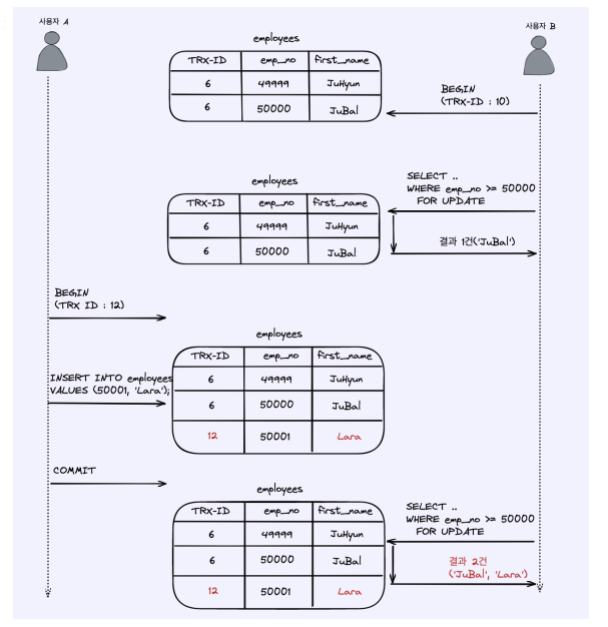
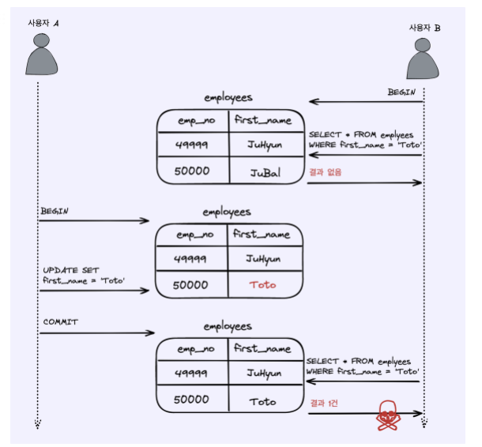
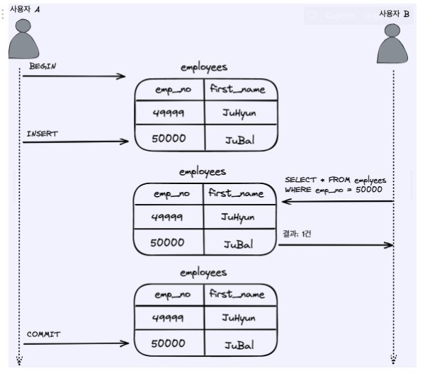
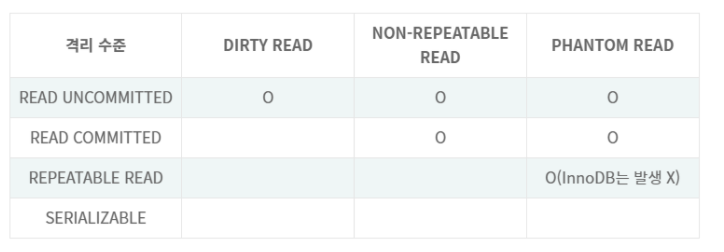

# Introduction
데이터베이스를 구성한 뒤, 효율적인 처리와 이상 현상 제거를 위해 정규화를 진행하고 본격적으로 데이터베이스를 사용할 준비가 되었다고 하자.   
데이터베이스에 접근하기 위해서는 쿼리를 사용하여야 한다. 실제로 의미있는 작업을 하기 위해서는
여러 개의 쿼리를 묶어서 데이터에 접근/조작하게 된다.    
**트랜잭션은 여러 개의 쿼리들을 하나로 묶는 단위이며, 하나의 논리적 기능을 수행하기 위한 작업의 단위로 볼 수 있다.**

트랜잭션 도중 시스템 장애로 인해 작업을 온전히 하지 못할 수 있다. 이로 인해 발생할 에러 들에 대해 알아보고, 이를 회피하기 위해 트랜젝션이 가져야 할 특징들에 대해 알아본다.

# ACID
트랜잭션이 가져야 할 특징으로 원자성, 일관성, 독립성, 지속성을 의미한다.

## 원자성
"All or nothing"으로 요약할 수 있다. 트랜잭션과 관련된 일이 모두 수행되거나 되지 않음을 보장하는 것이다.
트랜잭션을 커밋했는 데 문제가 발생해 롤백할 경우 모두 수행되지 않음이 보장되어야 한다.

예를 들어 100만원을 가진 규철이 0원 가진 규영이에게 50만원을 이체한다고 하면 다음과 같은 쿼리들이 수행되어야 한다.
1. 규철의 잔고를 조회.
2. 규철의 잔고에서 50만원 인출.
3. 규영의 잔고에 50만원 입금.

만약 2의 과정에서 시스템 장애로 트랜잭션이 중단된 뒤 특별한 조치를 취하지 않는다면, 규철의 잔고에서 50만원이 그냥 날라간 것이기 때문에 문제가 된다.
즉 이 작업이 도중 취소/중단될 경우 모든 operation은 취소되어야 한다.

### 커밋과 롤백
- 커밋 : 여러 쿼리가 성공적으로 처리되었음을 확정하는 명령어
- 롤백 : 에러나 이슈로 트랜잭션 전으로 돌리는 것

## 일관성
허용된 방식으로만 데이터를 변경해야 한다. 예를 들어 규철의 잔고보다 더 많은 돈을 인출하려고 하면 일관성의 원칙에 위배된다.

## 격리성
트랜잭션 수행 시, 다른 트랜잭션이 끼어들지 못하게 하는 것이다.
복수의 트랜잭션이 병렬로 수행될 경우에도 서로 격리되어 마치 순차적으로 실행되는 것처럼 작동해야 한다.

### 격리 수준에 따른 이상 현상
- 팬텀 리드 : 한 트랜잭션 내에서 동일한 쿼리를 보낼 때, 조회 결과가 다른 경우    
     

- 반복 가능하지 않은 조회 : 한 트랜잭션 내에 같은 행에 두 번 이상 조회가 발생했는데, **그 값이 다른 경우**
팬텀 리드는 다른 행이 선택될 수 있으나, 반복 가능하지 않는 조회는 행값이 달라질 수 있다. 
-     

- 더티 리드 : 한 트랜잭션이 실행 중일 때, 다른 트랜잭션에 의해 수정되었으나 '아직 커밋되지 않은' 행의 데이터를 읽을 수 있는 경우.    
   

### 격리 수준
READ UNCOMMITTED로 갈수록 동시성은 높으나, 격리성이 낮다.

- READ UNCOMMITTED: 각 트랜잭션의 변경 내용이 COMMIT이나 ROLLBACK 여부와 상관 없이 다른 트랜잭션에서 보여지게 된다.
- READ COMMITTED: 다른 트랜잭션이 커밋하지 않은 정보를 읽을 수 없다. 가장 많이 선택되는 격리 수준이다. 읽는 것만 그렇고, 어떤 트랜잭션이 접근한 행을 다른 트랜잭션이 도중에 수정할 수 있다.
- REPEATABLE READ : 하나의 트랜잭션이 수정한 행을 다른 트랜잭션에서 수정할 수 없다.
- SERIALIZABLE  : 병렬 수행을 허용하지 않고, 트랜잭션을 순차적으로 수행시킨다.

## 지속성
성공적으로 수행된 트랜잭션은 영원히 반영되어야 한다. 즉, 시스템 장애가 발생해도 원래 상태로 복구할 수 있어야 한다.

- 체크섬 : 오류 정정을 통해 송신된 자료의 무결성을 보호하는 방법
- 저널링 : 커밋 결과를 반영하기 전에 변경 사항에 대한 로그를 남기는 것

## 무결성
데이터의 정확성, 일관성, 유효성을 유지하는 것

| 이름       | 설명                                                     |
|----------|--------------------------------------------------------|
| 개체 무결성   | 기본키로 선택된 필드는 빈 값을 허용하지 않음                              |
| 참조 무결성   | 서로 참조 관계에 있는 두 테이블의 데이터는 항상 일관된 값을 가져야 함               | 
| 고유 무결성   | 특정 속성에 대해 고유한 값을 가지도록 조건이 주어진 경우 속성 값은 모두 고유한 값을 가짐    | 
| NULL 무결성 | 특정 속성 값에 NULL이 올 수 없다는 조건이 주어진 경우 그 속성 값은 NULL이 올 수 없음 | 

# Reference
면접을 위한 CS 전공지식 노트 - 주홍철 지음         
[MySQL 트랜잭션 격리 수준](https://steady-coding.tistory.com/562)