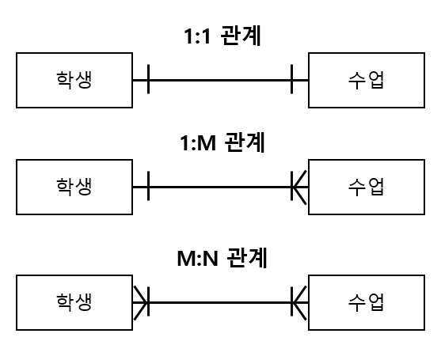
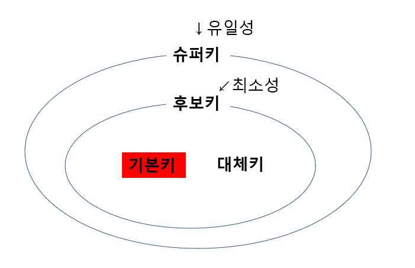

# Introduction
데이터베이스는 일정한 규칙 혹은 규약을 통해 구조화되어 저장되는 데이터의 모음이다.

DBMS: 데이터베이스를 제어 관리하는 통합시스템. 데이터베이스 안에 있는 데이터들은
DBMS마다 정의된 쿼리 언어를 통해 삽입, 삭제, 조회, 수정이 가능하다.

데이터베이스는 실시간 접근과 동시에 공유가 가능한데, 이 데이터 베이스를 이루는 기본적인 개념을 알아본다.

# Basic concept
## 엔터티
엔터티는 사람, 장소, 물건 등 여러 속성을 지닌 명사를 의미한다.
ex) 회원 = 엔터디면, 이름, 아이디, 주소 등의 속성을 가진다.

## 약한 엔터티와 강한 엔터티
혼자서 존재하지 못하고 다른 엔터티에 종속적인 엔터티를 약한 엔터티라 한다.
종속적이지 않은 엔터티는 강한 엔터티라고 한다.
예를 들어 건물은 그 자체로 여러 속성을 가지는 강한엔터티로 보고, 건물 안에서만 정의되는
방은 약한 엔터티다.

## 릴레이션
데이터베이스에서 정보를 구분하여 저장하는 기본 단위이다. 
엔터티에 대한 데이터를 데이터베이스는 릴레이션 하나에 저장한다.
- 관계형 데이터베이스에서는 **테이블**이라고 한다.
- NOSQL에서는 **컬렉션**이라고 한다.

## 속성과 도메인
속성은 릴레이션에서 관리하는 구체적이며 고유한 이름 갖는 정보이며,
속성이 가질 수 있는 값의 집합을 도메인이라고 한다.
에를 들어, 성별이란 속성은 {남, 여}의 집합을 도메인으로 갖는다.

## 필드와 레코드
회원이라는 엔터티가 있다고 하면, member라는 테이블에 이름, 아이디 등의 속성을 가질 수 있다.
실제로 **속성들을 테이블의 열로서 name, ID, address로 표현할 수 있는데 이를 필드**라고 한다.
**테이블에 쌓이는 행 단위를 레코드**라고 한다.

## 관계
테이블 간에도 서로 관계가 정의되어 있다. 다음과 같이 관계 화살표를 나타낼 수 있다.  

   
 
0개 또는 1개 이상의 테이블이 관계 되어있을 경우 다음과 같이 표현할 수 있다.    

## ERD (Entity Relationship Diagram)
데이터 베이스를 구축할 떄 가장 기초적인 뼈대 역할을 하며, 릴레이션 간의 관게를 정의한 것이다.
구축 시 ERD 예제들을 참고해 청사진을 그려보자..

ERD를 그릴 때 다음의 구성 요소들을 포함해야 한다.
- 엔터티들
- 속성
- 관계
- 액션 (어떻게 엔터티들이 데이터베이스 내에서 정보를 공유하는지를 나타냄)

## 키
키는 데이터베이스에서 조건에 만족하는 튜플을 찾거나 순서대로 정렬할 때 다른 튜플들과 구별되도록 기준이 되는 **속성**이다.
키를 통해 테이블 간의 관계를 조금 더 명확하게 할 수 있다.
- 유일성 : 중복되는 값이 없는 성질. 학번과 주민번호같은 속성은 중복될 수가 없어 유일성을 가진다.
- 최소성 : 유일성을 만족하는 데 불필요한 필드를 조합하지 않고, 최소 필드만 써서 키를 형성할 수 있는 것.    

## 키의 종류
- 슈퍼키 : 유일성을 갖춘 키
- 후보키 : 유일성에 최소성까지 갖춘 키
- 기본키 : 테이블에서 지정한 후보키
- 대체키 : 기본키로 지정받지 않은 후보키
- 외래키 : 다른 테이블의 기본키를 그대로 참조하며, 개체와의 관계를 식별하는 데 사용. 중복이 되어도 됨.    
예를 들어 고객 테이블과 주문 테이블이 있을 경우 고객 테이블의 id 속성을 그대로 참조해, 주문 테이블의 user_id 속성에 넣으면, 주문 테이블에서 누가 물건을 주문했는지 알 수 있게 된다.

후보키에서 기본키로 선택하는 기준은 보통 다음과 같다.
- **널 값을 가질 수 없는** 후보키
- 값이 **자주 변경되지 않는** 후보키
- **단순한** 후보키

# Reference
면접을 위한 CS 전공지식 노트 - 주홍철 지음         
[데이터베이스-관계](https://doorbw.tistory.com/228)       
[ERD 보조 설명](https://www.techtarget.com/searchdatamanagement/definition/entity-relationship-diagram-ERD)