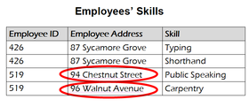
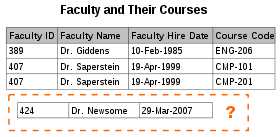
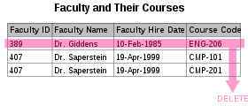
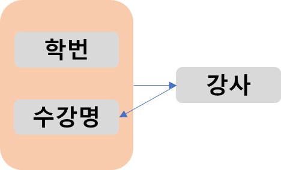

# Introduction
관계형 데이터베이스의 설계에서 **중복을 최소화하게 데이터를 구조화하는 프로세스를 정규화**라고 한다.    
아래와 같은 장점을 가진다.
- 릴레이션 간의 잘못된 종속 관계로 데이터베이스 이상 현상이 일어나 이를 해결함.
- 저장 공간을 효율적으로 사용.

아래의 원칙을 가진다.
- 정규화되어도 같은 의미를 표현해야 한다.
- 자료의 중복성은 감소해야 한다.
- 독립적인 관계는 별개의 릴레이션으로 표현한다.
- 각 릴레이션은 독립적인 표현이 가능해야 한다.

비공식적으로 **관계형 데이터베이스 테이블이 3NF화가 되었으면 정규화되었다라고 한다.** 3NF 테이블의 대부분이 삽입, 변경, 삭제 이상이 없으며, 3NF 테이블의 대부분이 BCNF, 4NF, 5NF이다

그러나, 성능적인 이유로 항상 정규화를 진행하지는 않는다.

# 데이터베이스 이상 현상
충분히 정규화 되지 않은 테이블은 아래와 같은 특성들이 있다

## 갱신 이상
같아야 하는 정보가 복수 개의 행에서 표현되면, 갱신 시 논리적인 모순을 초래할 수 있다.   
아래 예시에서 Employee 519는 다른 레코드에서 다른 주소를 가지고 있다.    

## 삽입 이상
테이블 조건(식별 필드에 NULL 삽입 금지 등)에 따라 레코드 삽입이 불가능한 경우이다.
아래 예시에서 신입 교수인 Dr. Newsome은 아직 수업을 배정받지 않았다는 이유로 교수 정보를 관리하는 이 테이블에 Newsome 교수 레코드를 삽입할 수가 없다.   

## 삭제 이상
어떤 정보를 삭제하는데, 삭제되면 안 되는 다른 사실이 함께 삭제되는 현상이 있을 수 있다.   
ENG-206 수업이 끝나 해당 레코드를 삭제하면, Dr. Giddens 교수의 모든 정보가 삭제된다.

# 제1정규형
릴에이션의 **모든 도메인이** 더 이상 분해가 불가능한 **원자값으로만 구성**되어야 한다.   
아래 예시에서, **두 개 이상의 값을 가지는 반복집합이 있어서는 안된다.**   

|유저ID|수강명|학점|
|-----|--------|------|
| 차현 | {C, Python} | {A0, B-} |
| 종석 | {Java, DB} | {A+, C+} |

아래와 같이 수정하여 제1정규형을 만족할 수 있다.

|유저ID|수강명|학점|
|-----|---|---|
| 차현 | C | A0 |
| 차현 | Python | B |
| 종석 | Java | A+ |
| 종석 | DB | C+ |

# 제2정규형
제1정규형을 만족하고 **부분 함수의 종속성을 제거**해야 한다.
- 부분 함수의 종속성 : 기본키가 복합키일 경우, 복합키의 특정 컬럼에만 종속된 속성이 있음.   
부분 함수의 종속성이 제거되면, 기본키가 아닌 모든 속성이 기본키에 완전 함수 종속적이다.   

아래 예시에서는 모든 속성이 중복된 값을 가지므로 복합키를 기본키로 가져야 한다.
{유저ID, 수강명}을 기본키로 할 수 있다. 그러나, 이 경우 유저ID로만 번호 속성이 결정되어 부분 함수의 종속성을 가지게 된다.

| 번호  | 유저ID |수강명|학점|
|-----|------|---|---|
| 1   | 차현   | C      | A0 |
| 1   | 차현   | Python | B |
| 2   | 종석   | Java | A+ |
| 2| 종석   | DB   | C+ |

따라서 다음과 같이 릴레이션을 2개로 분리해 부분 함수의 종속성을 제거할 수 있다. 

| 번호 | 유저ID |
|-----|-----|
| 1   | 차현  | 
| 2   | 종석  |

| 유저ID |수강명|학점|
|------|---|---|
| 차현   | C      | A0 |
| 차현   | Python | B |
| 종석   | Java | A+ |
| 종석   | DB   | C+ |

# 제3정규형
제2정규형을 만족하면서, 기본키가 아닌 모든 속성이 **이행적 함수 종속을 만족하지 않는 상태**이다.
이행적 함수 종속: A->B, B->C가 존재하면, 논리적으로 A->C가 성립되며, 즉 집합 C가 집합 A에 이행적으로 함수 종속이 되었다고 할 수 있다.

아래 예시에서 유저 ID에 의해 할인율이 정해지므로 이행적 함수 종속 상태다.

| 유저ID | 회원등급| 할인율 |
|-----|-----|-----|
| 1   | 골드 | 10% | 
| 2   | 실버 | 5%  |
| 3   | 플래티넘 | 15% |

다음과 같이 릴레이션을 분해하여 이행적 함수 종속 제거가 가능하다.

| 유저ID | 회원등급| 
|-----|-----|
| 1   | 골드 |
| 2   | 실버 | 
| 3   | 플래티넘 |

 | 회원등급| 할인율 |
|-----|-----|
 | 골드 | 10% | 
 | 실버 | 5%  |
 | 플래티넘 | 15% |

# 보이스/코드 정규형 (BCNF)
제3정규형을 만족하고, **모든 결정자가 후보키인 상태**를 말한다.
- 결정자 : **함수 종속 관계에서 X->Y일 때 X는 결정자, Y는 종속자이다**. 

예를 들어 요구 사항이 다음과 같다.
- 각 수강명에 대해 한 학생은 한 강사의 강의만 수강한다.
- 각 강사는 한 수강명만 담당한다.
- 한 수강명은 여러 강사가 담당할 수 있다.

다음과 같이 릴레이션을 구성했다.

| 학번    | 수강명|강사|
|-------|----|---|
| 12010 | 코딩테스트 | 큰돌|
| 12010 | MEVN | 재엽|
| 12011 | 코딩테스트 | 큰돌|
| 12011 | MEVN |가영|

이 때 {학번, 수강명} 또는 {학번, 강사}가 후보키가 된다.   
이 때, 범석이란 강사가 JAVA라는 수강명을 담당하기로 결정되어 레코드에 삽입할 경우, 학생이 정해지지 않아 학번이 NULL이 될 수 있다.

함수 종속 다이어그램을 그리면 다음과 같다.

즉 강사 속성은 수강명을 결정하는 결정자이나, 후보키가 아니므로 이 강사 속성은 분리되어야 한다.

다음과 같이 릴레이션을 분리할 수 있다.

| 학번 |강사|
|---|---|
| 12010 | 큰돌|
| 12010 | 재엽|
| 12011 | 큰돌|
| 12011 |가영|

| 수강명   |강사|
|-------|---|
| 코딩테스트 | 큰돌|
| MEVN  | 재엽|
| MEVN  |가영|
| JAVA  |범석|

# Reference
면접을 위한 CS 전공지식 노트 - 주홍철 지음         
[정규화-위키백과](https://ko.wikipedia.org/wiki/%EB%8D%B0%EC%9D%B4%ED%84%B0%EB%B2%A0%EC%9D%B4%EC%8A%A4_%EC%A0%95%EA%B7%9C%ED%99%94)
