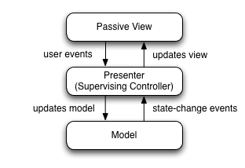

# Introduction
## 디자인 패턴이란?
 프로그램 설계 시 객체 간 상호 관계 등을 어떻게 구현할지 규약(패턴)을 만들어 놓는 것이다.
**정해진 규약대로 설계**함으로써, 프로그램에서 발생하는 여러 문제들을 회피하고 유지-보수를 용이하게 해준다. 

# 디자인 패턴의 종류
## 싱클톤 패턴
하나의 클래스에 하나의 인스턴스만 생성하고, 이 인스턴스를 여러 모듈에서 공유하는 형태로
주로 데이터 베이스 연결 모듈에 사용된다.    
하나의 인스턴스만 생성하기 때문에 자원(비용)이 적게 소요되는 장점이 있다.
그러나 의존성 문제가 있다. 예를들어 TDD(Test Driven Development)를 할 때 단위 테스트를 진행하게 되면
테스트를 진행할 모듈들이 서로 독립적이어야 하며, 어떤 순서로도 실행이 가능해야 한다. 
하지만 인스턴스를 공유하기 때문에 단위 실행 순서에 따라 인스턴스의 어트리뷰트는 변할 수 있으므로 TDD는 불가하다.

### 의존성 주입
의존성 문제를 해결하기 위해 의존성 주입을 하기도 한다.
의존성 주입이란, Interface 등과 같은 의존성 주입자를 이용해 간접적으로 의존성을 주입하는 것이다.

대표적으로 다음과 같은 세 가지의 의존성 주입 패턴이 있다.
- 생성자 주입 : 필요한 의존성을 모두 포함하는 클래스의 생성자를 만들고 그 생성자를 통해 의존성을 주입한다.
- Setter를 통한 주입 : 의존성을 입력받는 세터(Setter) 메소드를 만들고 이를 통해 의존성을 주입한다.
- Interface를 통한 주입 : 의존성을 주입하는 함수를 포함한 인터페이스를 작성하고 이 인터페이스를 구현하도록 함으로써 실행시에 이를 통하여 의존성을 주입한다.

이를 통해 모듈을 쉽게 교체할 수 있는 구조가 되어 단위 테스트가 쉬워지는 등 장점이 있으나, 코드의 복잡성이 증가한다.
 **이 개념은 싱글톤 패턴 뿐 아니라 대부분의 디자인 패턴에서 의존성을 줄이기 위해 적용되는 개념**으로 잘 알아두어야 한다.

## 팩토리 패턴
객체를 생성하는 부분을 떼어내 추상화하는 패턴이다.
상속관계에 있는 두 개의 클래스에서 상위 클래스에서는 뼈대를 결정하고, 하위 클래스에서는 객체를 생성하기 위한 세부 내용을 결정한다.
   
의존성 주입과 같은 맥락으로, 상위 클래스가 하위 클래스와 분리되며 느슨한 결합을 가진다.    
상위 클래스에서는 뼈대만 만들어주면 되기 때문에 객체가 실제로 어떻게 생성되는지는 전혀 관여하지 않게 된다.    
객체를 생성 시에 세부사항만 살짝 바꿔줄 일이 있다면 하위 클래스 객체만 수정하면 되기 때문에 유지보수가 쉬워진다.


## 전략 패턴
객체 행위를 바꾸고 싶은 경우, 객체를 직접 수정하지 않고 전략이라 부르는 '캡슐화한 알고리즘'을 컨텍스트 안에서 바꿔주어 상호 교체가 가능하게 해준다.   
예를 들어 어떤 상품을 사기 위해 카카오카드나 루나카드로 결제할 수 있다 하자.
이 결제 방법을 전략이라고 하며 아래 예제 코드에서 LUNACardStrategy와  KAKAOCardStrategy에 해당한다.
다른 전략을 사용하더라도 객체 cart는 변경되지 않는다. 이 때문에 전략은 일종의 의존성 주입자라고도 볼 수 있다.
```java
public class HelloWorld{
    public static void main(String []args){
        ShoppingCart cart = new ShoppingCart();
        
        Item A = new Item("kundolA",100);
        Item B = new Item("kundolB",300);
        
        cart.addItem(A);
        cart.addItem(B);
        
        // pay by LUNACard
        cart.pay(new LUNACardStrategy("kundol@example.com", "pukubababo"));
        
        // pay by KAKAOBank
        cart.pay(new KAKAOCardStrategy("Ju hongchul", "123456789", "123", "12/01"));
    }
}
```
## 옵저버 패턴
주체, 대상 객체, 옵저버로 이루어진 패턴이다.    
대상 객체의 상태 변화를 주체가 계속 관찰하면서, 객체에 변화가 생길 때마다 메서드 등을 통해 옵저버들에게 변화를 notify하는 패턴이다.
이 때 주체와 대상 객체를 굳이 분리하지 않고, 하나로 합친 패턴도 있다. 

대표적으로 트위터가 있다. A라는 사람(주체 + 대상 객체)이 글을 올리면(대상 객체의 변화), 팔로우한 사람들(옵저버)에게 알림이 가는 형식이다.

## 프록시 패턴
대상 객체에 접근하기 전, 그 객체에 접근하기 위한 흐름을 가로채면서, 그 객체 앞단에서 인터페이스 역할을 하는 패턴이다.    
대표적으로 node.js에서 nginx을 서버 앞단에 배치하여 프록시 서버로 활용하는 패턴이 있다.

### 프록시(proxy) 객체
프록시 객체는 어떤 대상의 기본적인 동작(속성 접근, 할당, 순회 함수 호출 등)을 가로챌 수 있는 객체를 의미한다.
### 프록시 서버
서버와 클라이언트 사이에서, 클라이언트가 자신을 통해 네트워크에 간접적으로 접속할 수 있는 컴퓨터 시스템이나 응용프로그램을 말한다.

## 이터레이터 패턴
이터레이터 패턴은 이터레이터 객체를 이용해 이터러블한 콜렉션 요소들에 접근하는 패턴이다.
이터러블한 객체기만 하면 하나의 인터페이스로 순회가 가능하다.

## MVC 패턴


모델(Model), 뷰(View), 컨트롤러(Controller)로 이루어진 디자인 패턴이다.
어플리케이션의 구성 요소들을 이 세 가지로 나눔으로써, 설계 시 개별 요소에 더 집중할 수 있는 장점을 가진다.    
대표적으로 리엑트 라이브러리가 있다.

### 모델
어플리케이션의 데이터베이스, 상수, 변수 등의 **데이터**를 의미한다.

### 뷰
모델을 구성하는 데이터를 추가/삭제/변경할 수 있는 인터페이스 요소를 나타낸다. 보통은 사용자가 볼 수 있는 GUI를 의미한다.
뷰는 데이터를 따로 저장할 수 있는 기능이 없어야 하며, 모델만 데이터를 따로 가지고 있을 수 있다.    
따라서 **뷰는 엄밀한 의미에서 단순히 모델에 있는 데이터를 보여주기만 할 뿐**이다.
이에 따라 뷰는 모델에 대응되며, 높은 의존성을 가진다.

### 컨트롤러
**모델과 뷰를 이어주는 역할**을 하는 구성요소이다. 사용자가 뷰와 상호작용하면서 모델에 있는 데이터가 변경되도록 로직을 구성한다.
모델과 뷰의 생명 주기도 관리하며 모델이나 뷰의 변경 알림을 받을 경우 이를 해석해 관련된 구성 요소에 전달한다.
컨트롤러는 여러 개를 뷰를 선택할 수 있다. 즉, 1:N 연결 구조이다.


## MVP 패턴


MVC 패턴에서 C가 presenter로 변경된 패턴이다.    
이 패턴에서는 Model과 View 분리되어 있고 오직 Presenter를 통해서 상태나 변화를 알려줄 수 있다.     
MVC와 달리 Presenter와 View는 1:1 관계이다.
따라서 View와 모델간 의존성은 줄었으나, presenter와 View의 의존성이 높아지는 문제가 있다.
## MVVM 패턴

MVC패턴에서 C가 뷰모델(view model)로 변경된 패턴이다. 뷰모델은 뷰를 더 추상화하여, 커멘드와 데이터 바인딩(화면의 데이터와 웹 브라우저의 메모리 데이터를 일치시키는 기법)을 가지게 된다.
대표적으로 Vue.js가 있다.


# 질문
- 프로젝트에서 주로 사용해본 디자인 패턴과, 그 패턴을 사용한 이유는?
- 프로그램 설계 시, 의존성을 줄이기 위해 사용할 수 있는 기법을 말하고, 그 기법의 장점과 단점을 얘기해라.
- MVC, MVP, MVVM의 차이에 대해 설명하라.
# Summary

 
# Reference
면접을 위한 CS 전공지식 노트 - 주홍철 지음    
[위키백과-의존성 주입](https://ko.wikipedia.org/wiki/%EC%9D%98%EC%A1%B4%EC%84%B1_%EC%A3%BC%EC%9E%85)    
[예제코드](https://github.com/gilbutITbook/080326)