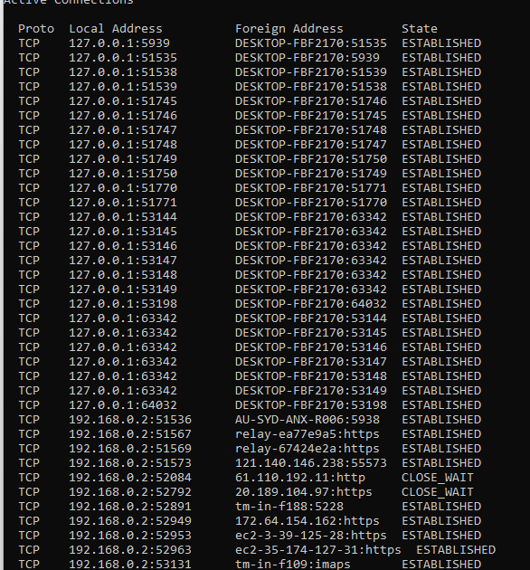
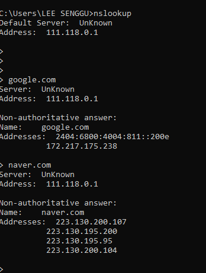
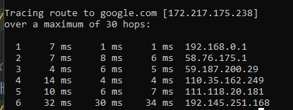

# Introduction
네트워크란 ****노드와 링크가 서로 연결되어 있거나 연결되어 있지 않은 집합체****이다.   
**노드는 서버, 라우터, 스위치 등의 네트워크 장비**를 의미하고
**링크는 유선 또는 무선**을 의미한다.    
구성할 수 있는 네트워크 토폴로지를 알아보고, 그에 따른 장단점과 네트워크 성능 분석을 위한 명령어를 알아본다.
    
# 네트워크
## 트리 
계층형 구조를 가진 네트워크이다.   
장점 : 노드의 추가, 삭제가 쉽다.   
단점 : 특정 노드에 트래픽이 집중 시 하위 노드에 영향을 미칠 수 있다.

## 버스
중앙 회선 하나에 여러 개의 노드를 연결하고, 회선을 공유하는 방식이고, LAN에 주로 사용한다.    
장점 : 회선을 공유하기 때문에 설치 비용이 적고 노드를 추가하거나 삭제가 쉽다.    
단점 : 스푸핑 공격을 받을 수 있다.

## 스타
중앙 노드에 모든 노드가 연결되는 방식이다.    
장점 : 노드 추가가 쉽고, 어느 노드에 장애가 발생해도 에러가 쉽게 발견된다. 패킷 충돌 발생 가능성이 적다.     
단점 : 중앙 노드에 장애가 발생하면 전체가 문제가 된다.

## 링형
각 노드가 양 노드와 연결되어 고리형태의 망 구성이다.    
장점 : 노드 수가 증가 되어도 네트워크 손실이 거의 없고 충돌이나 고장 발견이 쉽다.    
단점 : 네트워크 구성 변경이 어렵고, 회선에 장애가 발생 시 전체에 영향이 간다.

## 메시
모든 노드가 그물망처럼 서로 연결된 구조이다.
장점 : 트래픽 분산 처리, 한 노드가 고장나도 다른 노드에서 통신이 가능하다.
단점 : 노드 추가 시 구축 비용이 고가고 어렵다.

### 스푸핑이란?
LAN에서 송신부 패킷을 송신과 관련없는 다른 호스트에
가지 않도록 스위칭 기능을 마비 시킨다.

# 네트워크 성능 분석 명령어
## ping
대상 노드와 통신이 가능한지 알아보기 위해 많이 쓰이는 명령어다.
**ICMP 프로토콜을 지원하지 않는 단말은 쓸 수 없다.**

### ICMP란?
- TCP/IP 4계층 중 인터넷 계층에 속한다.    
 -TCP/IP의 IP 계층에서 추가적으로 필요한 기능들을 수행하기위한 프로토콜로, 
IP 패킷을 처리할 때 발생되는 문제를 알리거나, 문제의 진단 등을 수행한다.
-IP(Internet Protocol)와 하나의 쌍을 이루며 동작한다.

## netstat
접속된 서비스들의 네트워크 상태를 보여준다. 주로 특정 서비스의 포트가 열려있는지 확인할 때 쓴다.
아래와 같이 뜬다.
왼쪽부터 **프로토콜, 내 ip 주소:포트, 상대의 ip 주소:포트, 상태**가 뜬다.    

## nslookup
도메인과 매핑된 IP를 확인하는 명령어다.   

## tracert
목적지 노드까지 경로를 확인하는 명령어다. 응답 시간이 어느 구간에서 느려지는 지 확인하여 병목현상을 줄일 때 도움이 될 수도 있겠다.

# 질문

# Reference
면접을 위한 CS 전공지식 노트 - 주홍철 지음      
[ICMP 정의](http://www.ktword.co.kr/test/view/view.php?m_temp1=94)