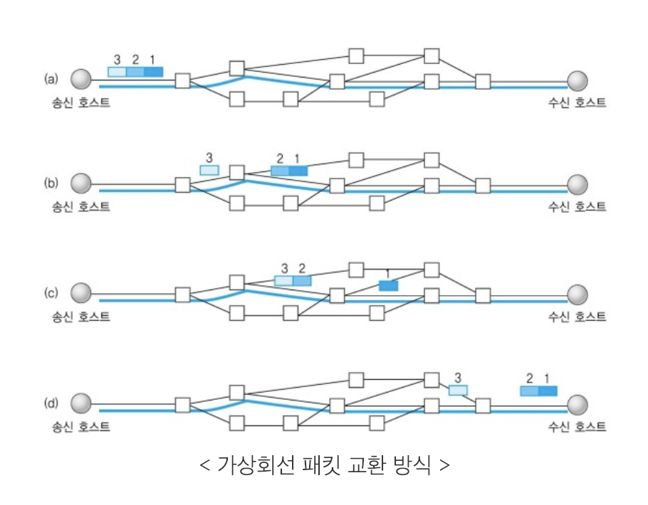

# Introduction
인터넷 프로토콜 스위트(Internet Protocol Suite)는 인터넷에서 컴퓨터들이 서로 정보를 주고받는 데 쓰이는 프로토콜의 집합이다.    
보통 TCP/IP 4계층을 많이 쓰기 때문에, TCP/IP 4계층으로 이 프로토콜 집합을 설명한다. 
아래는 OSI 7 계층과 TCP/IP 4계층의 비교 이미지이다.

    

참고로 OSI 7 계층에서 각 계층에 포함되는 프로토콜 (또는 장치, 신호)는 다음과 같다.
위키백과를 참고했다. 

- **각 계층들은 다른 계층이 변경되어도 영향을 받지 않도록 설계된다**는 점에서 구별된다.

여기서는 TCP/IP 계층 위주로 프로토콜을 설명한다.

# TCP/IP 4계층 설명
## 애플리케이션 계층
응용 프로그램이 사용되는 프로토콜 계층이다. 실질적으로 사람들에게 제공하는 층이다.
- FTP, HTTP, SSH, SMTP, DNS 등 네트워크 관련 종사자가 아닌 일반 인터넷 사용자들이 주로 사용하는 프로토콜 들이 포진되어 있다.

## 전송 계층
송신자와 수신자를 연결하기 위한 통신서비스를 제공한다.    
즉, 컨텐츠 자체보다는 데이터 스트림 지원, 신뢰성, 흐름제어를 통해 단말간 중계 역할을 하는 계층이다.    
대표적으로 TCP, UDP가 있다.
### TCP : Transmission Control Protocol
패킷 사이의 **순서를 보장**하고, 연결지향 프로토콜을 사용한다. **가상회선 패킷 교환 방식**을 사용한다.    

### 가상회선 교환 방식

- 각 패킷마다 가상회선 식별자를 가지며, 이 식별자로 순서대로 도착하는 것을 보장하므로 오류 제어가 쉽다.
- 가상회선을 결정하는 Call setup 이라는 과정이 필요하며, 이로 인한 오버헤드로 인해 소량의 데이터만 옮길 경우에는 부적합하다.
- 단, Call setup은 첫 패킷이 도착할 때 한 번 결정되면 되며 각 노드에서 처리 시간은 데이터 그램보다 적다.
- 따라서 대량의 데이터를 옮긴다면 오히려 효율적이다.

### UDP : User Datagram Protocol
패킷 사이 **순서를 보장하지 않고**, 수신 여부를 확인하지 않으며, 단순히 대이터만 주는 **데이터그램 패킷 교환 방식**을 사용한다.
### 데이터그램 패킷 교환 방식

- 가상회선과 달리 여러 경로로 패킷을 보낼 수 있으므로, 망 상황에 따라 유연하게 패킷 교환을 할 수 있다.
- Call setup 과정이 필요없어 오버헤드가 적다.

## 인터넷 계층
장치로 부터 받은 네트워크 패킷을 IP 주소로 지정된 목적지로 전송하기 위해 사용된다.
IP, ARP, ICMP 등이 잇고 패킷을 수신해야 할 상대의 주소를 지정해 데이터를 저장한다.

## 링크 계층
전선, 광섬유, 무선 등 실질적으로 데이터를 전달하며 장치 간에 신호를 주고받는 규칙을 정하는 계층이다.

# 캡슐화와 비캡슐화
## 캡슐화
상위 계층의 헤더와 데이터를 하위 계층의 데이터에 포함시키고, 하위 계층에 헤더를 포함시키는 것이다.
예를 들면 애플리케이션 계층 데이터가 전송 계층으로 전달될 때, 전송 계층의 헤더와 데이터가 포함된다.   
**애플리케이션에서 전송 계층**으로 데이터가 전달되면 **세그먼트** 또는 데이터 그램화라고 하며, **인터넷 계층으로 가면 패킷화**, **링크 계층으로 가면 프레임화** 된다고 표현한다.

## 비캡슐화
비캡슐화는 캡슐화 과정을 반대로 거치는 것으로 각 계층의 헤더부를 제거 하는 것이다.

# Protocol Data Unit (PDU) 
계층 간 데이터 이동 시, 데이터 덩어리의 단위를 PDU라고 한다.
PDU는 아래와 같이 계층마다 다르게 부른다.
- 애플리케이션 계층 : 메시지
- 전송 계층 : 세그먼트(TCP), 데이터그램(UDP)
- 인터넷 계층 : 패킷(IP)
- 링크 계층 : 프레임(데이터링크 계층), 비트(물리 계층)

# Reference
면접을 위한 CS 전공지식 노트 - 주홍철 지음    
[TCP/IP 모델 위키 백과](https://ko.wikipedia.org/wiki/%EC%9D%B8%ED%84%B0%EB%84%B7_%ED%94%84%EB%A1%9C%ED%86%A0%EC%BD%9C_%EC%8A%A4%EC%9C%84%ED%8A%B8)    
[패킷 교환 방식 종류](https://ko.wikipedia.org/wiki/%ED%8C%A8%ED%82%B7_%EA%B5%90%ED%99%98)