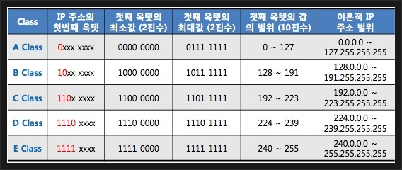
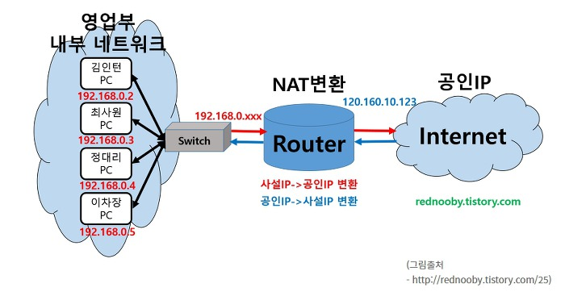
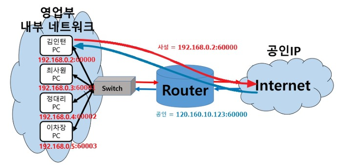

# Introduction
IP 주소가 어떻게 구성되고, 어떻게 사용되는지 좀 더 자세히 알아보자.

# Address Resolution Protocol (ARP)
실제로 컴퓨터 간 통신은 IP 주소를 기반으로 하는 것이 아니다. 
정확히는 IP주소가 ARP를 통해 MAC 주소를 찾고 MAC 주소로 통신을 한다.
IP는 원활한 통신 구조를 위한 가상 주소일 뿐이다.

## 브로드캐스트
송신 호스트가 전송한 데이터가 네트워크에 연결된 모든 호스트에 전송되는 방식이다.
장치 A가 연결된 B,C,D PC 들이 있다면, 이들 모두에게 ARP Request를 보내서 ip 주소에 대응하는 MAC주소를 찾게 된다.

## 유니캐스트
고유 주소로 식별된 하나의 네트워크 목적지에 1:1로 데이터를 전송하는 방식이다.
위의 예시에서 장치 B가 ARP reply 유니캐스트를 A에 보내게 된다.

# 클래스 기반 할당 방식
IP 주소는 A,B,C,D,E의 클래스로 나뉘며,
앞 부분을 네트워크 주소, 뒷 부분을 호스트 주소로 사용한다.

A,B,C는 일대일 통신에 사용되고, D는 멀티캐스트 통신, E는 예비용 으로 사용한다.  

이 방식은 간단하지만, 사용하는 주소보다 많은 주소를 버릴 수도 있기 때문에 이를 대신할 DHCP, IPv6, NAT, PAT이 나왔다.
# Dynamic Host Configuration Protocol (DHCP)
IP 주소나 통신 매개변수를 자동으로 할당하기 위한 프로토콜이다.

# Network Address Translation (NAT)
패킷이 라우팅 장치를 통해 전송될때  패킷의 ip 주소 정보를 수정해 다른 주소로 매핑하는 방법이다.
외부망과 내부망을 나누어서 사설 IP를 만드는 데, 이 방법이 쓰이게 된다.    
공유기에는 NAT 기능이 탑재되어 여러 PC를 하나의 공인 IP에 연결할 수 있다.
**사설 IP는 외부에 알려지지 않게 되며, 외부의 공격을 차단할 수 있다.**
- 내부망의 개별 PC가 외부로 통신 가능
- 외부망에서 내부망의 개별 PC에 대해 통신 불가

# Part Address Translation (PAT)
PAT은 하나의 공인 IP에 PORT를 구분해 사설 PC에 메핑하는 것이다.
PORT(일종의 식별자 역할)를 통해 사설 PC가 구분되며, 따라서 외부에서 내부로 통신이 가능하다.

# 질문
- 클래스 기반 ip 할당 방식의 단점을 예로 들어 설명하고, 이를 해결하기 위한 방법을 생각해라.

# Reference
면접을 위한 CS 전공지식 노트 - 주홍철 지음     
['클래스 기반 할당 방식'](https://engkimbs.tistory.com/621)
['NAT와 PAT'](https://cheershennah.tistory.com/123)