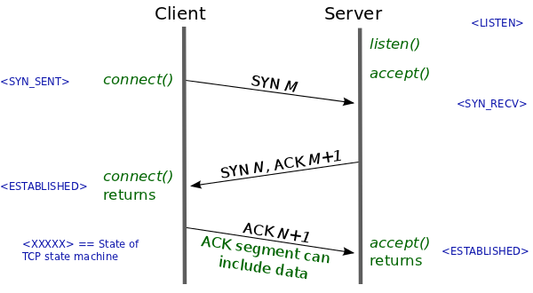
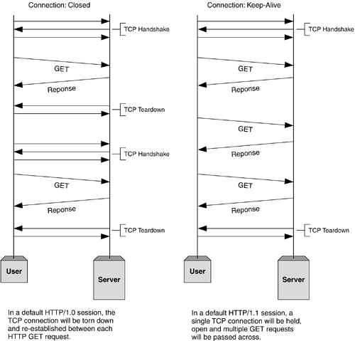
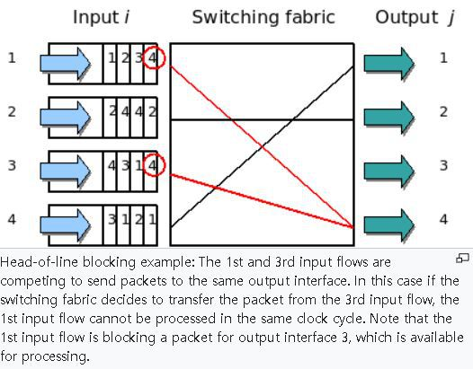

# Introduction
HTTP (HyperText Transfer Protocol)는 애플리케이션 계층에서 웹 서비스를 위한 프로토콜로 사용된다.
HTTP의 종류와 특징에 대해 알아본다.

##  RTT
패킷의 왕복시간 (목적지에 도달하고 나서 다시 출발지로 돌아오는 시간) 이다.

# HTTP/1.0
하나의 연결 당 하나의 요청만을 처리하도록 설계되었다.
따라서 요청이 생길 때마다 TCP 3-WAY handshake를 계속해서 열어야 한다.    
이로 인해 RTT가 증가한다. 이를 줄이기 위해 이미지 스플리팅이나 코드 압축을 사용한다.

# HTTP/1.1
매번 TCP 연결할 필요없이 한 번 TCP 초기화를 하면 keep-alive 옵션으로 여러 파일을 송수신 할 수 있다.
그러나 다수의 리소스를 처리하려면, 리소스 개수에 비례해 대기 시간이 길어진다.    
또한, 헤더에 쿠키 등 많은 메타 데이터가 들어있고 압축이 되지 않아 무거운 단점이 있다.    

## HOL Blocking
같은 큐에 있는 패킷이 첫 번째 패킷에 의해 지연되는 현상이다.     
아래 이미지를 보면 input 데이터가 switching fabric(입력 포트를 출력포트로 전달하는 과정)를 거쳐 output으로 나온다.
이 때, 1번 input과 4번 input은 동일한 경로로 4번 output으로 보내려고 할 경우, 1번 input의 전달이 지연되는 현상이다.

# HTTP/2
HTTP/1.X 보다 지연시간을 줄이고, 응답시간을 더 빠르게 하였으며, 다음을 지원한다.
- 멀티플렉싱 : 여러 개의 스트림을 사용해 송수신.
- 헤더 압축 : 허프만 코딩 압축 알고리즘을 사용하는 HPACK 압축 형식을 가진다.
- 서버 푸시 : 클라이언트 요청없이 서버가 리소스를 바로 푸시할 수 있다. 예를 들어, html은 css 파일이 포함될텐데, html을 서버가 읽으면서 css까지 푸시하여 클라이언트에 전달할 수 있어 요청 시간이 단축된다.

HTTP/2는 HTTPS 위에서 동작한다.

# HTTPS
애플리케이션 계층과 전송 계층 사이에 신뢰 계층인 SSL/TLS 계층을 넣어 신뢰할 수 있는 HTTP 요청을 말한다.
통신 암호화를 위해 쓴다.

# 질문
- HTTP와 HTTPS의 차이점은?
- HOL Blocking을 해결하기 위한 방법은?

# Reference
면접을 위한 CS 전공지식 노트 - 주홍철 지음     
['http 프로토콜 비교'](https://hirlawldo.tistory.com/106)