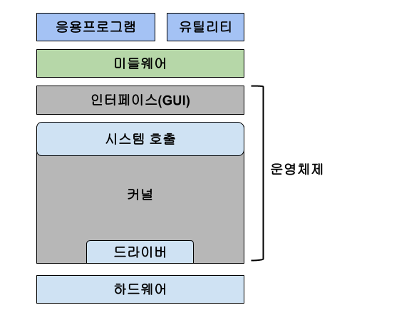

## 참고
OS의 기초적인 내용만 써두었고, 필요 시 내용 추가 예정인 글이다.

# Introduction
운영체제란 한정된 메모리나 시스템 자원을 관리해주고, 유저 프로그램과 시스템콜을 통해 사용자와 상호작용할 수 있는 기능을 가진 소프트웨어이다.

# 운영체제의 구조와 역할
## 운영체제의 구조

## 운영체제의 역할
- CPU 스케줄링과 프로세스 관리
- 메모리 관리
- 디스크 파일 관리
- I/O 디바이스 관리

## 시스템콜 
운영체제가 커널에 접근하기 위한 인터페이스이다.
유저 프로그램에서 OS 서비스를 받기 위해 커널 함수를 호출 시 쓰인다.
이 때 유저 프로그램이 I/O 요청을 하는 것을 **트랩을 발동시킨다**고 한다.

### modebit
시스템콜이 동작할 때 modebit을 참고해 유저와 커널모드를 구분한다.
0은 커널 모드, 1은 유저 모드로 설정된다. 
유저 모드의 경우 시스템 콜을 못하게 막아 한정된 일만 가능하게 한다.

#### 커널 모드
모든 자원에 접근할 수 있는 모드

#### 유저 모드
접근가능한 자원 영역을 제한적으로 두는 모드

# 컴퓨터 구성 요소
### CPU
산술논리연산장치, 제어장치, 레지스터로 구성되어있으며, 
인터럽트 요청에 의해 메모리에 존재하는 명령어를 해석해서 실행하는 장치이다.

- 산술논리연산장치 (ALU): 덧셈, 뺄셈 같은 두 숫자의 산술연산 등을 지원한다.
- 제어장치 (CU): 프로세스 조작을 지시하며, 입출력 장치간 통신을 제어하고, 명령어를 읽고 해석해 데이터 처리 순서를 결정한다.
- 레지스터 : CPU에서 직접 읽을 수 있는 매우 빠른 임시기억장치다.
- 
### DMU 컨트롤러
- I/O 디바이스가 메모리에 직접 접근할 수 있도록 하는 하드웨어 장치이다.
- 연산하기도 벅찬 CPU가 메모리를 계속 관리하게 되면, 심한 병목현상이 생길 것이므로 메모리만 따로 관리하는 장치를 두는 것이다.

# Reference
면접을 위한 CS 전공지식 노트 - 주홍철 지음    