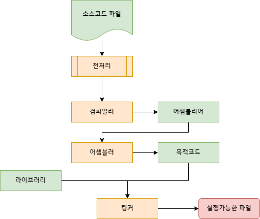
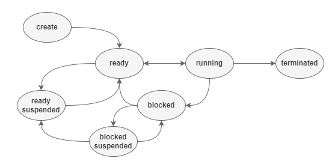
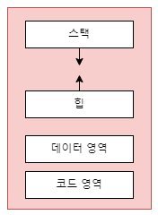

# Introduction
이전 포스팅에서 컴퓨터 구성 요소를 하드웨어(CPU, DMA 등)와 소프트웨어(유저프로그램, 커널, 시스템 콜 등) 및 메모리 자원(레지스터, 캐시, 주메모리 등)에 대한 전반적인 설명을 하였다.    
실제로 이것들이 어떻게 유기적으로 사용되는지 알기 위해서는 스레드와 프로세스의 이해가 필수적이다.

**프로세스는 HDD/SDD에 저장된 프로그램이 메모리에 올라와 인스턴스화** 된 것이며 이후 OS의 CPU 스케줄링에 따라 CPU가 개별 프로세스를 실행한다. 
CPU 스케쥴링 관점에서는 **TASK** 라는 개념으로도 호환되어 사용된다.

**스레드는 이 프로세스 내에서 실행되는 작업의 흐름**을 의미한다.

프로세스와 스레드에 대해 조금 더 자세히 알아보고 여기서 파생되는 개념들을 배워보자.

# Process
프로세스는 프로그램이 인스턴스화된 것으로, 먼저 프로그램이 어떻게 만들어지는지 알아보자.

## 프로그램 생성
### C언어에서 컴파일 과정

- 전처리 : 소스코드의 주석을 제거하고 #include 등 헤더 파일 병합해 매크로를 치환한다.
- 컴파일러 : 오류처리, 코드 최적화 작업 후 어셈블리어로 변환한다. 어셈블리어는 기계어와 1:1로 대응된다.
- 어셈블러 : 어셈블리어를 기계어(0과 1)로 이루어진 목적 코드로 변환한다. 
- 링커 : 프로그램에 사용되는 라이브러리 함수를 목적 코드와 결합해 실행 파일을 만든다.

### 인터프리터 방식인 파이썬 프로그램의 경우
파이썬은 인터프리터 방식 언어이므로 위와는 다르게 프로그램이 생성된다.

### 정적 라이브러리와 동적 라이브러리
- 정적 라이브러리 : 라이브러리가 제공하는 모든 코드를 실행 파일에 넣는 방식이다.
- 동적 라이브러리 : 프로그램 실행 시 필요할 때만 DLL이라는 함수 정보를 통해 참조하는 방식이다.
 
## 프로세스의 상태

- 생성 상태 (create) : 프로세스를 생성한 상태, **fork 또는 exec로 프로세스를 생성하며, PCB가 할당된다.**    
fork() : **부모 프로세스의 주소 공간을 그대로 복사하여 새로운 자식 프로세스를 생성**하는 함수다. 부모 프로세스의 비동기 작업까지 상속하지는 않는다.
exec() : 새로운 프로세스를 생성한다.
- 대기 상태 (ready) : CPU 스케줄러로부터 CPU 소유권을 대기하는 상태다. 메모리 공간이 충분하면 메모리를 할당받고 대기한다.
- 대기 중단 상태 (ready suspended) : 메모리 부족으로 일시 중단된 상태다.
- 실행 상태 (running) : CPU 소유권과 메모리를 할당받고 인스트럭션을 수행중인 상태다.
- 중단 상태 (blocked) : 어떤 이벤트가 발생한 이후 기다리며 프로세스가 차단된 상태다. I/O 입력 등으로 이런 현상이 자주 발생하기도 한다.
- 일시 중단 상태 (blocked suspended) : 중단된 상태에서 프로세스를 실행하려 했으나 메모리 부족으로 일시 중단된 상태다.
- 종료 상태(terminated) : 메모리와 CPU 소유권을 모두 놓고 가는 상태다.

## 프로세스의 메모리 구조

- 코드 영역 : 프로그램 소스코드가 들어가는 영역으로 기계어로 저장되어 정적인 특징을 가진다.
- 데이터 영역 : 전역변수, 정적 변수가 저장되고, 프로그램이 종료되면 사라지는 변수가 들어있는 영역이다. 초기화되지 않는 변수가 0으로 초기화되서 저장되는 BSS 영역과 0이 아닌 다른 값으로 할당되는 Data 영역으로 저장된다.
- 힙 : 변수를 동적할당할 때 사용되어 런타임 시 크기가 결정된다. 벡터같은 동적 배열은 힙에 할당된다.
- 스택 : 보통 함수가 호출될 때 사용되는 메모리 영역으로, 지역변수, 매개변수, 함수가 저장된다. 컴파일 시 크기가 결정되며 동적인 특징을 가진다. 

## PCB (Process Control Block)
OS에서 프로세스에 대한 메타데이터를 저장한 데이터이다.   
중요한 정보를 포함하므로 일반 사용자가 접근하지 못하도록 커널 스택의 가장 앞부분에서 관리된다.

## PCB의 구조
- 프로세스 스케줄링 상태 : 프로세스가 CPU에 대한 소유권을 얻은 우 상태
- 프로세스 ID : 해당 프로세스의 자식 프로세스 ID
- 프로세스 권한 : 컴퓨터 자원 또는 I/O 디바이스에 대한 권한 정보
- 프로그램 카운터 : 프로세스에서 실행해야 할 **다음 명령어의 주소에 대한 포인터**
- CPU 레지스터 : 프로세스를 실행하기 위해 저장해야 할 레지스터에 대한 정보
- CPU 스케줄링 정보 : CPU 스케줄러에 의해 중단된 시간에 대한 정보
- 계정 정보 : 프로세스 실행에 사용된 CPU 사용량, 실행한 유저의 정보
- I/O 상태 정보 : 프로세스에 할당된 I/O 디바이스 목록

## 컨텍스트 스위칭
프로세스를 다룰 때 컨텍스트 스위칭은 PCB를 교환하는 과정을 말한다.   
PCB를 교환할 때 캐시미스가 발생할 수 있다.
- 캐시미스 : 컨택스트 스위칭이 일어날 때 프로세스 메모리 주소가 그대로 있으면 잘못된 주소 변환이 생기므로
캐시클리어 과정을 거치면서 캐시미스가 발생하기 쉽다.

스레드의 경우에도 컨텍스트 스위칭이 일어나는 데 스택 영역을 제외한 메모리 영역을 공유하므로 컨텍스트 스위칭에 따른 오버헤드가 적다.

# Multi processing
여러 개의 프로세스를 동시에 수행하는 것이다. 

## IPC (Inter Process Communication)
프로세스간 데이터 공유를 관리하는 메커니즘이다.
클라이언트와 서버 관계에서도 데이터를 요청하고 받는 IPC의 예로 볼 수 있다.
IPC는 관계된 프로세스 종류와 공유 메카니즘에 따라 공유 메모리, 파일, 소켓, 익명 파이프 등 여러 종류가 있다.

### 공유 메모리
여러 프로세스에 동일한 메모리 블록에 대한 접근 권한이 부여되어 프로세스가 서로 통신할 수 있는 공유 버퍼를 생성하는 것이다.
**메모리 자체를 공유**하므로 **불필요한 데이터 복사로 인한 오버헤드가 발생하지 않는 장점**이 있다.
 그러나 같은 메모리 영역을 여러 프로세스가 공유하기 때문에 **동기화가 필요**하다.

### 파일
디스크에 저장된 데이터를 그대로 읽고 쓰는 방식ㅇ다.

### 소켓
네트워크 인터페이스를 통해 전송하는 데이터를 의미하며 TCP와 UDP가 있다.
일반적적으로 RPC (Remote Procedure Call) 호출을 소켓 방식을 사용한다.

### 익명 파이프
프로세스 간에 FIFO방식으로 읽히는 임시공간인 파이프를 기반으로 데이터를 주고 받는 방식이다.
부모 자식 프로세스간에만 사용할 수 있다.

### 명명된 파이프
파이프 서버와 하나 이상의 파이프 클라이언트 간 통신을 위해 명명된 단방향 또는 이중 파이프를 의미한다.
클라이언트/서버 통신을 위한 별도의 파이프를 제공한다. 여러 파이프를 동시에 사용할 수도 있다.

### 메시지 큐
메시지를 큐 형태의 데이터 구조체로 관리하는 것이다. 커널의 전역 변수 형태 등으로 전역적으로 관리된다.
사용 방법이 직관적이고 간단하다.

## 동기화와 통신 방향에 따른 IPC 분류
IPC는  동기화 여부에 따라 대기가 있는 통신(blocking communication)과 대기가 없는 통신(non-blocking communication)으로 분류된다.

blocking communication : Synchronization 통신 방식이다. 데이터를 받는 쪽은 데이터가 도착할 때까지 자동으로 대기 상태에 머물러 있다.    
non-blocking communication : Asynchronous 통신 방식이다. 데이터를 받는 쪽은 바쁜 대기를 사용하여 데이터가 도착했는지 여부를 직접 확인한다.

양방향 통신 : 일반적인 통신
양방향 통신 & 대기가 있는 통신 : 소켓
단방향 통신 * 대기가 없는 통신 : 전역 변수, 파일
단방향 통신 & 대기가 있는 통신 : 파이프

# Thread
프로세스가 실행 가능한 가장 작은 단위이다. 프로세스 내 실행 흐름으로도 표현한다.

## 스레드의 메모리 구조

스레드는 코드,데이터, 힙 영역을 공유한다.

# Multi Threading
프로세스 내 작업을 여러 개의 스레드로 처리하는 기법이다.    
멀티 프로세싱과 달리 스레드간 코드, 데이터, 힙 영역에서 자원 공유가 되므로 효율성이
높다..곤하나 공유 자원과 임계 영역 문제를 신경써줘야 하며, 이에 따른 오버헤드도 있다.

예를 들어 파이썬에서는 임계 영역 문제를 GIL로 해결해, 공유되는 자원은 하나의 스레드만 점유할 수 있어 원하는 성능이 안나올 수 있다.

## Thread 동기화
multi thread를 사용할 경우 실행 순서에 대한 동기화와 메모리 접근에 대한 동기화가 필요하다.

### 실행 순서에 대한 동기화
정해진 실행 순서대로 thread가 실행되도록 하는 것이다.   
절차적 프로그래밍에서는 함수가 수행되는 순서가 정해져 있으나, multi threading을 사용 시 함수 순서가 뒤바뀔 경우 잘못된 결과나 시스템 에러가 발생할 수 있다.

### 메모리 접근에 대한 동기화
 한 시점에 두 개 이상의 쓰레드가 동일한 메모리에 접근할 경우 계산 결과가 overwrite될 수 있다.   
후술할 임계 영역을 지켜 공유 자원을 사용할 수 있도록 하는 것이다.

# 공유 자원과 임계 영역
## 공유 자원
공유자원은 시스템 안에서 프로세스나 스레드가 함께 접근 가능한 하드웨어 장치, 메모리, 파일, 데이터 등의 자원이나 변수를 의미한다.
**공유 자원을 동시에 읽거나, 쓰는 상황을 race condition** 이라고 한다.    
race condition이 발생할 경우, 데이터 접근 타이밍 및 순서에 따라 결과값에 영향을 미친다.

## 임계 영역 (critical section)
공유 자원에 접근 시 순서 등의 이유로 결과가 달라지는 영역을 임계 영역이라고 한다.
임계 영역을 해결하기 위해 상호배제, 한정 대기, 융통성이란 조건을 만족해야 한다.
- 상호 배제 : 한 프로세스가 임계 영역에 들어갈 때 다른 프로세스는 들어갈 수 없다.
- 한정 대기 : 특정 프로세스가 영원히 임계 영역에 들어가지 못하면 안 된다.
- 융통성 : 한 프로세스가 다른 프로세스의 일을 방해해서는 안된다.

이를 만족하는 방법으로 뮤텍스, 세마포어, 모니터가 있다.
- 뮤텍스 : 공유 자원을 사용하기 전에 설정하고 사용한 후 해제하는 잠금 기법이다.
- 세마포어 : 일반화된 뮤텍스로 정수값과 wait(P) 함수, signal(V) 함수로 공유 자원에 대한 접근을 처리한다.
wait는 자신의 차례가 올 때까지 기다리는 함수며, signal은 다음 프로세스로 순서를 넘겨주는 함수이다.
- 모니터 : 공유 자원에 안전하게 접근할 수 있도록 숨기고, 접근에 대한 인터페이스만을 제공하는 것이다.

# 교착 상태 (deadlock)
두 개 이상의 프로세스 들이 서로가 가진 자원을 기다리며 중단된 상태이다. 크게 선점형과 비선점형이 있다.
## 비선점형 방식
프로세스가 스스로 CPU 소유권을 포기해야 하며, 강제로 프로세스를 중단할 수 없다.
따라서 컨텍스트 스위칭으로 인한 부하가 적다. 다음의 종류가 있다.
- FCFS
- SJF
- 우선순위

## 선점형 방식
현대 OS가 주로 쓰는 방식으로 사용 프로세스를 스케쥴링 알고리즘에 의해 중단시키고 강제로 다른 프로세스에 CPU 소유권을 할당할 수 있다.
- 라운드 로빈
- SRF
- 다단계 큐

# CPU 스케줄링 알고리즘
CPU 스케줄러는 스케줄링 알고리즘에 따라 프로세스가 해야할 일을 스레드 단위로 CPU에 할당한다.

뮤텍스, 세마포어, 모니터 3가지의 방법을 사용한다.

# 면접 예상 질문
3~7번은 python과 pytorch과 관련된 질문이다. 본 포스팅 내용으로 답변이 불가능한 질문들이 있는데 reference 페이지를 참고한다.

1. Multi Threading / Multi Processing을 활용한 경험을 말하고 Thread  / Process 동기화를 어떻게 처리했는지 설명하라.
2. 멀티 프로세싱과 멀티스레딩의 처리 속도 차이가 발생하는 이유를 메모리 구조 관점에서 설명하라.
3. Python에서 GIL이 사용되는 이유를 공유 자원과 임계 영역 관점에서 설명하고 GIL로 인한 문제와 해결법을 설명하라.
4. Python에서 torch.nn.DataParallel를 사용 시 원하는 만큼 성능이 나오지 않는 것을 multi thread 개념을 이용해 설명하라.
5. Python에서 GIL로 인한 문제에도 불구하고, Multi Thread가 single thread보다 성능이 잘 나오는 상황이 있다면, 그 이유를 설명하라.
7. Pytorch에서 GPU 가용량이 현재 50% 언저리고, 이를 100%에 가깝게 높이고 싶다. 성능 개선을 위한 방법을 데이터로더와 멀티 프로세싱 개념을 이용해 설명하라.

# 추가로 정리해야 할 내용 
1. GIL
2. Reference Count
3. fork()로 프로세스를 생성할 때와 exec()로 생성할 시 차이
4. 분산처리와 병렬처리
5. 동시성과 병렬성

# Reference
면접을 위한 CS 전공지식 노트 - 주홍철 지음         
[IPC](https://velog.io/@abcdeeefg/IPCInter-Process-Communication)    
[스레드 동기화 - 메모리 동기화](https://popcorntree.tistory.com/65)   
[스레드 동기화 - 순서 동기화](https://popcorntree.tistory.com/66?category=832214)

# Useful link (for python)
[GIL과 Referene count](https://dgkim5360.tistory.com/entry/understanding-the-global-interpreter-lock-of-cpython)     
[딥러닝 프레임워크에서 GPU를 100% 사용하는 방법](https://ainote.tistory.com/14)    
[Multiprocessing VS Threading VS AsyncIO in Python](https://ivdevlog.tistory.com/3)         
[Python Tip - 스레드를 블로킹 I/O용으로 사용하고병렬화용으로 사용하지 않기](https://brownbears.tistory.com/215)
