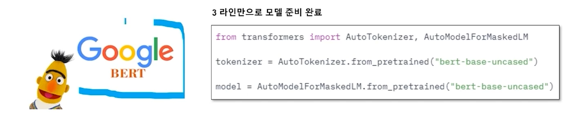
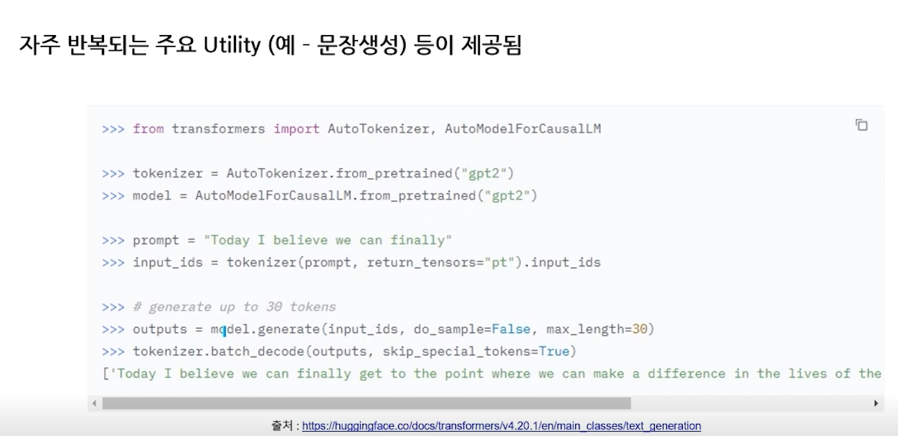

# Introduction

# Pre-question
- Transfer Learning
- 

NLP 처리를 위해서는 다음과 같은 3가지 자원이 필요하다.
- Model의 파라미터
- 어휘 사전 (Token, embeding value)
- Tokenization 방법

다양한 분야에서 Pre-trained model 제공한다.
- audio clasification
- image classification
- NLP

# Discussion

# Reference
- 네이버 AI 부트캠프 (* 강의 자료 바탕으로 재구성)