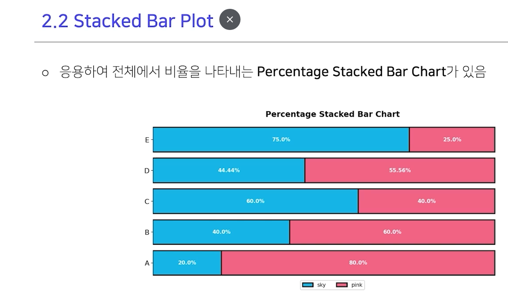

# Introduction

2022-10-27_seaborn_images/1666870117475.png)

2022-10-27_seaborn_images/1666870525633.png)

``` 

2022-10-27_matplotlib_images/1666868863278.png)

# Reference
- 네이버 AI 부트캠프 (* 강의 자료 바탕으로 재*구*성)