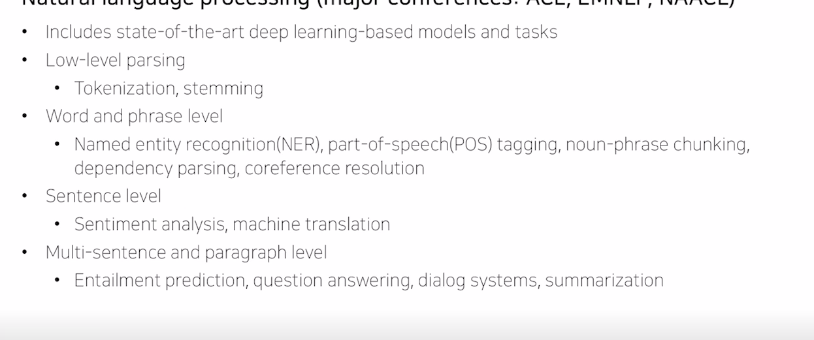
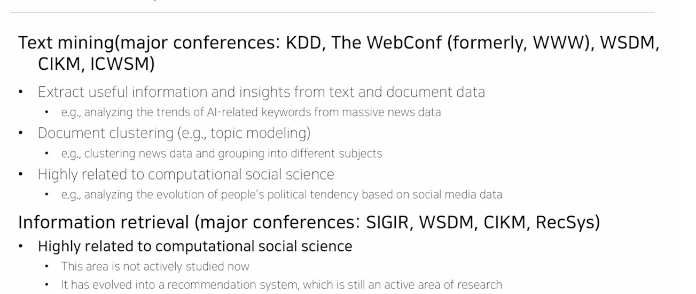
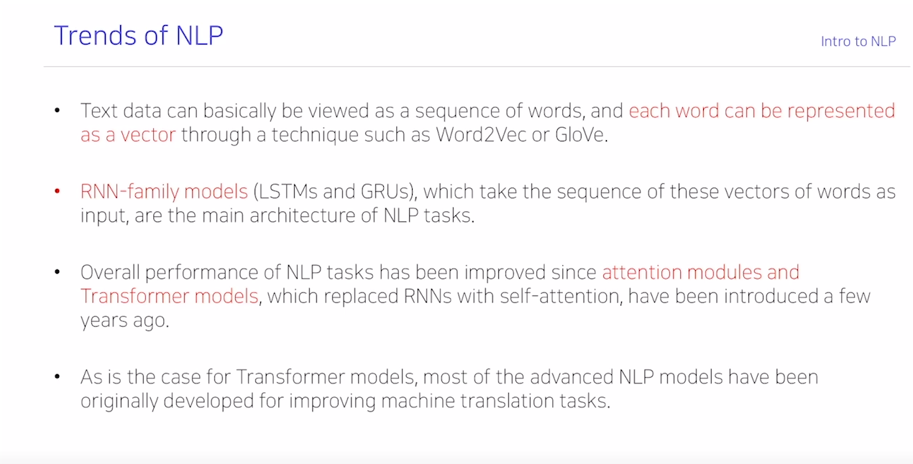
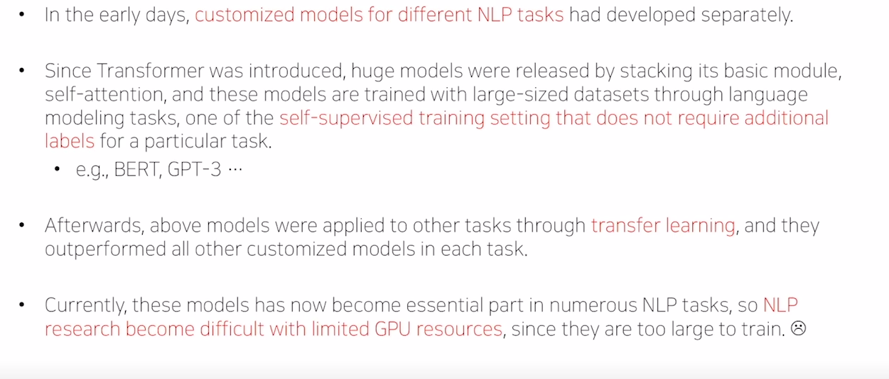
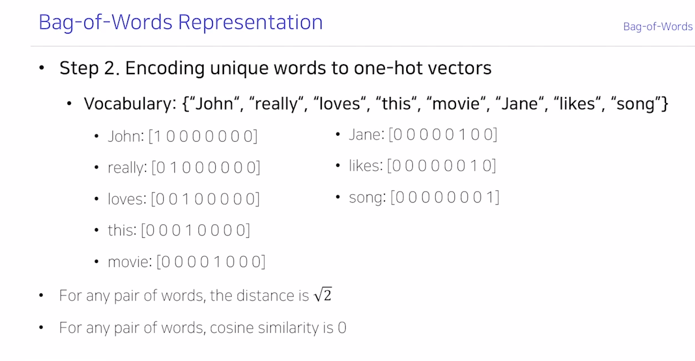
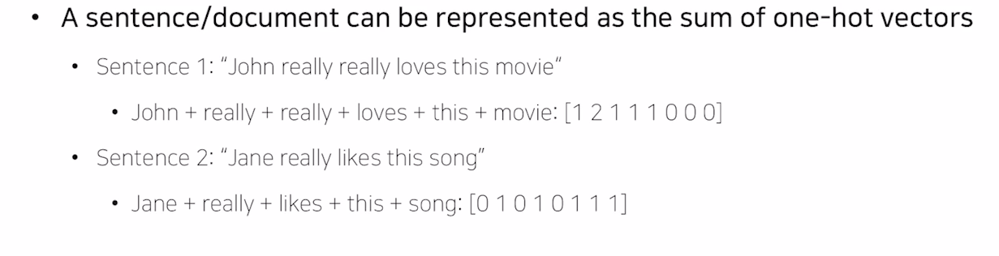
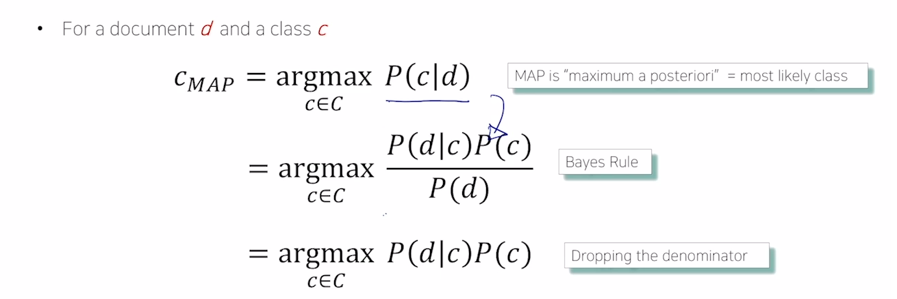
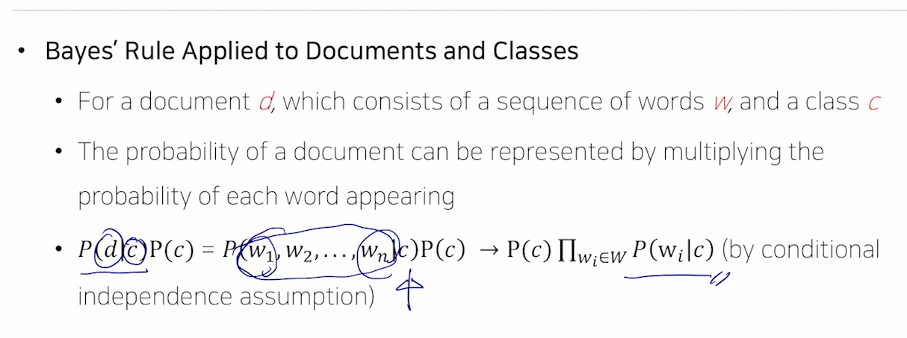
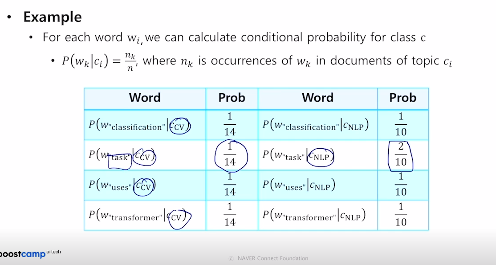
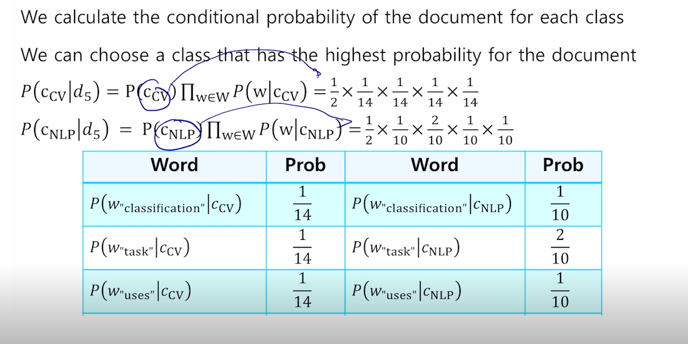

# Introduction

# Pre-question
- 단어를 벡터로 표현하는 방법, 문서를 벡터로 표현하는 방법

최근의 자연어처리 발전 동향

컴퓨터가 주어진 단어 문장을 이해한다.

NLP라는 분야는 딥러닝의 발전을 선도한다.
ACL, EMNLP, NAACL

Low-level parsing
- Tokenization, stemming
의미 단위로 볼 때 가장 LOW 레벨

Word and phrase level
- 문장 내에서 단어의 품사가 뭔지?
- 기계 번역

Sentence lelvel

Multi-sentence and paragraph level

qustion answering

트렌드 분석, 상품과 함께 등장한 내용들을 분석.

검색 성능이 고도화 -> 성숙화
: 상대적으로 느리다.

본 과정은 자연어 처리 

입력 중 일부 단어를 가리고 맞추게 하는 BERT

처음 할 일은 텍스트 데이터에서 유니크한 워드를 모으는 것.
마치 영어를 처음 배울 때 단어장을 만들 듯이..

naivebayes classifier for document classification

MLE 식의 유도 과정을 통해서 나옴
# Discussion

# Reference
- 네이버 AI 부트캠프 (* 강의 자료 바탕으로 재구성)