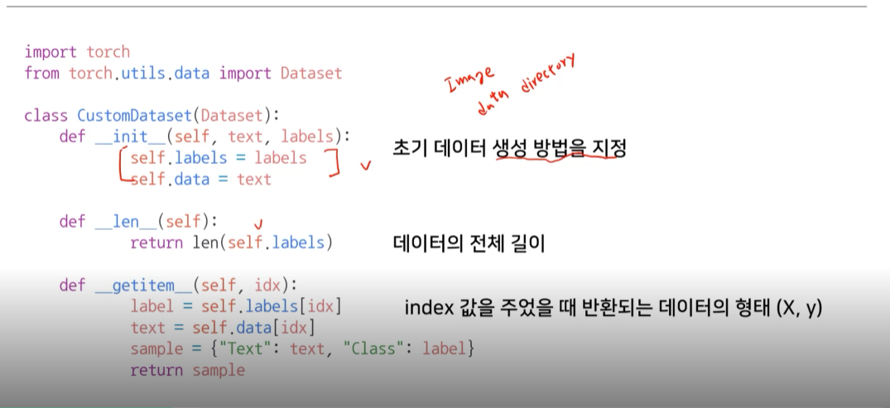
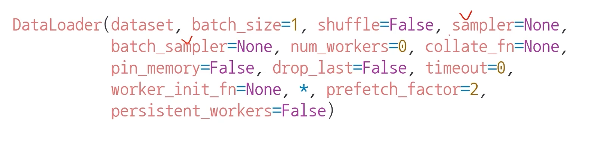

Pytorch 튜토리얼을 참고하였다.
   
## Dataset
데이터셋의 feature와 label을 지정하고, 이를 getitem 함수로 불러올 수 있는 객체이다.
Dataset class는 3개의 함수를 구현해야 하며, 그 함수들은 __len__, __init__, __getitem__ 이다.
1. __init__
getitem에서 필요한 정보를 초기화 시켜준다. normalization 등의 전처리를 위한 transform, data source path, label 등이 포함된다.
2. __len__
데이터셋의 샘플 개수를 반환한다.
3. __getitem__
주어진 인덱스에 해당하는 샘플을 데이터셋에서 불러오고 반환한다. 보통 X,y를 쌍으로 불러온다.

```python
import os
import pandas as pd
from torchvision.io import read_image

class CustomImageDataset(Dataset):
    def __init__(self, annotations_file, img_dir, transform=None, target_transform=None):
        self.img_labels = pd.read_csv(annotations_file, names=['file_name', 'label'])
        self.img_dir = img_dir
        self.transform = transform
        self.target_transform = target_transform

    def __len__(self):
        return len(self.img_labels)

    def __getitem__(self, idx):
        img_path = os.path.join(self.img_dir, self.img_labels.iloc[idx, 0])
        image = read_image(img_path)
        label = self.img_labels.iloc[idx, 1]
        if self.transform:
            image = self.transform(image)
        if self.target_transform:
            label = self.target_transform(label)
        return image, label
```
  
   
## Dataloader
모델을 학습 시 batch 단위로 dataset에서 샘플들을 모델에 전달하고, 학습을 하기 위한
과정을 추상화한 iterable 객체이다.
```python
from torch.utils.data import DataLoader

train_dataloader = DataLoader(training_data, batch_size=64, shuffle=True)
test_dataloader = DataLoader(test_data, batch_size=64, shuffle=True)
```
   
   
아래와 같이 iterable 객체에서 사용되는 함수(next)를 이용해 데이터셋을 직접 순회할 수도 있다.

```python
train_features, train_labels = next(iter(train_dataloader))
print(f"Feature batch shape: {train_features.size()}")
print(f"Labels batch shape: {train_labels.size()}")
img = train_features[0].squeeze()
label = train_labels[0]
plt.imshow(img, cmap="gray")
plt.show()
print(f"Label: {label}")
```
## @ 참고
https://tutorials.pytorch.kr/beginner/basics/data_tutorial.html
____
dataset 클래스
- 데이터 입력 형태를 정의하는 클래스이다.
- 데이터를 입력하는 방식의 표준화가 필요한데, 그걸 구현하는 게 클래스
- 데이터 형식, image, audio, text에 따라 입력이 달라진다.



__init__에서 모든 걸 다 해줘야 하나?
이미지의 텐서 변환은..
getItem할 때 변환한 텐션이 아니라, 학습이 필요한 시점에서 변환해줘도 됨.

cpu는 변환해주고, gpus는 학습 이렇게 병렬로 처리할 수 있다.

그래서 transform을 이용해 정의.

데이터 셋에 대한 표준화된 처리 방법 제공 필요
: 후속 연구자 또는 동료에게 빛과 같은 존재다

HuggingFace와 같은 표준화된 라이브러리를 사용한다.


- sampler
- batch_sampler
- collate_fn

 Further Question

DataLoader에서 사용할 수 있는 각 sampler들을 언제 사용하면 좋을지 같이 논의해보세요!
데이터의 크기가 너무 커서 메모리에 한번에 올릴 수가 없을 때 Dataset에서 어떻게 데이터를 불러오는게 좋을지 같이 논의해보세요!