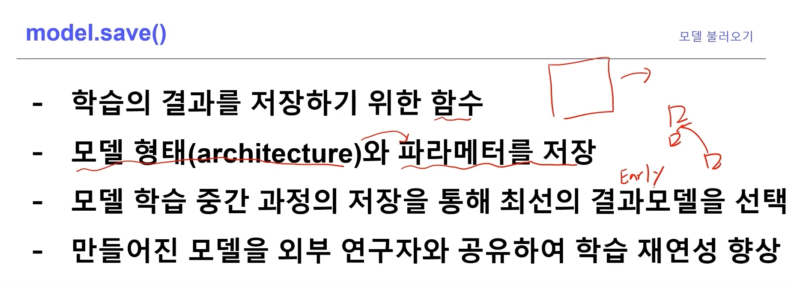
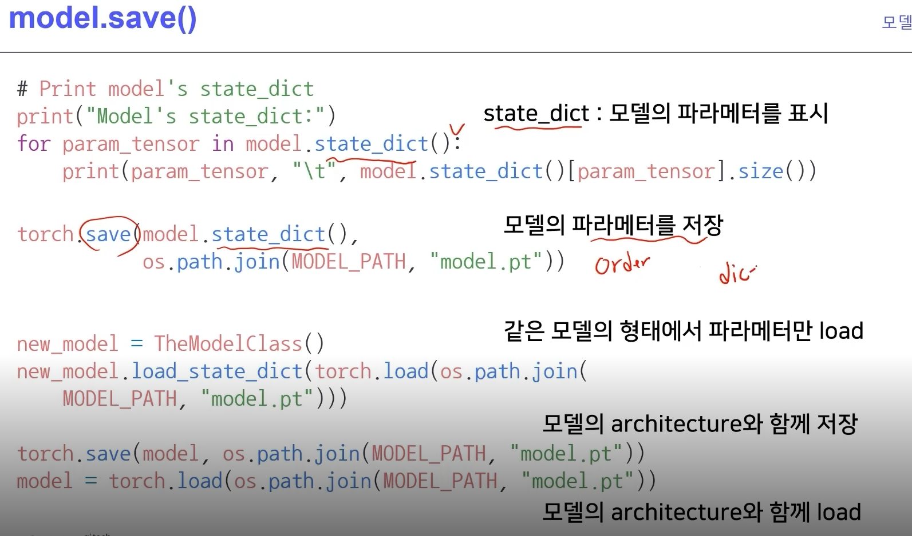
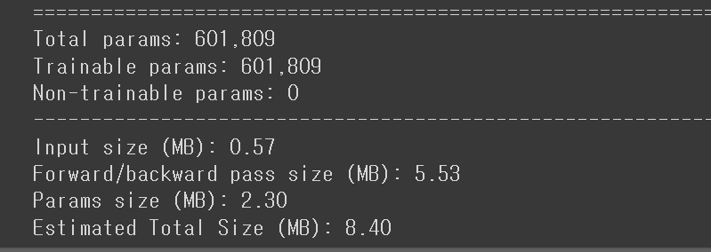
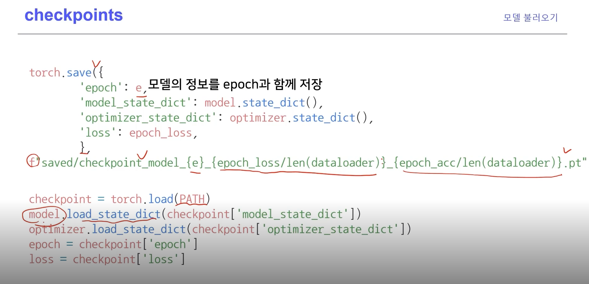
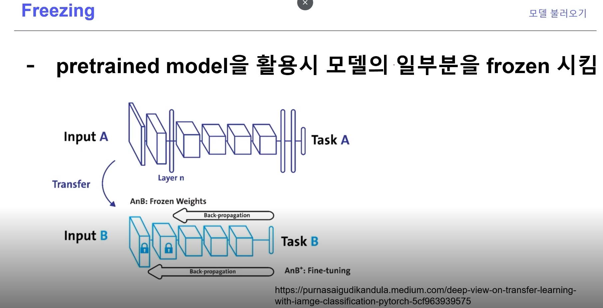
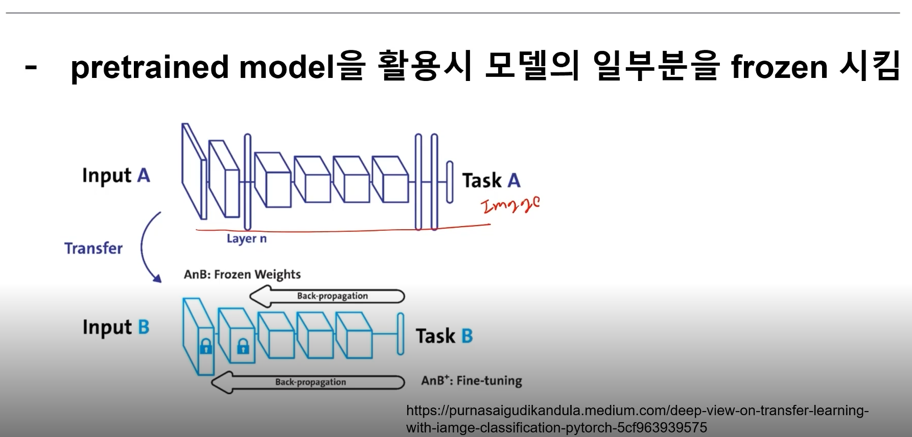
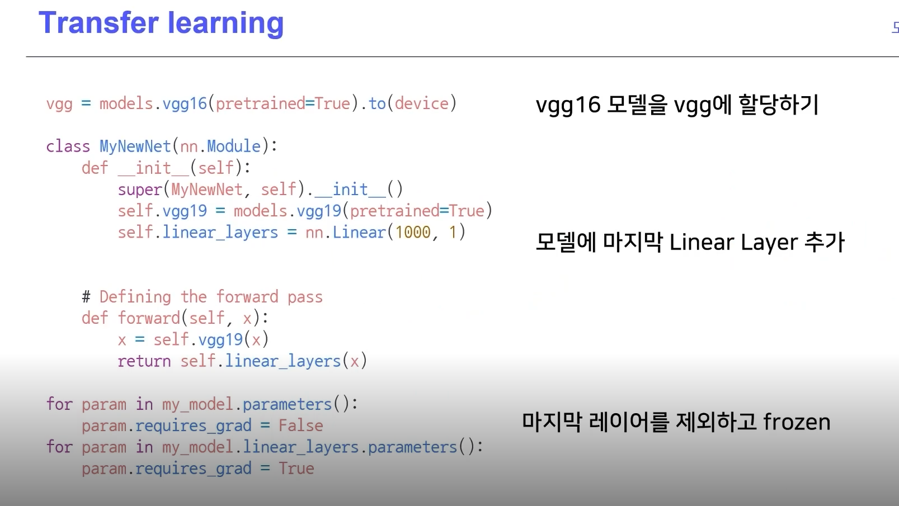
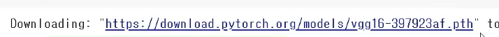

# Introduction
pytorch로 커스텀 모델을 만들 수 있다. 커스텀 모델을 만들기 위한 nn.Module 사용법 등을 알아본다.
 
# Pre-question

2022-04-15-torch9_hyperparm_tuning_images/1664810726861.png)
BOHB 기법
2022-04-15-torch9_hyperparm_tuning_images/1664810850649.png)

2022-04-15-torch9_hyperparm_tuning_images/1664810886043.png)

모델 불*러*오기

bert = 대세

fine-tuning
: transfer learning

학습 결과를 공유하고 싶다.
: 
학습 중간 과정의 저장을 통해 최선의 결과 모델을 선택함.
만든 모델을 외부 연구자와 공유해 학습 재연성 향상.

  

NLP는 허깅패이스가 푲ㄴ

Freezing-pretrained MODEL

요즘은
stepping freezing -> 순차적으로 freezing해서 한다.

pth -> pytorch extensing

# Reference
- 네이버 AI 부트캠프

- 
- https://www.youtube.com/watch?v=O2wJ3tkc-TU