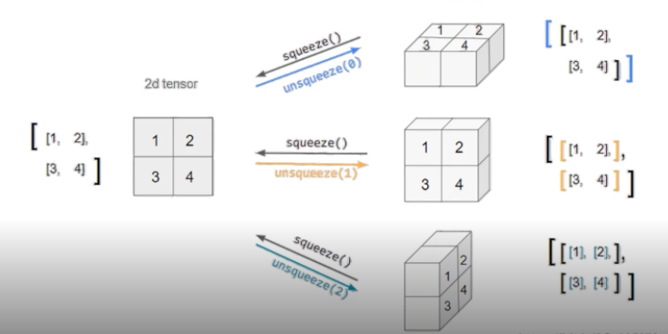

# Introduction
이 포스팅은 Pytorch에서 많이 다뤄지는 텐서의 기본적인 지식과 텐서를 효과적으로 다루기 위한 방법을 기록하였다.
내용은 파이토치 튜토리얼과 네이버 ai 부스트캠프를 참고하였다.

# Pre-question
- 파이토치에서 view, reshape, squeeze, unsqueeze는 어떤 용도로 쓰일까?

## 텐서
Pytorch에서는 텐서를 사용해서 모델의 입력과 출력 및 매개변수들을 encoding한다.  
Numpy의 ndarray와 유사하며, Automatic differentiation ([Autograd](https://tutorials.pytorch.kr/beginner/basics/autogradqs_tutorial.html)) 에
 최적화 되어있다.
기본적으로 필요한 모듈은 다음과 같다.
```python
import torch
import numpy as np
```
또한 Pytorch에서 텐서를 다루는 것은 numpy 구현 문법과 매우 비슷하나 일부 다른 부분이 있다. 이는 뒤에서 설명한다.

  
## 텐서 초기화
- 데이터로 부터 직접 생성   
```python
data = [[1,2],[3,4]]
x_data = torch.tensor(data)
```
   
- Numpy 배열로 생성       
from_numpy를 이용한다.
```python
np_array = np.array(data)
x_np = torch.from_numpy(np_array)
```
다른 예시인데, 아래와 같이 numpy를 정의하는 것과 tensor를 정의하는 것을 같이 확인해보자.   

```python
# numpy 정의
import numpy as np
n_array = np.arrange(10).reshape(2, 5)
print(n_array)
print("ndim :", n_array.ndim, "shape: ", n_array.shape)

# torch의 tensor 정의 방식
import torch
t_array = torch.FloatTensor(n_array)
print(t_array)
print("ndim :", t_array.ndim, "shape: ", t_array.shape)
```

3. 다른 텐서로 생성  
ones_like, zeros_like, rand_like 등을 사용한다.

```python
x_ones = torch.ones_like(x_data)
# 속성을 override.
x_rand = torch.rand_like(x_data, dtype=torch.float)
```
   
4. 상수값 사용
```python
shape = (2,3,)
ones_tensor = torch.ones(shape)
```
## 텐서 속성 확인.
tensor에는 shape, dytpe, device 등 다양한 attribute가 있다. dir(tensor)로 가능한 속성을 확인할 수 있다.
```python
tensor = torch.rand((3,4))
print(f"Shape : {tensor.shape}, DataType : {tensor.dtype}, Device : {tensor.device}")
```
   
   
## 텐서 연산
pytorch는 여러 텐서 연산을 지원한다. [링크](https://pytorch.org/docs/stable/torch.html)   

## to 연산 : 연산 장치 할당
각 연산들은 CPU는 물론 GPU에서 실행할 수 있다. 어떤 장치로 연산을 할지 할당하기 위해 .to 메소드를 사용할 수 있다.
보틍은 nn.module 상속한 모델을 만들어서 모델에 직접 .to을 적용한다. 그러나 여기서는 텐서를 GPU 연산에 할당하는 방법만 확인해보자..
```python
import torch.cuda
x_data.device
# device 속성은 해당 텐서가 어떤 장치를 사용해 연산하는지를 나타낸다.
# cpu라면 오른쪽 처럼 출력된다 : device(type='cpu')

if torch.cuda.is_available()
 x_data_cuda = x_data.to("cuda")
x_data_cuda.device
# device(type='cuda', index=0)
```
    
## 인덱스와 슬라이싱, stack, unstack
아래와 같이 인덱싱과 슬라이싱도 numpy처럼 사용할 수 있으며, cat, stack을 이용해 합칠 수 있다.
```python
tensor = torch.ones((4,4))
print(f"First row:{tensor[0]}, First col:{tensor[:,0], Last col:{tensor[...,-1]}")
# cat 함수 : 차원수는 그대로 하되, 특정 차원(dim)의 요소를 concat
# 아래의 결과로는 (4,12)의 shape를 가진 텐서가 나옴.
print(torch.cat([tensor, tensor, tensor], dim=1))

# stack은 dim으로 설정한 차원을 추가한다.
# 아래의 결과로는 (4,4,3). dim=1이면 (4,3,4)
print(torch.stack([tensor, tensor, tensor], dim=1))
```

## squeeze, unsqueeze : 차원 축소/확장
데이터값 변경 없이 차원을 축소하거나 확장하는 squeeze, unsqueeze가 있다. 
- squeeze : 차원의 개수가 1인 차원을 삭제 (압축)
- unsqueeze: 차원의 개수가 1인 차원을 추가



## view, reshape : 텐서의 shape 구조 변경
아래 예제 코드를 확인해보자.
```python
tensor_ex = torch.rand(size=(2, 3, 2))
tensor_ex
# view, reshape 둘다 텐서의 차원 구조를 변경한다.
tensor_ex.view([-1, 6])
tensor_ex.reshape([-1,6])
a = torch.zeros(3, 2)
# 차이점으로 view는 보는 shape만 다르게 하고 참조 데이터와 같은 메모리를 공유한다.

b = a.view(2, 3)
a.fill_(1)
b
# tensor([[1., 1.],
#        [1., 1.],
#        [1., 1.]])

# 그러나 아래와 같이 reshape 경우는 메모리 공간을 반드시 공유하지는 않는다.
a = torch.zeros(3, 2)
b = a.t().reshape(6)
a.fill_(1)
b
# tensor([0., 0., 0., 0., 0., 0.])
```


##두 텐서간의 산술연산
element-wise product는 *또는 mul, 매트릭스 곱셈은 @이나 matmul 또는 mm을 사용한다.    
mm과 matmul은 연산은 동일하지만, broadcasting 지원에 차이가 있다.
matmul은 broadcasting을 지원하나 mm은 지원을 안해준다.  
 근데 broadcasting이 결과를 헷갈리게 할 수 있으므로 mm이 권장되기도 한다.
```python
# matrix multiplicaton
y1 = tensor @ tensor.T
y2 = tensor.matmul(tensor.T)
out = torch.matmul(tensor,tensor.T)

# element-wise product
z1 = tensor * tensor
z2 = tensor.mul(tensor)
out = torch.mul(z1, z2)
```
참고로 벡터간 내적을 구하려면 dot을 쓸 수 있다.
  
single-element 연산, 텐서의 요소값이 하나로 aggregate된다.
```python
agg = tensor.sum()
# item()을 사용해 python 숫자값으로 변환가능.
agg_item = agg.item()
print(agg_item,type(agg_item))
```

## Numpy bridge
CPU상에서 텐서와 Numpy 배열은 메모리 공간을 공유하므로, 하나가 변경되면 다른 하나도 변경된다.
```python
t = torch.ones(5)
n = t.numpy()
# in-place 연산
t.add_(1)
print(f"t:{t}, n:{n}")
# 새로 할당할 경우에는 결과가 다름.
t = t.add(1)
print(f"t:{t}, n:{n}")
```

## nn.functional 모듈
딥러닝에서 유용하게 쓸 수 있는 다양한 함수를 지원한다. 
```python
import torch
import torch.nn.functional as F

tensor = torch.FloatTensor([0.5, 0.7, 0.1])
h_tensor = F.softmax(tensor, dim=0)
```

## Autograd
 PyTorch의 핵심은 자동 미분의 지원이며, backward 함수를 사용해 자동 미분을 경험할 수 있다.
아래 requires_grad를 True로 하면, 해당 파라미터의 grad 값을 구할 수 있다.
```python
w = torch.tensor()(2.0, requires_grad=True)
y = w**2
z = 10*y + 25
z.backward()
w.grad
```
물론 이렇게 텐서 단위로는 보통 안하고, 모델 수준에서 autograd라는 함수를 그냥 사용한다.
왜냐면 이미 torch에서 모듈로 구현된 레이어 내부에서 requires_grad가 이미 true로 세팅되어있기 때문이다.

## 기타 조작 함수
선형 대수를 포함해 매우 다양하고 많은 tensor 조작 함수가 있다.
본 포스팅에 나온 내용 이외에도 눈여겨볼만한 함수들을 기록하였다.
- gather 함수 
https://pytorch.org/docs/stable/generated/torch.gather.html#torch.gather
```python
out[i][j][k] = input[index[i][j][k]][j][k]  # if dim == 0
out[i][j][k] = input[i][index[i][j][k]][k]  # if dim == 1
out[i][j][k] = input[i][j][index[i][j][k]]  # if dim == 2
```
- scatter 함수 
https://pytorch.org/docs/stable/generated/torch.Tensor.scatter_.html#torch.Tensor.scatter_
```python
self[index[i][j][k]][j][k] = src[i][j][k]  # if dim == 0
self[i][index[i][j][k]][k] = src[i][j][k]  # if dim == 1
self[i][j][index[i][j][k]] = src[i][j][k]  # if dim == 2
```

- expand 함수
https://pytorch.org/docs/stable/generated/torch.Tensor.expand.html?highlight=expand

- check 함수
https://pytorch.org/docs/stable/generated/torch.chunk.html#torch.chunk

- swapdims 함수
https://pytorch.org/docs/stable/generated/torch.swapdims.html#torch.swapdims

- 랜덤 샘플링 함수
https://pytorch.org/docs/stable/torch.html#random-sampling

- einsum 함수
https://pytorch.org/docs/stable/generated/torch.einsum.html#torch.einsum


## Reference
- https://tutorials.pytorch.kr/beginner/basics/quickstart_tutorial.html
- 네이버 AI 부스트캠프


