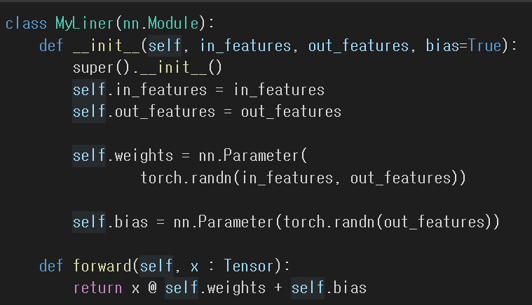
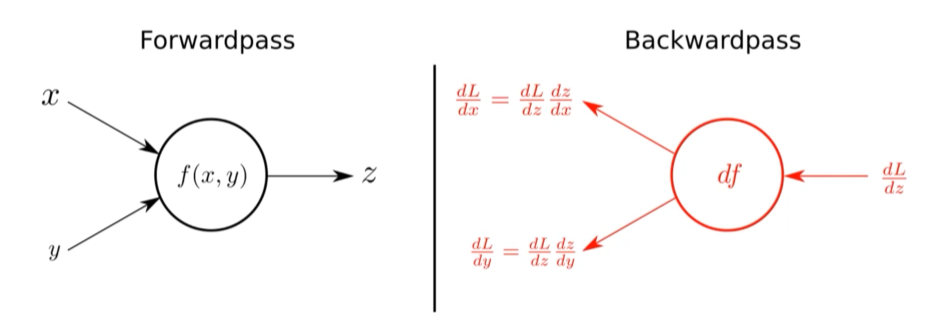
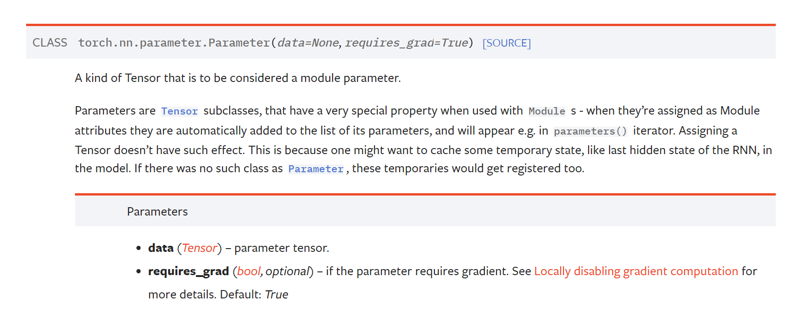

# Introduction
DL 모델은 수많은 레이어가 마치 레고블럭처럼 조립되는 것과 같다. 조립을 위해서는 레이어의 특성과 효율적인 조립 방법을 알아야 한다.    
또한 성능면이나 속도 면에서든 효율적인 추론을 위해 자동 미분의 핵심이 되는 optimizer를 어떻게 구성할 것인지 알아야한다.    
 optimizer를 어떻게 조립해 구성할지, 어떤 프로세스로 자동 미분이 일어날지도 같이 알아보자.

# Pre-question
- 1 epoch에서 이뤄지는 모델 학습 과정을 정리해보자.
- 모델 추론 성능 및 추론 속도를 올리기 위해서 어떤 부분을 먼저 고려하면 좋을지 같이 논의해보자.
- autograd가 무엇이고 어떤 프로세스로 동작하는지 알아보자.
- optimizer.zero_grad()를 안하면 어떤 일이 일어날지 그리고 매 batch step마다 항상 필요한지 논의해보자.

# 레이어 구성
하나의 레이어를 구성한다면 다음과 같이 구성할 수 있다. linear 레이어의 예시다.


## torch.nn.Module
- torch.nn.Module은 딥러닝을 구성하는 layer의 base class이다. 
- 이 레이어를 정의하려면 **input, output, forward, backward를 모두 정의**해야 한다.
- backward는 autograd에 의한 자동미분이다.
- 그리고 학습의 대상이 되는 모델의 param(tensor)에 대해 정의해야 한다. 

아래 이미지에서 입력 x, y를 받아 z를 출력하는 forwardpass와 LOSS 함수 L에 대해 z, y, x를 (편)미분한 값을 구하는 backwardpass 과정이 레이어의 핵심이다.



## nn.Parameter
- Tensor 객체의 상속 객체이다.
- nn.Module 내에 attribute가 될 때는 required_grad = True로 해줘야 한다. 그래야 학습의 대상이 되기 때문이다. 따라서 nn.Parameter에서는 기본적으로 required_grad를 True로 둔다. 
- 다만 우리가 직접 이 파라미터를 조정할 필요는 없다. 이미 linear, convolutional layer에서 어떤 파라미터를 써야하는지 기본적으로 구성되어 있기 때문이다.



# Backward
- Layer에 있는 Parameter들의 미분을 수행한다.
- Forward의 결과값인 model의 output과 실제값간의 차이(loss)에 대해 미분을 수행한다. 그래서 Forward의 output은 꼭 넣어주어야 한다.
- 해당 값으로 Parameter 업데이트를 한다.
```python
# loss 함수와 loss함수 값을 최소화하기 위한 optimizer를 정의한다.
criterion = torch.nn.MSELoss() 
optimizer = torch.optim.SGD(model.parameters(), lr=learningRate)

for epoch in range(epochs):
    # gradient buffer에 있는 값들을 초기화해준다. 이전 gradient값이 현재 gradient에 영향을 주지 않게 하기 위해서임.
    optimizer.zero_grad()
    # forward propagation으로 예측값을 계산하기 위한 코드
    output = model(inputs)
    # loss함수를 이용해 loss를 계산한다.
    loss = criterion(outputs, labels)
    # loss에 대한 학습 파라미터의 편미분 값들을 계산한다. 
    # backward를 실행하면 optimizer가 동작해서 미분이 된다.
    loss.backward() 
    # parameters를 업데이트한다.
    optimizer.step()
```
# optimizer.zero_grad()를 사용하는 이유
다음과 같이 gradient descent를 low level에서 구하는 코드를 보자. (*네이버 ai 부트코스 코드를 일부 참조)

```python
for i in range(epoch):
    _y = train_x * w + b
    # L2 norm
    error = np.sum((_y - train_y) ** 2) / n_data
    
    gradient_w = np.sum((_y - train_y) * train_x) / n_data
    gradient_b = np.sum((_y - train_y)) / n_data

    w = w - lr_rate * gradient_w
    b = b - lr_rate * gradient_b

    # plot으로 확인하기 위함
    errors.append(error)
```
보면 데이터 개수 만큼 gradient_w, gradient_b에 np.sum을 적용해 대입하는 것을 볼 수 있다.
torch에서 backward를 하면 이 연산이 대입연산(=)이 아니라 += 로 처리된다. (즉, **이전 데이터에서 계산된 gradient가 누적된다는 뜻**.)

그래서 loss가 원하는 결과값으로 수렴할 수 없다.

그러면 loss.backward()에 그냥 집어넣어 패키징하면 되지, 왜 따로 optimizer.zero_grad()를 사용하게 만들었을까?

RNN에서는 loss.backward() 시 gradient을 누적해 계산해야하는 경우가 있기 때문이다.

아래 RNN의 BPTT를 구현하는 코드 일부를 보면, timestep마다 grad를 계산하는 for문 내 재귀를 돌 때,
wx_grad와 ws_grad이 대입(=)이 아니라 +=를 사용하였다. 
```python
# 네이버 ai 부트코스 코드를 일부 참조
def backward_gradient(X, S, grad_out, wRec):
    """
    X: input
    S: 모든 input 시퀀스에 대한 상태를 담고 있는 행렬
    grad_out: 최종 output에 대한 gradient
    wRec: 재귀적으로 사용되는 학습 파라미터
    """
    # 초기화
    grad_over_time = np.zeros((X.shape[0], X.shape[1]+1))
    grad_over_time[:,-1] = grad_out
    # gradient accumulations 초기화
    wx_grad = 0
    ws_grad = 0

    for k in range(X.shape[1], 0, -1):
        # np.sum + np.mean : 다차원 tensor에 대한 일반화
        wx_grad += np.sum(
            np.mean(grad_over_time[:,k] * X[:,k-1], axis=0))
        ws_grad += np.sum(
            np.mean(grad_over_time[:,k] * S[:,k-1], axis=0))
        grad_over_time[:,k-1] = grad_over_time[:,k] * wRec
        optimizer.zero_grad()
    return (wx_grad, ws_grad), grad_over_time

```

## Reference
- 네이버 AI 부트캠프 (원본에서 재구성)


