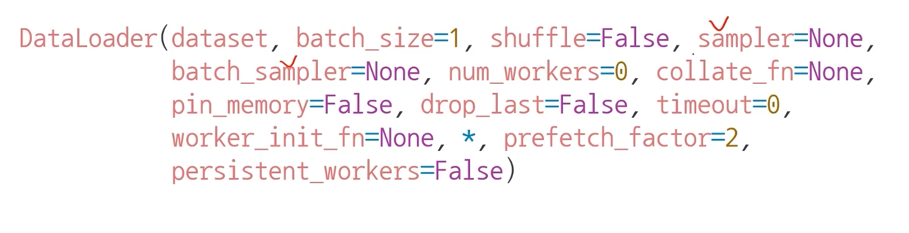

# Introduction
파이토치로 만든 모델에 어떻게 데이터를 feeding할지 정해야 한다. 정해진 형식이 없다면, ML엔지니어들이 중구난방으로 feeding 방법에 대한 코드를 짤 것이다.      
다행히도 **파이토치는 Transform, Dataset, Dataloader라는 클래스를 지원해주며, 개발자는 이 클래스를 상속하여 커스텀 데이터도 손쉽고 체계적으로 모델에 feeding할 수 있다.**     

※ 아래는 모델에 데이터를 feeding 하기 위한 과정을 표현한 다이어그램이다.      


이번 포스팅에서는 dataset과 dataloader를 사용하는 방법을 알아보자.
정리된 내용은 Pytorch 튜토리얼과 네이버 ai 부트캠프 강의를 모두 참고하였다.
   


# Pre-question
- DataLoader에서 사용할 수 있는 각 sampler들을 사용하기 적절한 상황은?
- 데이터의 크기가 너무 커서 메모리에 한번에 올릴 수가 없는 경우가 많다. 이를 해결하기 위해 Dataset또는 Dataloader에서 어떻게 처리하면 좋을까?

# Dataset
데이터셋의 feature와 label을 지정하고, 이를 getitem 함수로 불러올 수 있는 객체이다.
Dataset class는 3개의 함수를 구현해야 하며, 그 함수들은__len__, __init__, __getitem__ 이다.
1. __init__ :
getitem에서 필요한 정보를 초기화 시켜준다. normalization 등의 전처리를 위한 transform, data source path, label 등이 포함된다.
2. __len__
데이터셋의 샘플 개수를 반환한다.
3. __getitem__
주어진 인덱스에 해당하는 샘플을 데이터셋에서 불러오고 반환한다. 보통 X,y를 쌍으로 불러온다.

주의할 것은 __init__에서 모든 걸 다 해줄 필요는 없다. getitem에서 전처리를 하는 경우가 많다.     
이는 메모리나 처리 효율성 문제 때문이기도 한데, **torch에서 cpu가 데이터를 feeding할 때 gpu에서 동시 학습을 시킬 수 있기 때문이다.**    
그래서 전처리 용도로 쓰는 transform의 정의는 __init__에서 하고 아래 getitem에서 실제로 적용한다.


```python
import os
import pandas as pd
from torchvision.io import read_image

class CustomImageDataset(Dataset):
    def __init__(self, annotations_file, img_dir, transform=None, target_transform=None):
        self.img_labels = pd.read_csv(annotations_file, names=['file_name', 'label'])
        self.img_dir = img_dir
        self.transform = transform
        self.target_transform = target_transform

    def __len__(self):
        return len(self.img_labels)

    def __getitem__(self, idx):
        img_path = os.path.join(self.img_dir, self.img_labels.iloc[idx, 0])
        image = read_image(img_path)
        label = self.img_labels.iloc[idx, 1]
        if self.transform:
            image = self.transform(image)
        if self.target_transform:
            label = self.target_transform(label)
        return image, label
```
  
   
# Dataloader
모델을 학습 시 batch 단위로 dataset에서 샘플들을 모델에 전달하고, 학습을 하기 위한
과정을 추상화한 iterable 객체이다.
```python
from torch.utils.data import DataLoader

train_dataloader = DataLoader(training_data, batch_size=64, shuffle=True)
test_dataloader = DataLoader(test_data, batch_size=64, shuffle=True)
```

아래와 같이 iterable 객체에서 사용되는 함수(next)를 이용해 데이터셋을 직접 순회할 수도 있다.

```python
train_features, train_labels = next(iter(train_dataloader))
print(f"Feature batch shape: {train_features.size()}")
print(f"Labels batch shape: {train_labels.size()}")
img = train_features[0].squeeze()
label = train_labels[0]
plt.imshow(img, cmap="gray")
plt.show()
print(f"Label: {label}")
```

## DataLoader의 파라미터
DataLoader는 개발자의 편의를 위해 매우 다양한 파라미터를 가지고 있다.    

     

아래 파라미터가 주로 사용된다.
- batch_size : 배치 사이즈를 의미한다. GPU 메모리가 부족하단 OOM이 뜰 경우 배치 사이즈 먼저 줄인다.
- shuffle : dataloader에서 데이터를 섞을지 여부를 설정한다. 
- sampler / batch_sampler :  데이터의 index를 설정한 sampler의 규칙대로 컨트롤한다. 따라서 shuffle은 false이어야 한다. [관련글 링크](https://towardsdatascience.com/pytorch-basics-sampling-samplers-2a0f29f0bf2a)
  - SequentialSampler : 항상 같은 순서로 샘플링
  - RandomSampler : 랜덤이나 replacemetn 여부 선택 가능, 개수 선택 가능
  - SubsetRandomSampler : 랜덤 리스트, 위와 두 조건 불가능
  - WeigthRandomSampler : 가중치에 따른 확률
  - BatchSampler : batch단위로 sampling 가능
  - DistributedSampler : 분산처리 (torch.nn.parallel.DistributedDataParallel과 함께 사용)
- num_workers : 데이터를 불러올 때 사용하는 서브 프로세스 개수이다. 사용할 프로세스 수는 CPU 개수에 맞게 늘려야 하며, 너무 늘릴 경우 병목이 생길 수 있다. [관련글 링크](https://jybaek.tistory.com/799) 
- collate_fn : sample list를 batch 단위로 바꾸기 위해 필요한 기능이다. zero-padding 등 데이터 사이즈를 맞추기 위해 사용이 많이 된다.  [관련글 링크](https://deepbaksuvision.github.io/Modu_ObjectDetection/posts/03_01_dataloader.html)


# Discussion
- 이렇게 dataset, dataloader를 사용해 데이터 셋에 대한 표준화된 처리 방법을 활용한다면, 후속 연구자 또는 동료에게 매우 도움이 된다.
- NLP 데이터는 특히 HuggingFace와 같은 표준화된 라이브러리를 사용한다.

# Reference
- [파이토치 공식](https://tutorials.pytorch.kr/beginner/basics/data_tutorial.html)
- 네이버 AI 부트캠프 (원본에서 재구성)


