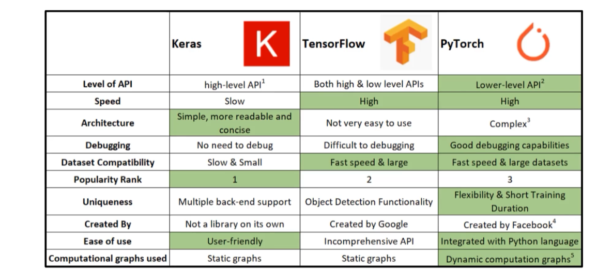

# Introduction
 파이토치는 딥러닝을 만드는데 기본이 되는 프레임워크로, 2022년 기준 모델 연구에 사용되는 DL 프레임워크 중 가장 많은 사용층을 보유하고 있다.    

# 딥러닝 프레임워크간 비교
다음은 주로 사용되는 딥러닝 프레임워크 비교표이다.
    
(* 네이버 ai 부트캠프에서 발췌한 자료)
- 여기서 keras는 일종의 wrapper로 쓰여서 간단히 DL을 구현하고자 할 때 사용한다. 실제로 내부 구조를 까보면 엔진은 텐서플로우 등으로 되어있다.

## computational graph 관점
- Tensorflow :define and Run
: 그래프를 먼저 정의하고 실행 시점에 데이터를 feed한다. 

- Pytorch : define by Run
: 실행 시점에서 그래프를 정의하는 방식, dynamic computational graph라고도 한다.
즉시 결과를 확인이 가능하며 pythonic code를 작성하기가 쉽다.

## 사용 도메인 관점
- Tensorflow : 프로덕션이나 클라우드 또는 멀티gpu에 최적화된 장점이 있다.
- Pytorch : 2022기준 연구쪽에서 많이 쓰인다. 그러나 실무적인 부분으로도 영역을 확장하고 있다.

# Discussion
- 사용하고 있는 DL 프레임워크가 있다면 왜 내가 그 프레임워크를 사용하는지 알고 있어야 한다. 
- 예를 들어 지금 석박사 또는 research scientist를 한다면 SOTA 논문들이 파이토치로 구현되어있을 것이니 파이토치를 많이 쓸 것이다. 
- 또는 비젼 분야에서 엣지 디바이스 개발을 할 경우 텐서플로우가 TFLife와 같은 경량화 툴 등 프로덕션 레벨에서 사용하기 위한 좋은 에코시스템이 형성이 되어있으므로 이것들을 활용하면 좋을 것이다.
- 최성철 디렉터님께서는 pytorch를 **Numpy + autograd + function**로 정의한다. 왜 이렇게 정의할 수 있는지를 직접 배우면서 생각해보는 것도 좋을 것 같다.

# Reference
- 네이버 AI 부트캠프 (* 강의 자료 바탕으로 재구성)   
- [딥러닝 프레임워크 비교](https://en.wikipedia.org/wiki/Comparison_of_deep_learning_software)
- [파이토치 튜토리얼](https://tutorials.pytorch.kr/beginner/basics/quickstart_tutorial.html)    