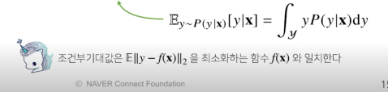
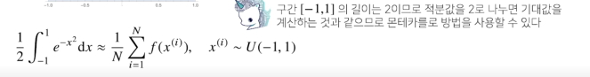

# Introduction
딥러닝은 확률론 기반의 기계학습 이론에 바탕을 둔다.
손실함수들은 모두 데이터 공간을 통계적으로 해석해서 유도함.
 * 예측이 틀림 위험을 최소화하도록 데이터를 학습

회귀함수에서 손실함수로 사용되는 L2 노름은
예측 오차의 분산을 가장 최소화하는 방향으로 학습
분류 문제에서 사용되는 교차 엔트로피는 모델 예측의 불확실성을 최소화하는 방향

분산 및 불확실성을 최소화하는 방법

확률 분포는 데이터의 초상화 
데이터 공간을 X x Y라고 할 때 D는 데이터 공간에서 데이터를 추출하는 분포다.

데이터는 확률 변수로 (X, y) ~ D라 표기

확률 분포 d에 따라 이산형과 연속형 확률 변수로 구분된다.

이산형 확률 변수는 확률 변수가 가질 수 있는 모든 경우의 수를 모두 고려해 확률을 모두 더해서 모델링

연속형 확률 변수는 데이터 공간에 정의된 확률변수의 밀도 위에서 적분을 통해 모델링한다.

결합분포 P(X, y): X일 때 y일 확률.

주변확률 분포 P(x) : 입력 x에 대한 주변확률분포 = y에 대한 정보를 주지는 않음.

조건부 확률 분포 P(x|y) : 데이터 공간에서 입력 x와 y 사이의 관계를 모델링. 예를 들어 y=1인 경우에만 카운팅해서 주변확률 분포를 계산. 

조건부 확률 분포 P(y|x) : x이 주어진다면 정답이 y일 확률

로직스틱 회귀에서 사용했던 선형 모델과 소프트맥수 함수의 결합은 데이터에서 추출된 패턴을 기반으로 확률을 해석한다.
분류 문제에서 softmax(WΦ+ b)는 x로 부터 추출된 특징패턴 Φ(x)과 가중치행렬 W를 통해 조건부 확률  

회귀 문제는 연속된 실수 범위에서 정답을 구해야 하므로 카테고리에 대한 확률이 아니라 밀도함수를 통한 기댓값으로 추정한다.

데이터를 대표하는 통계량이며 동시에 확률분포를 통해 다른 통계적 범함수를 계산하는데 사용한다.

분산 :
첨도 : 
공분산 : 

조건부 확률과 기계학습
조건부 확률은 입력변수 x에 대해 정답이 y일 확률이다.

몬테카를로 샘플링 방법
독립 추출만 보장되면 대수의 법칙에 의해 수렴성이 보장된다.

 

# Pre-question

# Discussion

# Reference
- 네이버 AI 부트캠프 (* 강의 자료 바탕으로 재구성)            