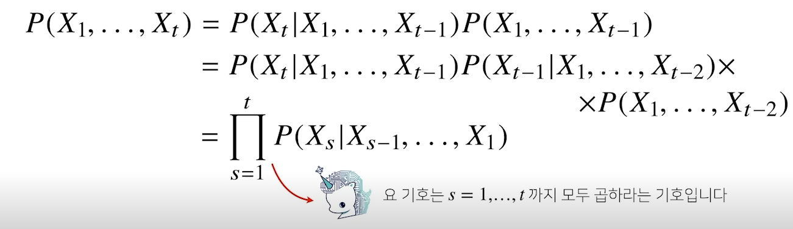

# Introduction

# Pre-question
- 기존 MLP는 왜 과거의 정보를 제대로 다룰 수 없을까?
- 
# 시퀀스 데이터란?
순차적으로 들어오는 데이터, 이를테면 소리, 문자열, 주가 등의 데이터를 시퀀스 데이터라고 한다.
소리라고 한다면, 음성 데이터도 소리 데이터
문자열 데이터도 
텍스트 같은 문장도 시퀀스

시계열 데이터 또한 시간 순서에 따라 나열된 데이터라 시퀀스 데이터에 속한다.

시곙려ㅑ 데이터

주요한 특징으로 독립동등분포(i.i.d) 가정을 위배한다는 특징이 있다. 이말은 순서를 바꾸거나 과거 정보에
손실이 발생하면 데이터의 확률 분포도 바뀐다는 것이다

예를 들어
개가 사람을 물었다. 라는 데이터의 순서를 바꿔서 사람이 개를 물었다. 랃고
한다면, 이 문장의 의미가 완전히 달라지고 또한 문장이 발생할 빈도 또한 다를 것이다.

이전 시퀀스의 정보로 앞으로 발생할 데이터의 확률 분포를 다루기 위해
조건부확률을 이용할 수 있다.

그러나 위 식에서 나온 것처럼 모든 과거 정보가 필요하지는 않다.

 
예를 들어 2021년 기업 A의 주가를 당장 예측한다고 할 때, 30년전 20년 전 데이터가 필요하지는 않다.

길이가 가변적인 데이터를 다룰 수 있는 모델이 필요하다.

고정된 길이만의 시퀀스만 사용하면 Autoregresive Model이라고 한다.

문제에 따라서 타우가 바뀔 수 있다. 어떤 경우는 길고 어떤 경우는 짧고 해야한다.

각 경우의 모델링은 
예를 들어 아래 경우처럼 직전 정보를 제외하고 나머지 정보를 Ht라는 잠재변수로 인코딩해서 활용가능하다.

아래와 같이 단순한 MLP 모델 레이어가 식으로 주어진다.
근데 이 모델은 과거의 정보를 다룰 수 없다. 현재의 입력값만 들어오기 때문이다.

MLP와 유사한 모양이나, 새로운 가중치 TERM이 생긴다.

유의할 것은 가중치가 3개
W(1)X과 과거 정보를 인코딩 한 W(1)H
W(2) 출력으로 만들어주는 가중치
이 3개의 W는 t에 따라 변하지 않는 가중치다.

## BPTT
빨간색이 그레디언트 전달 경로
 

시퀀스가 긴 경우..

길이를 끊는 것이  중요하다.
Truncated BPTT : 과거에 해당하는 블럭 일부 잘라서 사용한다.

그러나, 이게 모든 해결하진 않아서 등장한 RNN 네트워크가 LSTM GRU다.

# Reference
- 네이버 AI 부트캠프 (* 강의 자료 바탕으로 재구성)            