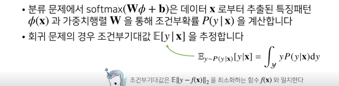
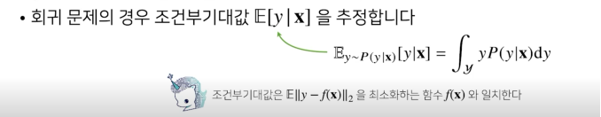
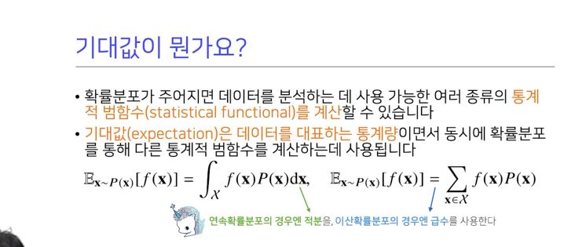

# Introduction
 기계 학습이론은 통계학에서 발전하였으며, 통계학은 확률론에 기본 뼈대를 둔다.    
 딥러닝에서 사용되고 있는 손실함수들은 모두 데이터 공간을 통계적으로 해석해서 유도한다. 이는 예측이 틀린 위험을 최소화하도록 하기 위한 것이다.
예를 들면,
- 회귀함수에서 손실함수로 사용되는 L2 노름은 예측 오차의 분산을 가장 최소화하는 방향으로 학습한다.
- 분류 문제에서 사용되는 교차 엔트로피는 모델 예측의 불확실성을 최소화하는 방향으로 학습한다.

이 포스팅에서는 확률론에 대한 기초적인 지식을 공유한다.

# Pre-question
- 확률과 가능도의 차이는 무엇일까? 개념과 수식적 차이를 설명해보자.
- 확률 대신 가능도를 사용하였을 때의 이점은 어떤 것인가?

# 확률 분포 = 데이터의 초상화
데이터 공간이 X x Y로 구성되어 있다고 가정하고, D를 이 데이터 공간에서 데이터를 추출하는 분포라고 하자.    
주의할 것은 **D는 사전에 알 수 없고 이론적으로만 존재하는 확률 분포**이다. 현재 관찰가능한 데이터로 추정한 (또는 모델링한) 실제 분포라고도 볼 수 있다.       
데이터 공간을 '가정'한다는 표현을 쓴 이유도 확률 분포 모델링을 위해 임의로 공간을 정의한 것이기 때문이다.

2022-09-19-Prohbability_images/1663949036681.png)

데이터는 확률 변수로 (x, y) ~ D라 표기하자. 이는 **데이터 공간 상에서 현재 관측가능한 데이터**를 의미한다.    
총 관측가능한 데이터 개수가 17개라고 할 때, 아래와 같은 확률 분포를 정의할 수 있다.
- **결합분포 P(x, y)**: 입력 데이터 x가 주어지면서, 정답이 y일 확률. 예를 들어, P(X=2,Y=2) = 3/17이다. 결합분포는 D를 모델링한다. 
- **주변확률 분포 P(x)** : 단순히 입력 데이터 x가 나올 확률. y에 대한 정보는 주지 않는다. 예를 들어, P(X=2) = 5/17이다.
- **조건부 확률 분포 P(x|y)** : y를 만족할 때 입력 데이터가 x일 확률, 
데이터 공간에서 입력 x와 y 사이의 관계를 모델링한다. 특정 클래스가 주어진 조건에서 데이터의 확률분포를 보여준다.
예를 들어 P(X=2|Y=2) = 3/10이다.
- **조건부 확률 분포 P(y|x)** : 입력 데이터 x가 주어질 때 정답이 y일 확률. 예를 들어 P(y=2|X=2) = 3/5이다.

## 이산형과 연속형 확률 변수
확률 분포 D를 어떻게 정의했느냐에 따라 이산형과 연속형 확률 변수로 구분된다.    
※ 이전에 말한 것과 마찬가지로 "어떻게 정의했느냐"라고 표현한 것은, **실제 분포와 달리 모델링은 편의를 위해 관찰된 데이터들을 바탕으로 
이산형/연속형으로 취사선택할 수 있기 때문이다.**

- 이산형 확률 변수 : 확률 변수가 가질 수 있는 **모든 경우의 수를 모두 고려하고 확률을 모두 더해서 모델링**한다.
2022-09-19-Prohbability_images/1663950049889.png)   
여기서 P(X=x)는 확률 변수가 X=x의 값을 가질 확률로 해석이 가능하다.
- 연속형 확률 변수 : 데이터 공간에 정의된 **확률변수의 밀도 위에서 적분을 통해** 모델링한다.   
2022-09-19-Prohbability_images/1663950094164.png)    
여기서 **P(Y=y)는 밀도, 즉 누적확률분포의 변화율**을 모델링하므로 확률로 해석하면 안된다.

## 회귀 문제에서 확률 해석
로지스틱 회귀에서 사용했던 선형 모델과 소프트맥수 함수의 결합은 데이터에서 추출된 패턴을 기반으로 확률을 해석한다.
분류 문제에서 softmax(WΦ+ b)는 x로 부터 추출된 특징패턴 Φ(x)과 가중치행렬 W를 통해 조건부 확률  

회귀 문제는 연속된 실수 범위에서 정답을 구해야 하므로 카테고리에 대한 확률이 아니라 밀도함수를 통한 기댓값으로 추정한다.

데이터를 대표하는 통계량이며 동시에 확률분포를 통해 다른 통계적 범함수를 계산하는데 사용한다.

분산 :
첨도 : 
공분산 : 

조건부 확률과 기계학습
조건부 확률은 입력변수 x에 대해 정답이 y일 확률이다.

몬테카를로 샘플링 방법
독립 추출만 보장되면 대수의 법칙에 의해 수렴성이 보장된다.

 

____
통계학

통계적 모델링은 적절한 가정 위에서 데이터에 대한
확률 분포를 추정하는 것.
기계학습이나 통계학에서 공통적으로 추구함.

매우 다양한 확률 분포가 있다.
2022-09-19-Prohbability_images/1663762560237.png)

2022-09-19-Prohbability_images/1663922292813.png)

2022-09-19-Prohbability_images/1663922288129.png)
왜 추정해 ,.

뭘로 추정하냐, 실험한 결과(관찰치)가 가정한 확률 분포
2022-09-19-Prohbability_images/1663922301539.png)

아래 보면 뭐가 제일 잘 설명할까?
2022-09-19-Prohbability_images/1663922360323.png)

세미콜론 뭐냐.. 세미클론이나 Given(bar) 동일하다.
2022-09-19-Prohbability_images/1663922379975.png)

함수의 관점에 따라 다르다..
데이터가 여러개면? (점이 여러개)
어떻게 작성해..
2022-09-19-Prohbability_images/1663922503763.png)

왜 최대값이어야 되냐

가능도가 제일 높아야 모델을 설명..
2022-09-19-Prohbability_images/1663922559215.png)
2022-09-19-Prohbability_images/1663922639938.png)

2022-09-19-Prohbability_images/1663922647058.png)

2022-09-19-Prohbability_images/1663922776616.png)

확률값 0-1을 가진다 여기에 로그 씌우면 마이너스 무한대까지 확장되서 모델간 비교가 좀 더 넓은 range에서 가능하다.
2022-09-19-Prohbability_images/1663922874693.png)

fxi도 그렇고 P(x|세타) 서로 같은 식이다.
2022-09-19-Prohbability_images/1663922928371.png)

___

유한한 개수의 데이터로 모집단의 분포를 정확하게 알 수 없다.
근사적으로 확률 분포를 추정한다.

본포를 정확하게 맞춘 것보다 데이터 추정 방법의 불확실성을 고려해 위험을 최소화
모수가 뭐냐?

데이터가 특정 확률 분포를 따른다고 선험적으로 가정,
그 분포를 결정하는 모수(파라미터)를 추정하는 방법을 모수적 방법론이라 한다.

평균과 분산을 추정하는 것이 모수적 방법
그러나 특정 확률 분포를 가정하지 않고 데이터에 따라 모델의 구조 및 모수의 개수가 유연하게 바뀌면
비모수 방법론이다. (기계적인 방법론들은 거의 다 비모수 방법)
: 비모수는 모수가 없는 게 아니라 모수가 매우 많다.

확률 분포를 가정하는 방법 : 히스토그램을 통해 모양을 관찰한다.
데이터 2개 값만 가지면 = 베르누이 분포
데이터가 [0,1] 사이 값 = 베타 분포
데이터가 실수 전체에서 가지면 = 정규분포 등

기계적으로 확률 분포를 가정하지 말고 데이터 생성 원리를 먼저 고려해야 한다.

1. 모수를 추정하라
데이터의 확률 분포를 가정하면 모수를 추정할 수 있겠지
정규분포를 가정하면 평균과 분산 2가지 모수를 가지고 이를 추정하는
통계량은 다음고 같다.
2022-09-19-Prohbability_images/1663762875158.png)

통계량의 확률분포를 표집 분포(sampling distribution)라고 한다. 특히 표본 평균의 표집 분포는
N이 커질수록 정규분포를 따른다. (심지어 모집단의 분포가 정규분포를 따르지 않아도 성립된다.)

주의할 것은 모집단에서 일부 샘플만을 골라 얻은 표본 분포(sample distribution)와 통계량의 확률 분포인 표집분포는 다르다는 것이다.

표본 평균이나 표분 분산은 중요하나 확률 분포마다 사용하는 모수가 다르다.
적절한 통계량도 달라지게 된다.

가장 가능성이 높은 모수를 추정하는 방법이 최대가능도 추정법(MLE)라고 한다.
2022-09-19-Prohbability_images/1663763577796.png)

데이터(X)가 주어졌을 때,P(X|세타)가 가장 커질 세타값을 찾는 것.

가능성 함수는 모수 세타를 따르는 확률 분포가 X를 관찰할 가능성.

2022-09-19-Prohbability_images/1663763845627.png)

왜 로그 가능돌르 사용하나?

로그가능도를 최적화하는 모수든 그냥 가능도를 최적화하는 모수등 다 MLE다.

데이터 수가 커질수록 가능도를 계산하기 어렵다.
데이터 독립일 경우 로그로 가능도의 곱셈을 덧셈으로 바꿀 수 있기 때문에 ㄱ컴퓨터로 연산이 가능하다.
2022-09-19-Prohbability_images/1663763974996.png)

2022-09-19-Prohbability_images/1663764113459.png)

2022-09-19-Prohbability_images/1663764391663.png)

2022-09-19-Prohbability_images/1663764571509.png)

P1~pd를 다 더하면 1이 된다.
xi의 k 번째 
2022-09-19-Prohbability_images/1663764728349.png)

2022-09-19-Prohbability_images/1663766991804.png)

2022-09-19-Prohbability_images/1663769671283.png)

MLP는 멀티레이어 퍼셉트론의 결과
2022-09-19-Prohbability_images/1663769780520.png)

최대가능
P, Q사이에 거리인 ㅋ툴백 라이블러 발산을 최소화 하는 것과 동일하게 된다.

2022-09-19-Prohbability_images/1663770558638.png)

데이터 공간에 2개의 확률 분포가 있다고 하자.
TOTAL Variation distance
Kullbasck-Leibler Divergence

콜백 라이블러 발산

2022-09-19-Prohbability_images/1663770444382.png)

# Pre-question

# Discussion

# Reference
- 네이버 AI 부트캠프 (* 강의 자료 바탕으로 재구성)            