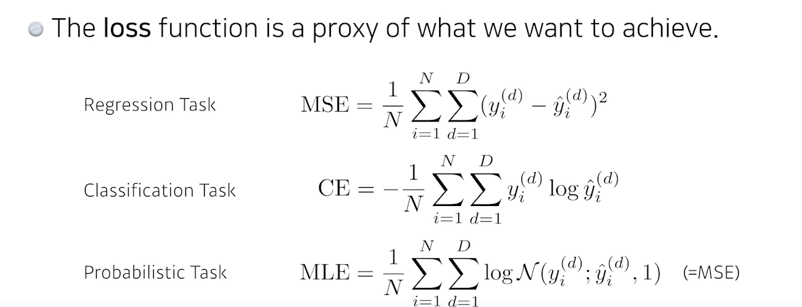
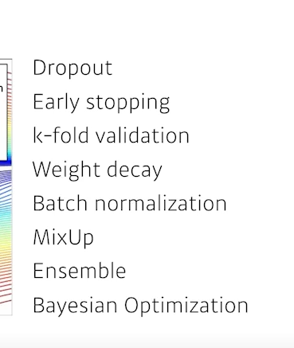
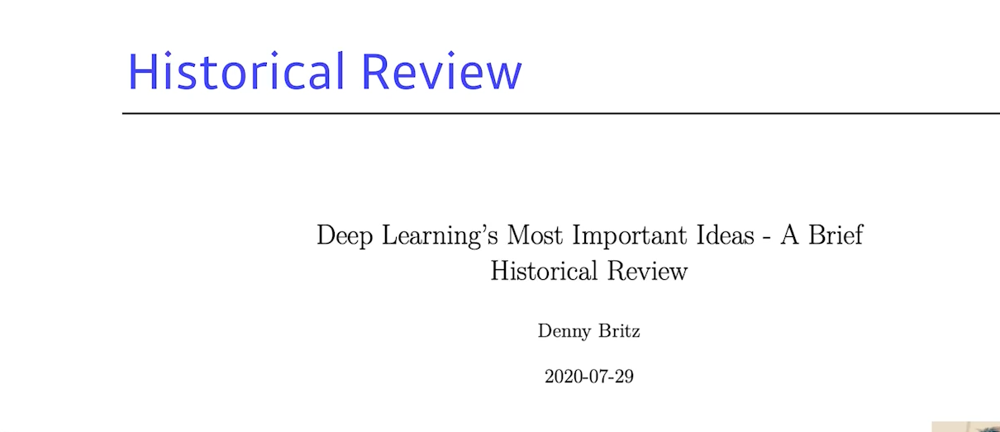
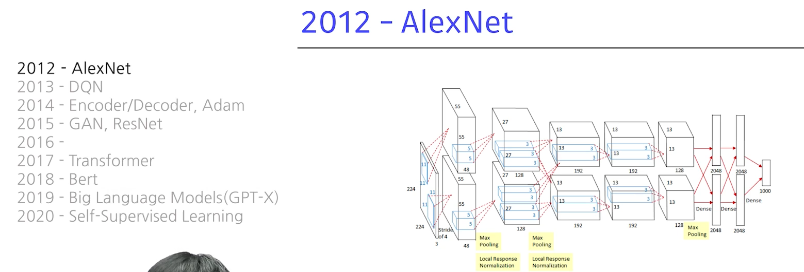

# Introduction
disclaimer

- 구현실력
- math skills
- knowing a lot of papers

뭘 배우냐
- data
- model
- loss
- algorithm
- 

loss가 스퀘어면 아웃라이어에 민감해진다.

# Pre-question

# Discussion

# Summary

# Reference
- 네이버 AI 부트캠프 (* 강의 자료 바탕으로 재구성)     
- [Denny Britz 블로그](https://dennybritz.com/blog/deep-learning-most-important-ideas)