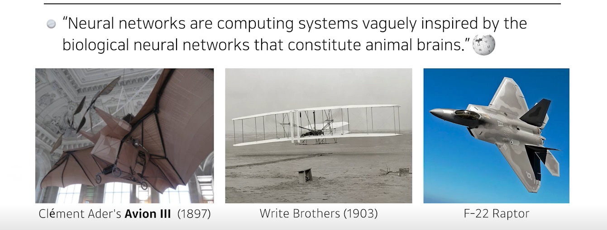
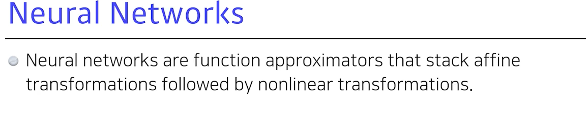
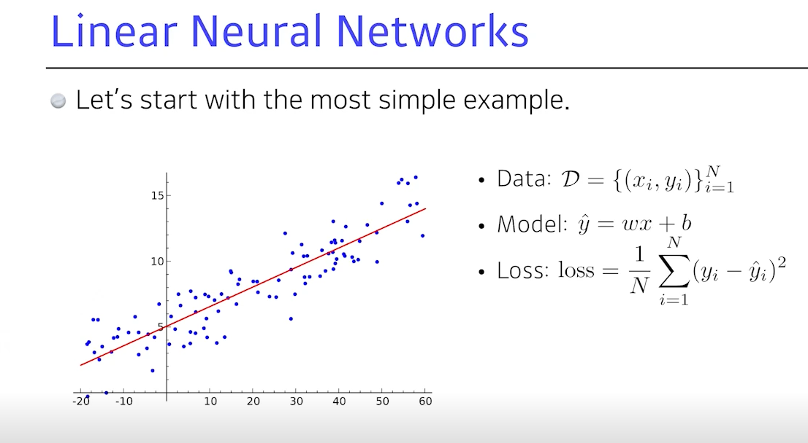
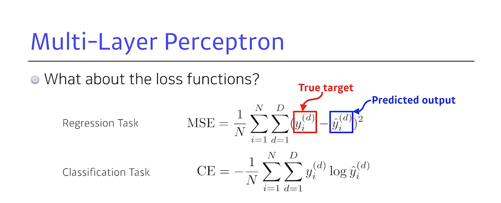
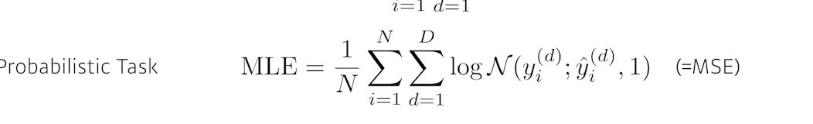

# Introduction

# Pre-question
- Regression Task와 Classification Task의 loss function이 다른 이유는?
- Regression Task, Classification Task, Probabilistic Task의 Loss 함수(or 클래스)는 Pytorch에서 어떻게 구현이 되었나?

역전파는 인간의 뇌에서 일어나지 않는다.고 한다.

우리가 하늘을 날고 싶다고 해서 새처럼 날 필요는 없다.

왜  ce가 분류 문제를 잘 풀 수 잇지>
분류 문제의 답은 원핫 벡터로 표현된다.
 :y(d)가 1인, 즉 해당하는 클래스값에서만 loss 값을 높이겠다.
d개의 아웃풋이든 i 번째 y값이 높으면 된다..

과연 CE가 분류 문제를 풀 때 유용할까

이 사람 보며 20살 405 405 아무튼 confidence값을 같이 가져가고 싶어

2022-10-04-mlp_images/1664850216394.png)

# Discussion

# Summary

# Reference
- 네이버 AI 부트캠프 (* 강의 자료 바탕으로 재구성)     
- [Denny Britz 블로그](https://dennybritz.com/blog/deep-learning-most-important-ideas)