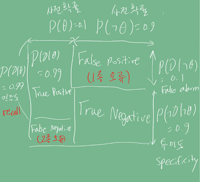

# Introduction
기계 학습이론은 통계학에서 발전하였으며, 통계학은 확률론에 기본 뼈대를 둔다.   
이 포스팅에서는 확률론에 대한 기초적인 지식을 공유한다.

# Pre-question

# 베이즈 정리
조건부확률의 정의에 따라 교집합을 다음과 나타낼 수 있다.

조건부확률을 이용해, A라는 새로운 정보가 주어질 때 P(B)로 부터 P(B|A)를 개산하는 방법을 알려준다.

D : 새로 관찰한 데이터    
θ: 우리가 모델링하는 이벤트 또는 계산하고 싶은 모델의 모수    
사후확률 : 데이터가 주어진 상황 (관찰을 한 경우) 측정을 할 확률    
사전확률 : 모델링 하기 이전에 이미 주어진 확률, 데이터를 분석하기 전에 가정한 확률    
가능도 : 현재 주어진 파라미터(가정)에서 관찰된 확률을 계산하는 것.    
Evidence : 데이터 자체의 분포     

코로나 바이러스 발병률이 10%고, 실제로 걸렸을 때 검진될 확률이 99%, 오검진 확률이 1%라고 할 경우,    
P(θ) : 가정된 발병률 (hypothesis) = 10%       
P(D|θ) : 실제로 걸렸을 때 검진 확률 = 99%     
P(D|┑θ) : 실제로 걸리지 않았을 때 오검진 확률 = 1% *1종 오류라고 한다.
    
사후확률을 계산하기 위해 evidence를 먼저 계산해보자.    

이 계산 결과를 이용해, 사후확률(검진 결과가 양성일 때, 실제 양성일 확률)을 계산해보자.
 

만약 1종 오류인 P(D|┑θ)이 10%로 오를 경우, P(D) = 0.189, P(θ|D) = 0.524로 상당히 올라가며,
테스트의 정밀도가 떨어지게 된다.

아래 혼동행렬을 참고하자.

False / True는 가정이 틀리고, 맞는지를 나타낸다. 

중요한 것은 베이즈 정리로 새로운 데이터가 들어왔을 때 앞서 계사한 사후확률을
사전 확률로 사용해 갱신된 사후 확률을 계산할 수 있다는 것이다.

그러나 인과관계를 추론할 때 함부로 사용해서는 안된다.

R을 지능지수,T가 키라고 하면, 중첩요인인 Z의 효과를 제거하지 않으면 가짜 연관성이 나온다.
연령이라는 중첩효과를 제거하지 않았기 때문이다.

전체적으로 

## 정밀도와 민감도
- Precision = TP / (TP + FP)로 계산된다.
- Recall : TP / (TP + TN)로 계산된다.

# Discussion

# Reference
- 네이버 AI 부트캠프 (* 강의 자료 바탕으로 재구성)            