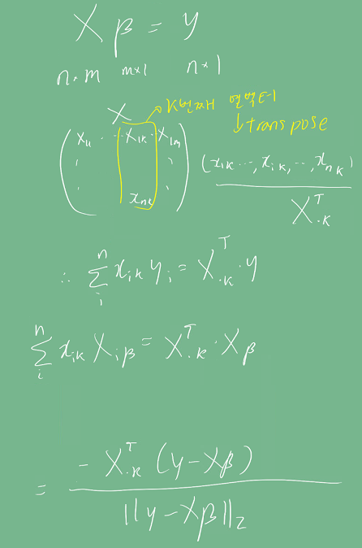

# Introduction
ML/DL에서 비용함수를 최소화시키기 위해 가장 기본이 되는 optimizer인 경사하강법(GD)과 
이것에 파생된 방법들을 설명한다.

# Pre-question
- 경사하강법은 무엇인가?
- 다변수 함수에 대해 경사하강법을 적용하는 방법을 설명하라.
- 선형회귀(linear regression)에서 목적식을 최소화하는 방법을 설명하라.
- 실제로 딥러닝에서 경사하강법을 사용하지 않는 이유는?
- 경사하강법에서 개선된 방법이 어떤 것이 있는지 설명하라.

# 경사하강법
경사하강법은 목적함수의 최소값을 구하는 방법 중 하나로, **주어진 x에 대해 기울기를 빼가면서** 최소값을 구한다.
단변수 함수의 경우 다음과 같은 절차를 가진다.

1. 점의 x 좌표가 주어진다. (초기조건)
어느 방향으로 가야 목적함수가 최소가 되어야 할지 결정해야 한다.
2. 목적 함수 f에 대해 주어진 점 (x, f(x)) 에서의 접선의 기울기를 구한다.
한 점에서 접선의 기울기를 알아야 어느 방향으로 점을 움직여서 함수값이 증가/감소할지 알 수 있다.
3. 주어진 점 x에 기울기를 뺀다. **기울기를 뺀다는 것은 함수가 증가하는 방향의 반대방향으로 간다**는 것이고, 이는 극소값으로 향함을 의미한다. 
4. 기울기가 일정 수준 이하가 되기 전까지 2~3을 반복한다.

아래와 같이 의사코드를 짤 수 있다. 
init은 x좌표의 초기값, gradient는 x좌표에서 목적함수의 기울기이다.
ε는 경사하강법을 멈추기 위한 최소 기울기 조건이다.
lr은 learning rate로 x 좌표의 step 사이즈를 결정한다.
```python
x = init
grad = gradient(x)

while(abs(grad) > ε):
  x = x - lr * grad
  grad = gradient(x)
```

# 다변수 함수에서 경사하강법
## Norm
Norm은 벡터의 크기를 일반화한 표현이다.
∥x∥ 라고 표현하며, 기하학적으로는 원점과 점 x와의 거리이다.    
L1, L2, Lx 노름이 있는데, L2이 우리가 보통 생각하는 거리를 계산할 때 쓰이며 유클리디안 거리라고 한다.   
경사하강법에서는 노름으로 벡터의 크기를 표현하기 위해 사용한다.


## 그레디언트
벡터가 입력인 다변수 함수의 경우 **기울기를 구하기 위해서 편미분과 그레디언트(gradient)를 사용한다.**
각 변수 별로 편미분을 계산한 그레디언트 벡터를 이용해 점 x의 좌표를 업데이트할 수 있다.
수식에서 ∇는 navia 기호라고 부른다.

2022-09-19-Log_images/1663642618240.png)

다변수 함수의 경우에도 기존의 알고리즘이 그대로 적용되나, 그레디언트 벡터의 크기인 노름을 계산해서 종료 조건을 설정한다.

```python
x = init
grad = gradient(x)

while(norm(grad) > ε):
  x = x - lr * grad
  grad = gradient(x)
```
 
# 선형회귀분석과 경사하강법
선형회귀분석은 종속 변수 y와 한 개 이상의 독립 변수 X에 대해
선형 상관 관계를 모델링하는 분석 기법이다.    
선형 상관 관계는 선형회귀 계수(β)에 의해 정의되며, 이를 머신러닝에서는
입력 X와 출력 y에 대해 선형회귀 계수를 구하는 문제로 귀결된다.
이상적인 모델의 경우 y = Xβ 식을 만족할 것이다.    
y는 n차원 벡터, X는 nxm 행렬, β는 mx1 벡터라고 하자.


그러나, 실제로는 오차가 존재하고 그 오차를 y - Xβ = E라고 하자. E를 최소화하는 β값을 구해야 한다.

이를 위해 경사하강법을 쓸 수 있다.    
y는 X에 대한 다변수 함수로 볼 수 있으므로 다변수 함수에 대한 경사하강법을 적용한다.
따라서 그래디언트 계산식을 먼저 구해야 한다.

수식이 상당히 복잡하여 직접 
중간에 빨간색으로 표시한 1/n term은 변수 개수에 대한 노멀라이즈? 용도로 쓰였고,
실제 norm 정의에는 포함되지 않는다.

    
    
    
    
    

유도된 식을 이용해 경사하강법을 의사코드로 구현하면 다음과 같다. N은 학습 횟수이다.
```python
for t in range(N):
    err = y - X @ beta
    grad = - transpose(X) @ err
    beta = beta - lr * grad
```

# 경사하강법의 문제 : 
## convex하지 않으면 수렴이 어려움
경사하강법은 미분가능하고 볼록(convex)한 함수에 대해서만
적절한 학습률과 학습횟수로 수렴이 가능하다.     

그러나, 딥러닝에 사용되는 대부분의 목적 함수는 convex하지 않기 때문에 수렴이 어려운 경우가 많다.

## 하드웨어 메모리 문제
선형회귀 분석에서 사용된 β를 업데이트하기 위해 모든 데이터를 한 번에 
메모리에 올려 그레디언트를 계산할 경우, 데이터가 너무 크면 out of memory가 발생할 수 있다.

# 확률적 경사하강법 (Stochastic Gradient Descent)
확률적 경사하강법은 전체 데이터가 아닌 미니 배치 단위의 데이터로 그레디언트 벡터를 계산한다.
확률적으로 미니 배치를 선택하므로 목적식 모양이 바뀐다.

아래 그림에서 왼쪽이 바닐라 경사하강법, 오른쪽이 확률적 경사하강법을 사용했을 때 목적 함수의 모양이다.

    
따라서 바닐라 경사하강법에서 non-convex한 함수의 극솟값에서도 빠져나올 수 있게 된다.

또한 모든 데이터를 한 번에 메모리에 올리지 않아 out of memory 문제에서도 좀 더 자유롭다.


 
# Discussion
- 경사하강법을 지금은 거의 사용하지는 않지만, 다른 optimizer가 경사하강법을 기반으로
진화한 방법이기 때문에 경사하강법을 제대로 이해하는 것이 중요하다.
- 확률적 경사하강법이 convex하지 않은 함수에서 수렴 문제와 메모리 부족 문제를 어떻게 해결하는지 개념을 확실히 알 필요가 있을 거 같다.


## 관련 개념
목적함수 : 최소값 또는 최대값을 구하려는 함수.

## 기타 


# Reference
- 네이버 AI 부트캠프 (* 강의 자료 바탕으로 재구성)       
- [Norm의 정의](https://en.wikipedia.org/wiki/Norm_(mathematics))