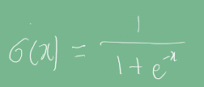
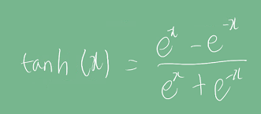
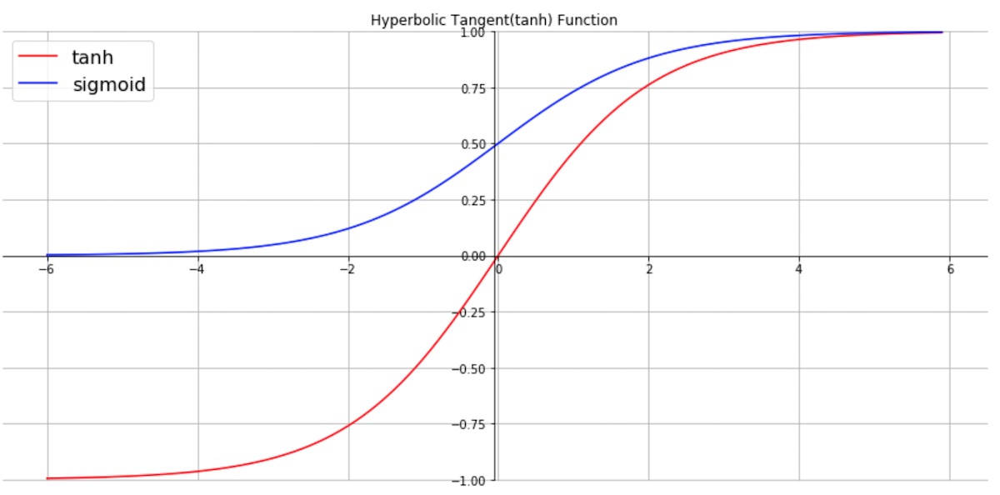
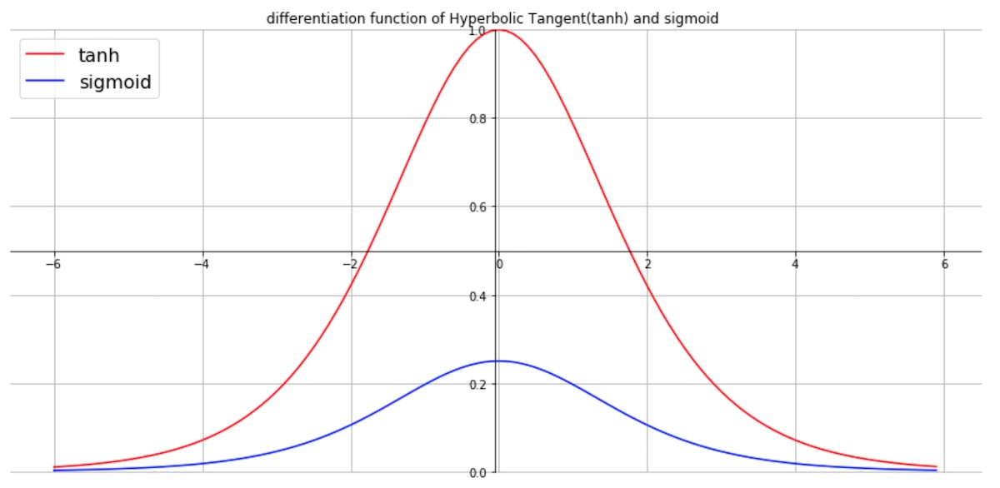
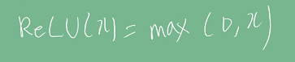
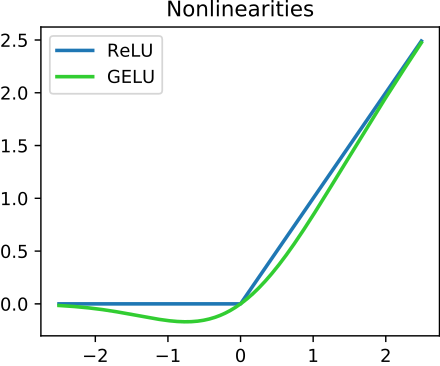
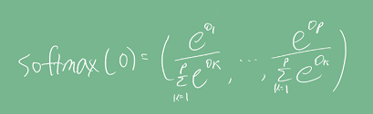
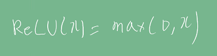
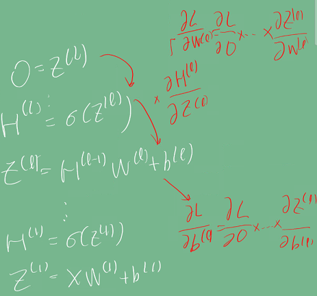
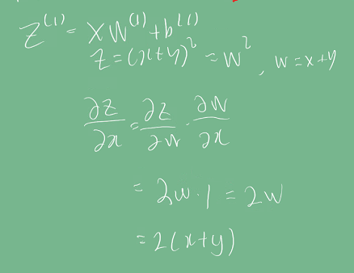

# Introduction
선형회귀 모델에 대해 경사하강법을 이용해 최적의 계수를 찾는 과정을 진행했었다.    
그러나, 대부분의 현실 문제는 선형회귀로는 설명이 되지 않는다. 비선형 문제를 풀기 위해
도입된 활성함수와 딥러닝의 기본적인 학습 방법에 대해 알아보자.

# Pre-question
- sigmoid, tanh, ReLU의 차이점과 활성함수로서 각각의 장단점을 알아보자.
- 분류모델에서 softmax가 최종 출력층에 사용되는 이유는 무엇인가?
- 신경망을 여러층으로 쌓는 이유는 무엇일까? 장단점 그리고 단점에 대해 해결하기 위한 기법들은 무엇이 있을까?

# 활성함수
## 왜 활성화 함수가 필요한가?
활성함수를 쓰지 않으면, 모델은 선형 함수의 중첩으로만 구성되어 있을 것이고, 이는 다시 선형 함수로 나타낼 수 있다.
문제가 선형 함수로만 설명이 되는 것이다. 그러나 현실의 문제는 거의 모든 것이 비선형으로 입출력 관계가 정해지며, 선형적으로 설명할 수 없다.

## 활성화 함수의 종류
딥러닝에서는 시그모이드, Tanh보다는 ReLU를 사용한다. 이외에도 특징에 따라 Leaky ReLU, ELU등 여러 활성화 함수를 사용하기도 한다.    

시그모이드 :    
    
Tanh :     
    

시그모이드와 하이퍼볼릭 탄젠트 함수의 원형이다. 

미분한 결과는 다음과 같다.

**시그모이드**는 0~1 범위를 가지며, 미분했을 때 0.3보다 작은 값이다.
이에 따라 **역전파 시 vanishing gradient 문제**가 발생하여, 가중치가 업데이트 되지 않을 수 있다.    
반면 tanh는 -1~1 범위를 가지며, 기울기가 좀 더 가파르기 때문에 빠른 수렴이 가능하다. 또한 미분값이 최대 1이라서
vanishing gradient문제에서 좀 더 자유롭다.    
그러나 tanh도, gradient의 최대값만 1이기 때문에
역전파를 계속 계산하다보면 결국 0으로 gradient가 수렴하게 되므로 완전히 vanishing gradient 문제에서 부터 자유롭지는 않다.
  
ReLU:    
    

ReLU는 **x가 0 이상일 때 gradient가 1이라 vanishing gradient 문제가 발생하지 않는다.**
또한 **계산이 쉬운 장점**이 있다. 다만 음수일 경우는 0이기 때문에 학습이 안되는 문제가 있으며 이를 보완하기 위해 leakyReLU등이 사용된다.

## 소프트맥스 연산
- 모델의 출력이 0~1로 나오며 확률로 해석할 수 있게 변환해주는 연산이다.

선형 모델의 결과인 O라는 출력 벡터에 softmax를 합성하면 확률 벡터가 된다. (비선형)
**확률 벡터의 결과는 해당 입력 데이터가 어떤 클래스에 속할지 확률을 나타낼 수 있다.** 
즉, 분류 문제의 학습에는 softmax를 사용할 수 있다.   

그러나, **분류 문제에서 추론을 하는 경우는 softmax를 쓰지 않고 one-hot 벡터를 주로 쓴다.**
실제 추론에서는 확률이 가장 높은 하나의 클래스만 정답으로 뽑으면 되기 때문이다.
 
# 신경망
신경망은 **선형 모델에 활성함수를 합성한 함수**이다.    

    

## 층을 왜 여러개 쌓을까?
universal approximation theorem이라고 해서, 2층의 신경망으로도 연속 함수를 근사할 수 있다.
층이 깊을수록 목적함수를 근사하는데 필요한 노드 수가 줄어 효율적인 학습이 가능,
층이 깊어지면 그만큼 최적화가 오래걸릴 수 있다.

# 순전파 알고리즘
x라는 입력을 받아 선형 모델과 활성화 함수를 반복적으로 적용해 최종 출력을 얻는 일종의 추론 과정이다.

# 역전파 알고리즘
각 층에 사용된 파라미터(가중치)를 학습하는 것이다. 선형 회귀 문제와 동일하게
 그래디언트를 계산해 가중치를 업데이트한다.   
차이점은 입력이 1개의 선형 함수에 의해 곧바로 최종 출력이 나오는 (1층으로 이루어진) 
선형 회귀와 달리, 
**딥러닝은 활성 함수를 포함해 여러 함수가 합성된(여러 층으로 구성된) 모델이기 때문에 한번에 계산이 불가하고
chain-rule을 이용해 최종 출력층부터 입력층까지 역순으로 계산하여야 한다.**
    

미분된 결과를 저장해야 하기 때문에 **역전파는 순전파보다 더 많은 메모리를 차지한다.**

# Discussion

# Reference
- 네이버 AI 부트캠프 (* 강의 자료 바탕으로 재구성)            
- [그래프 이미지](http://taewan.kim/post/tanh_diff/)
- [ReLU 위키백과](https://en.wikipedia.org/wiki/Rectifier_(neural_networks))