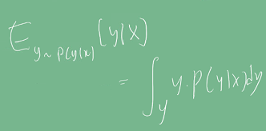
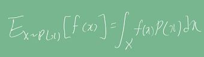
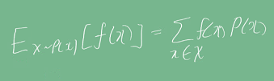
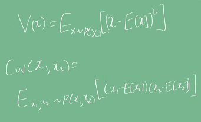
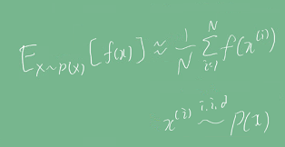

# Introduction
 기계 학습이론은 통계학에서 발전하였으며, 통계학은 확률론에 기본 뼈대를 둔다.    
 딥러닝에서 사용되고 있는 손실함수들은 모두 데이터 공간을 통계적으로 해석해서 유도한다. 이는 예측이 틀릴 위험을 최소화하도록 하기 위한 것이다.
예를 들면,
- 회귀함수에서 손실함수로 사용되는 L2 노름은 예측 오차의 분산을 가장 최소화하는 방향으로 학습한다.
- 분류 문제에서 사용되는 교차 엔트로피는 모델 예측의 불확실성을 최소화하는 방향으로 학습한다.

이 포스팅에서는 확률론에 대한 기초적인 지식을 공유한다.

# Pre-question
- 확률분포란 무엇이고 어떻게 정의될 수 있는가?
- 기대값이란?

# 확률 분포 = 데이터의 초상화
데이터 공간이 X x Y로 구성되어 있다고 가정하고, D를 이 데이터 공간에서 데이터를 추출하는 분포라고 하자.    
주의할 것은 **D는 사전에 알 수 없고 이론적으로만 존재하는 확률 분포**이다. 현재 관찰가능한 데이터로 추정한 (또는 모델링한) 실제 분포라고도 볼 수 있다.       
데이터 공간을 '가정'한다는 표현을 쓴 이유도 확률 분포 모델링을 위해 임의로 공간을 정의한 것이기 때문이다.
    
2022-09-19-Prohbability_images/1663949036681.png)     
    
위 그림처럼 X, Y 격자를 이용해 데이터를 정의해보자. 데이터는 확률 변수로 (x, y) ~ D라 가정할 수 있다. 이는 **데이터 공간 상에서 현재 관측가능한 데이터**를 의미한다.    
총 관측가능한 데이터 개수가 17개라고 할 때, 아래와 같은 확률 분포를 정의할 수 있다.
- **결합분포 P(x, y)**: 입력 데이터 x가 주어지면서, 정답이 y일 확률. 예를 들어, P(X=2,Y=2) = 3/17이다. 결합분포는 D를 모델링한다. 
- **주변확률 분포 P(x)** : 단순히 입력 데이터 x가 나올 확률. y에 대한 정보는 주지 않는다. 예를 들어, P(X=2) = 5/17이다.
- **조건부 확률 분포 P(x&#124;y)** : y를 만족할 때 입력 데이터가 x일 확률, 데이터 공간에서 입력 x와 y 사이의 관계를 모델링한다. 특정 클래스가 주어진 조건에서 데이터의 확률분포를 보여준다. 예를 들어 P(X=2&#124;Y=2) = 3/10이다.    
- **조건부 확률 분포 P(y&#124;x)** : 입력 데이터 x가 주어질 때 정답이 y일 확률. 예를 들어 P(y=2&#124;X=2) = 3/5이다.

## 이산형과 연속형 확률 변수
확률 분포 D를 어떻게 정의했느냐에 따라 이산형과 연속형 확률 변수로 구분된다.    
※ 이전에 말한 것과 마찬가지로 "어떻게 정의했느냐"라고 표현한 것은, **실제 분포와 달리 모델링은 편의를 위해 관찰된 데이터들을 바탕으로 
이산형/연속형으로 취사선택할 수 있기 때문이다.**

- 이산형 확률 변수 : 확률 변수가 가질 수 있는 **모든 경우의 수를 모두 고려하고 확률을 모두 더해서 모델링**한다.     
2022-09-19-Prohbability_images/1663950049889.png)      
여기서 P(X=x)는 확률 변수가 X=x의 값을 가질 확률로 해석이 가능하다.
- 연속형 확률 변수 : 데이터 공간에 정의된 **확률변수의 밀도 위에서 적분을 통해** 모델링한다.       
2022-09-19-Prohbability_images/1663950094164.png)          
여기서 **P(Y=y)는 밀도, 즉 누적확률분포의 변화율**을 모델링하므로 확률로 해석하면 안된다.

## 회귀 문제에서 확률 해석
로지스틱 회귀에서 사용했던 선형 모델과 소프트맥수 함수의 결합인, softmax(WΦ+ b)도 데이터에서 추출된 패턴을 기반으로 확률을 해석할 수 있다.    
softmax의 출력은 수식을 고려하면 확률로 해석될 수 있으며, 이를 통해 분류 문제는 x로 부터 추출된 특징패턴 Φ(x)과 가중치행렬 W를 통한 조건부 확률 P(y&#124;x)를 계산한다.    
- **P(y&#124;x) = 주어진 x에 대해 class y가 나올 확률은 몇인가?**   

그런데, **회귀 문제는 연속된 실수 범위에서 정답을 구해**야 하므로 카테고리에 대한 확률이 아니라 밀도함수를 통한 기댓값으로 추정한다.       
      

이 조건부기대값은 [y - f(x)]의 L2-norm 기대값을 최소화하는 함수 f(x)와도 일치한다.

위의 수식을 이해하기 위해 기대값의 정의도 알아보자.

# 기대값
기대값은 데이터를 대표하는 통계량이며 동시에 확률분포를 통해 다른 통계적 범함수를 계산하는데 사용한다.   
아래 식을 보자. 집합 X에 속하는 입력 변수 x에 대한 출력값 f(x)의 기대값을 구하는 식이다.
- 연속확률 분포의 경우      
    
- 이산확률 분포의 경우     
     

이런 기대값을 이용해 분산, 공분산 등을 구할 수 있다.    
    

# 기계학습에서 확률 분포
기계학습의 문제는 대부분 확률분포를 잘 모르는 경우가 많다.
확률 분포를 모를 때 데이터를 이용해 기대값을 계산하려고 할 경우 몬테카를로 샘플링 방법을 사용한다.

    

독립 추출만 보장되면 대수의 법칙에 의해 수렴성이 보장된다.

# Discussion
- 주어진 문제의 확률 분포를 정확히 추정할 수 있다면, 기계학습이 필요하지 않을 것이다.
- 예를 들어 어떤 입력이 주어질 때 출력을 알 수 있는 확률 분포가 정규분포로 주어진다고 확실히 말할 수 있다면,
그저 입력과 출력 관계식을 정규분포식으로 넣거나 그냥 정규분포의 기대값을 출력값으로 사용하면 될 것이다.
- 그러나 **현실에서 관심있는 데이터 대부분은 일반적인 확률 분포를 따르지 않는다.** 
- 그럼에도 불구하고 확률론을 이용해 설명하려는 것은 앞서 얘기한 몬테카를로 샘플링 방법 등 **확률론으로 시작해 발견된 방법들로 현상을 (어느정도는) 이해할 수 있기 때문**으로 생각된다.

# Reference
- 네이버 AI 부트캠프 (* 강의 자료 바탕으로 재구성)            