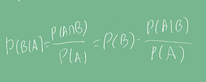

# Introduction
통계학에서 많이 응용되는 베이즈 이론에 대해 배워보고, 베이즈 이론의 한계와 머신러닝의 장점을 알아보자.

# Pre-question
- 베이즈 정리란 무엇이고, 어떻게 쓰일 수 있을까?
- 베이즈 정리의 장단점은?

# 베이즈 정리
조건부확률의 정의에 따라 교집합을 다음과 나타낼 수 있다.

베이즈 정리는 수식적으로 **조건부확률을 이용해, A라는 새로운 정보가 주어질 때 P(B)로 부터 P(B|A)를 개산하는 방법을 알려준다.**   

의미적으로는 **사전확률을 통해 사후 확률을 계산**할 때 쓰인다.

- D : 새로 관찰한 데이터    
- θ: 우리가 모델링하는 이벤트 또는 계산하고 싶은 모델의 모수    
- 사후확률 : 데이터가 주어진 상황 (관찰을 한 경우) 측정을 할 확률    
- 사전확률 : 모델링 하기 이전에 이미 주어진 확률, **데이터를 분석하기 전에 가정한 확률**    
- 가능도 : 현재 주어진 파라미터(가정)에서 관찰된 확률을 계산하는 것.    
- Evidence : 데이터 자체의 분포

예시를 들어보자. 코로나 바이러스 발병률이 10%고, 실제로 걸렸을 때 검진될 확률이 99%, 오검진 확률이 1%라고 할 경우,    
P(θ) : 가정된 발병률 (hypothesis) = 10%       
P(D|θ) : 실제로 걸렸을 때 검진 확률 = 99%     
P(D|┑θ) : 실제로 걸리지 않았을 때 오검진 확률 = 1% *1종 오류라고 한다.
    
사후확률을 계산하기 위해 evidence를 먼저 계산해보자.        

이 계산 결과를 이용해, 사후확률(검진 결과가 양성일 때, 실제 양성일 확률)을 계산해보자.    
 

만약 1종 오류인 P(D|┑θ)이 10%로 오를 경우, P(D) = 0.189, P(θ|D) = 0.524로 상당히 올라가며,
테스트의 정밀도가 떨어지게 된다.

아래 혼동행렬을 참고하자.     

여기서 False / True는 가정이 틀리고, 맞는지를 나타낸다. 

중요한 것은, **베이즈 정리로 새로운 데이터가 들어왔을 때 앞서 계산한 사후확률을
사전 확률로 사용해 갱신된 사후 확률을 계산할 수 있다는 것이다.**

2022-09-22-Bayes_theorem_images/1664790839516.png)

## 정밀도와 민감도
- Precision = TP / (TP + FP)로 계산된다. 예를 들면 날씨가 맑다고 예측한 결과 중 실제로 맑은 날의 비율이다.
- Recall : TP / (TP + TN)로 계산된다. 예를 들면 실제로 맑은 날 중, 모델이 맑다고 예측한 날의 비율이다.     

이와 관련되어 아래 포스팅에 잘 정리되어있어 참고해도 좋을 것 같다. [링크](https://sumniya.tistory.com/26)

# 베이즈 추론
내용이 꽤 길어 정리할 시간이 없어(...) 링크 내용을 참고하면 좋을 것 같다.
[베이즈 추론 링크](https://datascienceschool.net/02%20mathematics/09.03%20%EB%B2%A0%EC%9D%B4%EC%A6%88%20%EC%B6%94%EC%A0%95%EB%B2%95.html)

# 인과관계
인과관계는 **데이터 분포의 변화에 강건한 예측 모형**을 만들 때 필요하다. 인과관계를 추론할 때 베이즈 이론을 함부로 사용해서는 안된다.    
 예를 들어보자. 요소 T, Z, R이 있고 이 요소들은 특정 요소에 영향을 미칠 수 있다.
R은 지능지수, T는 키라고 하자. 통계적으로 T인 키가 클 경우, 지능지수 R이 높게 나온다고 한다.
이 경우, R은 T에 정비례 관계가 있다고 말할 수는 있다.     
 그러나, 키가 직접적으로 지능 지수를 높게 하는 원인이라고 할 수 있을까?
실제로는 그렇지 않은데, 바로 중첩효과 때문이다.

- **충첩효과(confounding factor)** : 현상에서 가정한 독립변수(T)와 종속변수(R)에 모두 영향을 미치는 변수가 존재할 때 이를 중첩효과라고 한다.    

예시로 설명하자면 Z, 나이라는 요소가 T, R에 모두 영향을 미치기 때문에 T->R의 인과관계가 있다고 오인한 것이다.    
2022-09-22-Bayes_theorem_images/1664804775051.png)

R을 지능지수,T가 키라고 하면, 중첩요인인 Z의 효과를 제거하지 않으면 가짜 연관성이 나온다.
연령이라는 중첩효과를 제거하지 않았기 때문이다.

따라서 **인과관계를 알기 위해서는 이런 중첩효과를 모두 제거**해야 한다. 그렇기 때문에 사실 인과관계를 알아내기가 쉽지 않다.

중첩효과로 인한 문제를 다음 예시에서 좀 더 확인할 수 있다.
- 신장결석에 걸린 사람을 치료할 수 있는 치료법이 a, b 두 개가 있다고 하자. T는 치료법[a,b]이고 R은 완치율이다. 그리고 신장 결석 크기를 Z라고 하자.

| 치료법 | 전체 완치율        | small stones에 대한 완치율 | large stones에 대한 완치율 |
|-----|---------------|----------------------|----------------------|
| a   | 78% (273/350) | **93%** (81/87)          | **73%** (192/263)        |
| b   | **83%** (289/350) | 87% (234/270) | 69% (55/80) |
       
치료법 a,b에서 전체 완치율만 놓고 보면 b가 좋아보인다.    
그러나, 신장결석 크기에 따른 조건부 확률로 계산해 보면 a가 더 좋고, 실제로 a가 더 좋은 치료법이다.    
조건부 확률로 계산한 치료효과가 do(T=a)라는 조정(intervention) 효과를 통해 Z의 개입을 제거하기 때문이다.    

2022-09-22-Bayes_theorem_images/1664806076664.png)     

2022-09-22-Bayes_theorem_images/1664806097181.png)

# Discussion
- 베이즈 정리는 기계공학에서 물체의 위치/방향을 추정하기 위한 칼만필터에서도 쓰인다. [링크](https://rk1993.tistory.com/entry/%EB%B2%A0%EC%9D%B4%EC%A7%80%EC%95%88)
- 베이즈 정리로 스팸 메일을 분류하는 데 쓰일 수 있다. 그러나 딥러닝을 사용한 방법이 더 좋은 결과를 내는 데, 왜 그런지 베이즈 정리의 한계로 설명할 수 있으면 좋을 것 같다.

# Reference
- 네이버 AI 부트캠프 (* 강의 자료 바탕으로 재구성)       
- [중첩효과](https://en.wikipedia.org/wiki/Confounding)