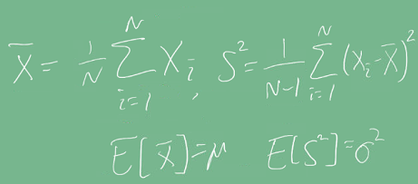
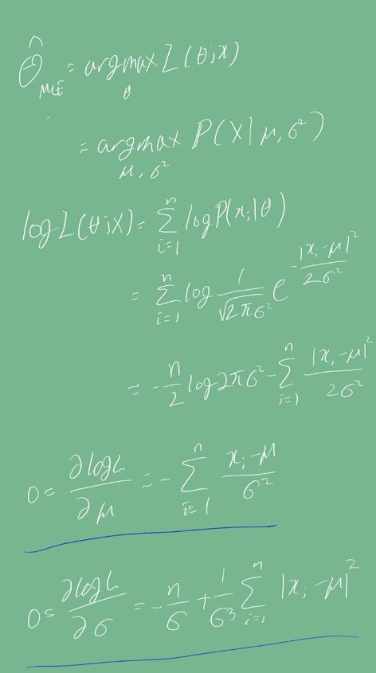
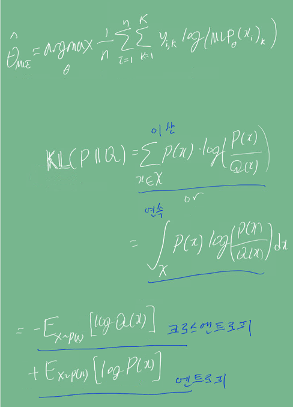

# Introduction
 **통계적 모델링은 적절한 가정 위에서 데이터에 대한 확률 분포를 추정**하는 것이다.
이 포스트에서는 **모수의 개념과 모수를 추정하기 위해 필요한 MLE**에 대해 배운다. 

# Pre-question
- 모수와 MLE에 대한 개념을 설명해라.
- 확률과 가능도의 차이는 무엇일까? 개념과 수식적 차이를 설명해보자.
- 확률 대신 가능도를 사용하였을 때의 이점은 어떤 것인가?

# 다양한 확률 분포와 모수
 주사위를 5번 던질 때 기대되는 눈의 합 등 입력데이터에 따른 출력이 어떻게 될지 예측한다고 해보자.    
 익히 아는 정규분포 외에도, 현상에 따라 아래 그림과 같이 매우 다양한 확률 분포로 가정할 수 있다.  
      
2022-09-19-Prohbability_images/1663762560237.png)  

여기서 '가정'이 들어가는 이유는 이전의 확률론 포스트에서 말한 내용이지만,
**유한한 데이터를 관찰해서 모집단의 분포를 정확히 알 수 없으므로, 근사적으로 실제 확률 분포를 추정할 수 밖에 없기 때문이다.**    
요약하면, 데이터가 특정 확률 분포를 따른다고 선험적으로 가정한다. 다음 모수를 추정하는데, 모수란 가정한 특정 확률 분포의 특징(평균, 분산 등)을 나타내는
파라미터를 말한다.     
 이렇게 **모수를 추정하여 확률 분포를 결정하는 방법을 모수적 방법**이라고 한다.      
 만약 **특정 확률 분포를 가정하지 않고 데이터에 따라 모델의 구조 및 모수의 개수가 유연하게 바뀐다면 비모수적 방법**이라고 한다.
비모수는 모수가 없는 게 아니라 모수가 매우 많다는 뜻이다.

## 확률 분포의 가정
모수 추정을 위해 확률 분포를 일단 가정해야 하는데,
확률 분포를 가정하는 방법은 히스토그램을 통해 모양을 관찰하는 것이다.      
- 데이터 2개 값만 가지면 = 베르누이 분포
- 데이터가 [0,1] 사이 값 = 베타 분포
- 데이터가 실수 전체에서 가지면 = 정규분포 등

## 통계량
관찰 데이터(표본)의 분포를 통계적으로 표현하기 위해 사용되는 표본평균과 표본 분산 값과
같은 것들을 통계량이라고 한다.
     
    
※ 표본 분산을 구할 때 N-1로 나누는 것은 불편(unbiased) 추정량을 구하기 위해서임.

이 때 **통계량의 확률분포를 표집 분포(sampling distribution)** 라고 한다. 특히 표본 평균의 표집 분포는
N이 커질수록 정규분포를 따른다. **(심지어 모집단의 분포가 정규분포를 따르지 않아도 성립된다.)**

주의할 것은 모집단에서 일부 샘플만을 골라 얻은 표본 분포(sample distribution)와 통계량의 확률 분포인 표집분포는 다르다는 것이다.

****표본 평균이나 표분 분산은 중요하나 확률 분포마다 사용하는 모수가 다르고, 그에 따라 적절한 통계량도 달라지게 된다.****

# Maximum likelihood estimation (MLE)
 확률 분포마다 사용하는 모수가 다르다. 정규 분포의 경우는 평균과 분산이 정규분포를 결정하기 위한 모수이다.
**주어진 데이터를 관찰할 가능성이 가장 높은 모수를 추정하기 위한 방법을 최대 가능도 추정법**(MLE)이라고 한다.
좀 더 정의에 대해 자세히 알아보면,
- Estimation : 데이터셋(모집단)의 특성을 나타내는 모수를 **"추정"**
- likelihood : 가정한 확률 분포에 대응하는 모수의 값으로 관찰 데이터를 설명할 수 있는 **"가능성"** 을 토대로 추정.
- Maximum : 가능도가 최대가 되면, 관찰 데이터로 가정한 확률 분포에 대응하는 모수의 값으로 설명할 가능성이 **"최대"** 임.

예시를 들어보자. 데이터 x가 1의 값이 나왔다. 이 데이터가 가장 관찰되기 위해서 확률 분포를 먼저 정규분포로 가정했다.
정규분포 식을 정하기 위해 평균과 분산을 정해야 한다. 평균은 아래 그래프와 같이 -1, 0, 1중 하나로 결정해야 한다면,
무엇이 가장 알맞을까?   
      
2022-09-19-Prohbability_images/1663922360323.png)    

이때 가능도는 다음과 같은 식으로 표현할 수 있다. 참고로 세미클론이나 Given(bar) 동일하게 조건을 명시할 때 쓴다.     
또한, 가능도 함수는 모수 θ를 따르는 분포가 X를 관찰할 가능성을 뜻하지만 확률로 해석하면 안된다.   
      
2022-09-23-통계학_images/1664783440813.png)    

참고로 데이터가 여러개면 다음과 같이 표현할 수 있다.         
2022-09-19-Prohbability_images/1663922503763.png)

가능도가 최대가 되는 모수를 추정하기 위해 MLE를 다음 식으로 표현할 수 있다.        
데이터(X)가 주어졌을 때,P(X|세타)가 가장 커질 세타값을 찾는 것이다.     
2022-09-23-통계학_images/1664783677476.png)

최대값을 찾기 위해 가능도 함수의 미분계수가 0이 되는 지점을 찾는다.   
이때 로그를 사용하는데 이유는,
- 데이터 숫자 단위를 줄인다.
- 미분식이 간단해진다. 시간복잡도가 O(n^2)에서 O(n)으로 줄어든다.
- 확률 값의 범위를 확장해 데이터들을 비교하기가 용이해진다.

가능도 함수가 확률로 표현되어, 0-1을 가지기 때문에, 로그를 씌우면 마이너스 무한대까지 확장되서 모델간 비교가 좀 더 넓은 range에서 가능하다.   
     
2022-09-19-Prohbability_images/1663922874693.png)

지금까지 알게 된 내용을 토대로 예시를 포함해, 확률변수 X로 부터 독립적인 표본 x0~xn-1을 추출 시 모수를 추정해보자.
      
    

추정된 모수인 평균과 분산은 다음과 같이 계산된다.       

따라서, 예시에서 x0=1이 관찰될 때, 추정하는 정규분포의 평균은 1이 된다.

## 딥러닝에서 MLE의 적용
 딥러닝 모델의 가중치가 모수가 되며, 분류 문제를 예로 들면 소프트맥스 벡터는 카테고리 분포의 모수(p1,.., pk)를 모델링한다.
one-hot 벡터로 표현한 정답레이블 y와 x를 관찰데이터로 이용해 소프트맥스 벡터의 로그가능도를 최적화할 수 있다.
식에서 MLP는 Multi-layer-perceptron의 출력값이다.

# 확률 분포의 거리
 추정한 확률분포(모델링)와 실제 확률분포의 차이(거리)를 계산해 모델링이 얼마나 잘 이루어졌는지
확인할 필요가 있다. 딥러닝에서 사용되는 손실 함수 또한 관찰되는 확률 분포의 거리를 통해 유도한다.   
데이터 공간에 두 개의 확률 P(x)- 정답레이블과 Q(x)- 모델의 예측값 분포가 있다고 하자. 두 확률 분포의 거리를 계산하기 위해 다음과 같은 함수를 이용할 수 있다.
- 총 변동 거리 (Total Variation Distance)
- 쿨백-라이블러 발산 (Kullback-Leibler Divergence, KL)
- 바슈타인 거리 (Wasserstein Distance)

## 콜백 라이블러 발산

최대가능도 추정법은 P, Q사이에 거리인 콜백 라이블러 발산을 최소화 하는 것과 동일하다.    
    

# Discussion
- 가정한 확률 분포에 대한 모수를 MLE로 추정하고, 이 확률 분포에 대해 정답 레이블에 대한 확률 분포와의 차이를 계산한다. 그리고 이 차이값을 이용해 ML/DL의 손실 함수를
모델링할 수 있다는 점이 인상깊었다.

# Reference
- 네이버 AI 부트캠프 (* 강의 자료 바탕으로 재구성)            