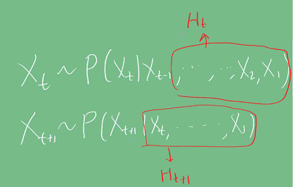
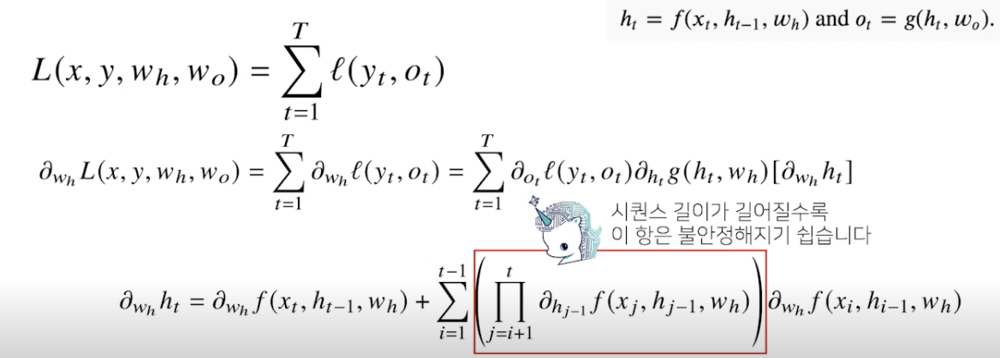

# Introduction
 CNN은 weight sharing과 kernel size에 따른 locality 특성으로, image 데이터를 주로 다루는 CV task에서 좋은 성능을 내고 있다.    
반면 부동산 가격이나 음성/문장 데이터와 같은 시퀀스 데이터의 경우에는 auto-regressive 특성을 고려해, RNN 계열 모델을 사용했다.    
  현재는 RNN 기반 모델을 잘 사용하지 않고, Transformer를 많이 사용하지만 Transformer의 아이디어 또한 거슬러 올라가면 RNN을 쓰면서 생긴 문제점을 해결하면서 나온 것이다.   
이번 글에서는 **시퀀스 데이터의 정의와 RNN의 기초에 대해 다룬다.**

# Pre-question
- 기존 MLP는 왜 과거의 정보를 제대로 다룰 수 없을까?

# 시퀀스 데이터란?
 도입부에서 설명했듯이 **순차적으로 들어오는 데이터, 이를테면 소리, 문자열, 주가 등의 데이터를 시퀀스 데이터**라고 한다.
시계열 데이터 또한 시간 순서에 따라 나열된 데이터라 시퀀스 데이터에 속한다.     
시퀀스 데이터는 아래와 같은 특성을 가진다.

## 독립동등분포(i.i.d) 가정을 위배
독립동등분포의 의미는 다음과 같다.
- 2개 이상의 확률변수를 함께 고려할 때, 이들의 확률적 특성이,
     - 통계적으로 독립이다. (각 사건이 일어날 확률이 다른 사건이 일어날 확률과 관련이 없다.)
     - 동일한 확률분포을 가진다. 각 사건이 일어날 확률변수 X,X,...,X이 상호독립적이며, 모두 동일한 확률분포 f(x)를 가진다. 
  
시퀀스 데이터는 IID를 위배한다. 이말은 **순서를 바꾸거나 과거 정보에 손실이 발생하면 데이터의 확률 분포도 바뀐다는 것이다.**    
예를 들어 "개가 사람을 물었다."라는 문장의 어절 순서를 바꿔서 "사람이 개를 물었다." 라고
한다면, 이 문장의 의미가 완전히 달라지고 또한 문장이 발생할 빈도 또한 다를 것이다.
이를 조건부확률을 이용해 표현할 수 있다.

     

## 길이가 가변적
시퀀스 데이터의 길이는 샘플마다 다를 수 있다. 따라서 길이가 가변적인 데이터를 다룰 수 있는 모델이 필요하다. 몇 가지 방법이 있다.
1. 단순히 시퀀스를 고정된 길이로 자르기   
과거 데이터 T개에서 최근 τ개의 데이터만 사용하는 것이다. 사실 i.i.d의 식에서 나온 것처럼 모든 과거 정보가 필요하지는 않다.
연관성이 높은 최신 데이터 일부만을 사용할 수 있다.      

2. 잠재변수로 인코딩    
아래 경우처럼 직전 정보를 제외하고 **나머지 정보를 Ht라는 잠재변수로 인코딩해서 활용가능하다. 이걸 활용하는 것이 RNN**이다.    

# MLP의 한계
MLP 모델 레이어의 출력은 과거 정보에 독립적으로 계산된다. 아래 식과 같이 **출력값이 현재의 입력값과 학습된 Weight값으로 계산되기 때문이다.**      
  

# RNN
MLP와 유사한 모양이나, 이전 상태값인(Ht-1)이 출력값 계산에 포함되며, 이에 따라 학습을 위한 가중치 WH가 생긴다.     
      
    

## BPTT (Backpropagation Through Time)
상태값이 추가되면서 기존 MLP와 back propagation 식이 좀 달라진다. RNN에서 Back propagation은 시간축에 따라서도 진행된다고 하여 BPPT라고 한다.
빨간색이 그레디언트 전달 경로이며 연결 그래프에 따라 순차적으로 계산한다.   
 

실제로 계산하면 다음과 같다.
    
그림에서 빨간색 박스친 항을 보면 활성화 함수인 f의 편미분값을 t번 곱하게 된다.
**이게 문제가 되는데, 시그모이드나 tanh처럼 활성화 함수의 편미분값이 0~1 범위 내에 있으면
시퀀스 길이만큼 계속 곱해져 결국 0에 수렴하게 된다.**       
이를 해결하기 위해 Truncated BPTT와 같이 과거에 해당하는 블럭 일부 잘라, 시퀀스 길이를 줄여서 사용하기도 한다.

# Discussion
RNN의 Long-term dependency 문제는 Truncated BPTT로 완전히 해결하지 못해 이를 보완한 LSTM, GRU가 나왔고, 최근에는 Transformer로 
max path length(현재 출력에 영향을 주기 위해 거쳐야 할 sequential 계산 횟수)를 1로 만들었기 때문에 이런 문제에서 좀 더 자유로워졌다.

# Reference
- 네이버 AI 부트캠프 (* 강의 자료 바탕으로 재구성)
- [독립동등분포 정의](http://www.ktword.co.kr/test/view/view.php?m_temp1=5021)