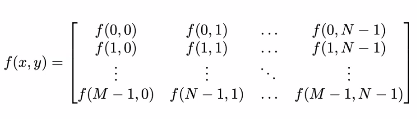
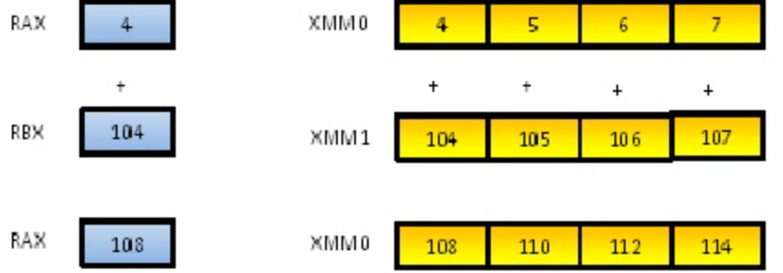
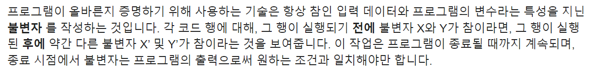

# Introduction
ㅇㅇ
또, 이미지는 차원 함수로도 정의할 수 있다. F(x,y) 

# array 관점 - 왜 numpy는 image 처리에 많이 쓰이는가? : vectorization
image를 처리함에 있어서 자주 사용되는 라이브러리가 있는데, **바로 numpy다.** 2D 리스트를 사용해 image를 처리할 수 있음에도 왜 numpy 사용할까? numpy는 전체 array에 대한 vectorization 연산을 수행하기 때문이다.
구현의 관점에서는, for 등의 루프들을 array 연산으로 치환하여 표현하는 것을 vectorization이라고 하며, 이는 파이썬에서 기본적인 문법을 이용한 방법보다 빠른 array 처리가 가능하다.

> Using NumPy arrays enables you 
> to express many kinds of data processing tasks 
> as concise array expressions that might 
> otherwise require writing loops. 
> This practice of replacing explicit loops 
> with array expressions is commonly referred to as vectorization. 
> In general, vectorized array operations will often be one or two 
> (or more) orders of magnitude faster than their pure Python equivalents, 
> with the biggest impact in any kind of numerical computations. 

하드웨어 연산 관점에서는 연산을 할 때, 한 번에 하나의 값을 가지는 scalar register로 처리하던 것을 여러 값을 동시에 가질 수 있는 vector register로 처리한다는 것이며, 따라서 루프에 의한 sequential 연산이 아니라, 레지스터가 동시에 가질 수 있는 값의 개수만큼 parallel 연산을 할 수 있도록 한다. 
> Vectorization, then, is the process of using these vector registers(XMM0, XMM1), 
> instead of scalar registers(RAX, RBX), in an attempt to make the program run faster. 
> In a perfect world, our example loop would execute 4 times faster.
> 

# 함수의 관점 - 함수형 패러다임과 형식적 증명 가능성
## 함수형 패러다임
자주 사용되는 AI 프레임워크인 텐서플로우의 테크닉은 보통 함수형 패러다임을 많이 차용한다.
앞서 말했듯 이미지는 2차원 함수로 정의할 수 있으며, 따라서 함수형 프로그래밍을 통해 유연하게 처리될 수 있다.   
함수형 프로그래밍은 함수들의 세트로 문제를 분해한다. 이상적으로는, 함수들은 입력을 받아서 출력을 만들어내기만 하며, 
주어진 입력에 대해 생성된 출력에 영향을 끼칠만한 어떠한 내부적인 상태를 가지지 않는다. 이런 점에서 내부 상태를 가지고 있는 객체를 다루는 객체 지향 프로그래밍과 반대라고 할 수 있다.    
(파이썬 공식 문서에 따르면) 함수형 프로그래밍은 프로그램이 실행될 때 **수정될 수 있는 자료 구조를 사용하는 부작용**이 전혀없는 순수함수만을 사용한다.
이로써 다음의 장점을 얻는다.
- 형식적 증명 가능성
- 모듈성
- 결합성
- 디버깅과 테스트 용이성

여기서는 형식적 증명 가능성에 대해서만 정리한다. (나머지는 Reference 참고)

## 형식적 증명 가능성
함수형 프로그램은 정확하다는 수학적 증명을 만드는 것이 더 쉽다는 이론적인 장점을 가진다.     
프로그램이 정확하게 동작하는 것을 증명하기 위해서는 수많은 입력에 대해 프로그램을 테스트하고 그 출력이 정확하다는 것을 입증해야 한다.
아래 파이썬 공식 문서를 참고하면, 올바른 프로그램은 이전 입력과 상관없이 참인 입력과 파라미터에 대해 언제나 올바른 출력을 내면 되는 것이다.

우리가 텐서플로우 등의 AI 프레임워크로 모델을 만들게 되겠지만, 아무리 큰 모델이어도 결국 정해진 입력과 학습된 가중치(불변자)에 대해서는 동일한
결과를 얻는 함수의 중첩으로 볼 수 있다. (물론 외부 메모리를 사용하는 네트워크나 랜덤으로 가중치를 초기화해주는 등 여러가지를 고려하면, 완전히 맞는 말은 아니다.)
그러므로 딥러닝을 이용해서 컴퓨터 비전을 포함한 현실 문제를 해결 하는 것은 함수를 사용하면 형식적 증명이 가능하며, 이를 통해 이론과 실제간의 간극을 줄일 수 있다. (그리고 인용수 수만의 논문이 나올 수 있게 된다.)

# Discussion: 
다음 포스팅에서는 함수형 패러다임에 대해 조금 더 자세히 알아보려고 한다.    
또한 본 포스팅처럼 어떤 개념을 설명하기 위해 주변 개념, 심지어는 사족이 많이 포함될 수 있는데,
이는 강의하신 분께서 나선형 학습 방식과 Bottom-up 접근법으로 강의를 진행하셨기 때문에 이에 맞춰서 포스팅 하려고 한다.
개인적으로도 좋아하는 방식이기도 하다.

# Reference 
- 서울 ICT 이노베이션스퀘어, 시각지능고급과정
- [파이썬 - 함수형 프로그래밍 HOWTO](https://docs.python.org/ko/3/howto/functional.html)