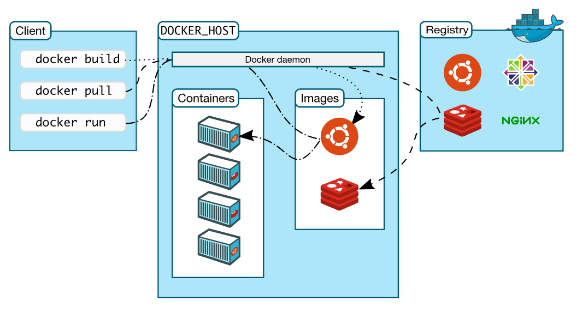

# Introduction
도커는 컨테이너 기반의 가상화 오픈플랫폼이다. 리눅스용으로 만들어졌지만, 윈도우에서도 사용이 가능하다.     
컨테이너는 도커 플랫폼에서 구성할 수 있는 독립적인 환경으로, 구동하려는 어플리케이션에 필요한 것들을 모두 포함한다.

# Docker architecture
도커는 client-server 구조를 사용한다. 
도커 클라이언트와 데몬은 동일한 시스템을 돌리거나 도커 클라이언트를 원격 docker daemon에 연결할 수 있다.
도커 클라이언트와 데몬은 REST API나 UNIX socket 또는 network interface 등을 이용해 통신할 수 있다.
또 다른 도커 클라이언트는 Docker compose로 컨테이너들을 포함한 어플리케이션들을 돌릴 수 있다.  


2022-06-01-docker_tutorial_images/1655105073538.png)


## Docker daemon
도커 데몬은 

The Docker client and daemon can run on the same system, or you can connect a Docker client to a remote Docker daemon. The Docker client and daemon communicate using a REST API, over UNIX sockets or a network interface. Another Docker client is Docker Compose, that lets you work with applications consisting of a set of containers.

The Docker daemon
The Docker daemon (dockerd) listens for Docker API requests and manages Docker objects such as images, containers, networks, and volumes. A daemon can also communicate with other daemons to manage Docker services.

The Docker client
The Docker client (docker) is the primary way that many Docker users interact with Docker. When you use commands such as docker run, the client sends these commands to dockerd, which carries them out. The docker command uses the Docker API. The Docker client can communicate with more than one daemon.

Docker Desktop
Docker Desktop is an easy-to-install application for your Mac or Windows environment that enables you to build and share containerized applications and microservices. Docker Desktop includes the Docker daemon (dockerd), the Docker client (docker), Docker Compose, Docker Content Trust, Kubernetes, and Credential Helper. For more information, see Docker Desktop.

Docker registries
A Docker registry stores Docker images. Docker Hub is a public registry that anyone can use, and Docker is configured to look for images on Docker Hub by default. You can even run your own private registry.

When you use the docker pull or docker run commands, the required images are pulled from your configured registry. When you use the docker push command, your image is pushed to your configured registry.

Docker objects
When you use Docker, you are creating and using images, containers, networks, volumes, plugins, and other objects. This section is a brief overview of some of those objects.

Images
An image is a read-only template with instructions for creating a Docker container. Often, an image is based on another image, with some additional customization. For example, you may build an image which is based on the ubuntu image, but installs the Apache web server and your application, as well as the configuration details needed to make your application run.

You might create your own images or you might only use those created by others and published in a registry. To build your own image, you create a Dockerfile with a simple syntax for defining the steps needed to create the image and run it. Each instruction in a Dockerfile creates a layer in the image. When you change the Dockerfile and rebuild the image, only those layers which have changed are rebuilt. This is part of what makes images so lightweight, small, and fast, when compared to other virtualization technologies.

Containers
A container is a runnable instance of an image. You can create, start, stop, move, or delete a container using the Docker API or CLI. You can connect a container to one or more networks, attach storage to it, or even create a new image based on its current state.

By default, a container is relatively well isolated from other containers and its host machine. You can control how isolated a container’s network, storage, or other underlying subsystems are from other containers or from the host machine.

A container is defined by its image as well as any configuration options you provide to it when you create or start it. When a container is removed, any changes to its state that are not stored in persistent storage disappear.


# Main content
포스팅에서 아래 내용들을 배우게 된다.
- Build and run an image as a container
- Share images using Docker Hub
- Deploy Docker applications using multiple containers with a database
- Running applications using Docker Compose
```commandline
docker run -d -p 80:80 docker/getting-started
```
- -d - detach mode (background mode)로 컨테이너를 동작
- p 80:80 - port 매핑, host의 80번 포트를 컨테이너의 80번 포트로 매핑.
  (-d 와 -p는 -dp로 줄여쓸 수 있다.)
- docker/getting-started - 사용할 도커 이미지

# Discussion


# Reference 
[도커 공식 문서](https://docs.docker.com/get-started/overview/)  
[안내서](https://subicura.com/2017/01/19/docker-guide-for-beginners-2.html