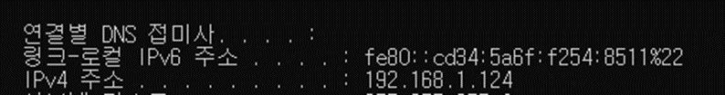
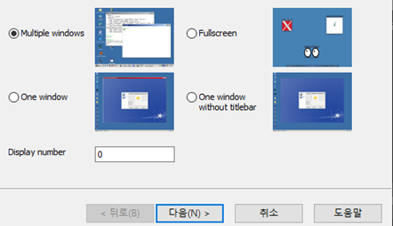
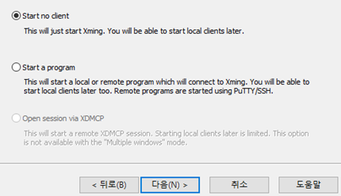
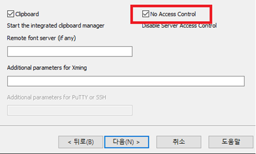
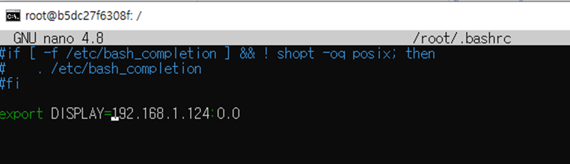

# Introduction
 이전에 원격 리눅스 서버의 GUI를 X-forwarding으로 로컬에 띄우는 방법을 포스팅했었다.
 [관련 포스팅](https://papari1123.github.io/pycharm/X11forwarding/)

 위 포스팅 상황과 마찬가지로, GUI가 지원되어야 하는 앱을 도커환경에서 실행해야 할 때가 있다. 이를 위한 셋업 방법을 알아본다.   

# 리눅스 환경에서 실행
GUI를 표시할 수 있는 호스트 PC가 리눅스일 때 사용하는 방법이다.

## xhost
xhost는 X-서버가 연결을 승인할 수 있는 (일종의) 화이트 리스트에 호스트 이름을 추가하거나 삭제한다.
```commandline
xhost [+ | -] [Name]
xhost +local:    # 로컬 PC를 X-서버 화이트 리스트에 추가.
```

## 실행
디스플레이가 달려 있는 리눅스 PC에서 아래 명령어를 실행한다. <container_name>과 <docker_image>에 개발 환경에 맞는 값을 넣는다.
```commandline
$ xhost +local:
$ docker run -it --name <container_name> -it --env="DISPLAY" --volume="/tmp/.X11-unix:/tmp/.X11-unix:rw" <docker_image> bash
```

# 윈도우 환경에서 실행
GUI를 표시할 수 있는 호스트 PC가 윈도우일 때 사용하는 방법이다.
windows에서는 바로 xhost를 쓸 수 없으므로, vcxsrc를 활용한다.
- ipconfig 명령어로 windows host pc의 IP를 확인한다. 예시는 192.168.1.124


- 사이트에서 vcxsrc를 설치한다.         
https://sourceforge.net/projects/vcxsrv/
- 설치 후 XLaunch를 실행한다. 아래 순서대로 하면 되나, 권한 문제 방지를 위해No access control는 반드시 체크해줘야 한다.





- 아래 명령어로 docker container를 생성 및 실행한다. <container_name>과 <docker_image>에 개발 환경에 맞는 값을 넣는다.
```commandline
docker run -it --name <container_name> -it --security-opt seccomp=unconfined --env="DISPLAY" --volume="/tmp/.X11-unix:/tmp/.X11-unix:rw" <docker_image> bash
```
- 컨테이너를 생성한 이후에는 아래 명령어를 통해 접속이 가능하다
```commandline
docker start qedic   (이미 컨테이너가 실행중인 경우 생략)
docker exec -it qedic /bin/sh 또는 docker attach qedic
```
- Xlaunch를 실행한 상태에서, 확인했던 ip 주소를 이용해 컨테이너 명령창에서 아래 명령어를 실행한다.
```commandline
export DISPLAY=<host pc ip>:0.0
```
- 컨테이너를 실행할 때마다 위의 명령어를 치기 번거로울 경우, /etc/.bashrc 파일에 아래와 같이 명령어를 추가한다. 단, Ip 변경 시에는 수정해야 한다.




# Reference
[xhost 명령어 설명](https://www.ibm.com/docs/ko/aix/7.2?topic=x-xhost-command)    
[원격작업을 하기 위한 X forwarding](https://papari1123.github.io/pycharm/X11forwarding/)