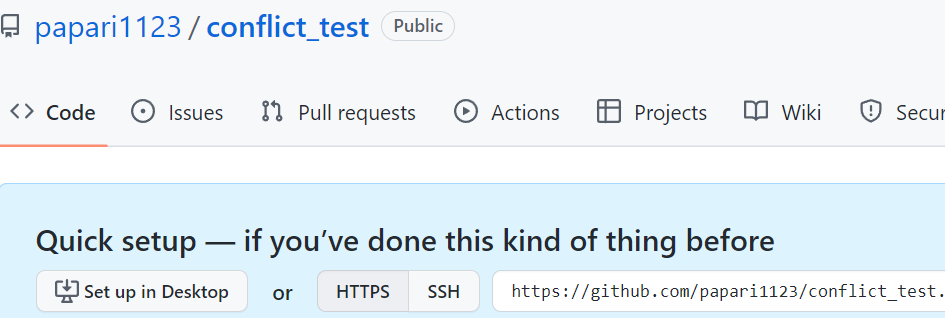

# Introduction

# Discussion

# Reference 
[bitbucket tutorial](https://www.atlassian.com/git/tutorials/learn-git-with-bitbucket-cloud)     
[누구나 쉽게 이해할 수 있는 Git 입문](https://backlog.com/git-tutorial/kr/stepup/stepup1_1.html)   
[Git 기초 (티스토리)](https://webclub.tistory.com/317)   
[git 명령어 (티스토리)](https://victorydntmd.tistory.com/74)   
   