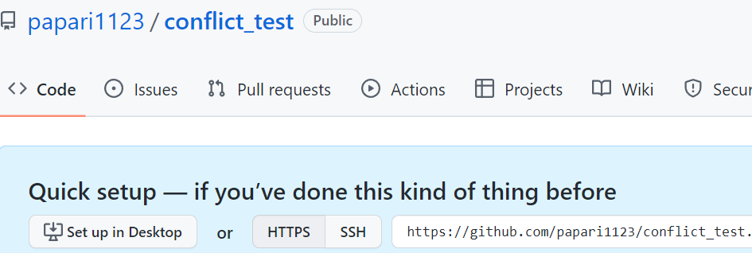

# Introduction

# Discussion

# Reference 
[누구나 쉽게 이해할 수 있는 Git 입문](https://backlog.com/git-tutorial/kr/stepup/stepup1_5.html)    
[branch model 원문](https://nvie.com/posts/a-successful-git-branching-model/)