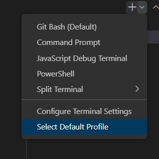
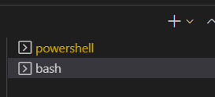

# Introduction
GIT은 
버전관리 백업 협업 이 가능하다.
 
GIT이 어려운 건
협업을 생각해서이다.

원래는 버전관리 용..

리눅스 토발즈
: 쓰고 있던 버전관리를 유료로 바꿔서

내가 만들게 한게 GIT

레포지토리를 만들면,

repository
.git이 저장소, repository이다.
버전까지 같이 패키징하고 싶으면 .git까지 같이 보내면 된다.

POWERSHEEL이라고 되어잇으면,

git bash로 설정

pwd 치면 경로가 나온다.

분할 커밋을 하자.

add 명령어를 사용하자.

git commit할 때 working dir는 쳐다도 안본다
stage area만 본다.
커밋하면 commit id를 볼 수 있다.
유일한 commit id : 식별이 가능하다.

2022-10-11-git2_images/1665456491729.png)

: hash id

Q. commit id는 어떻게 결정되는가?
: email, .. SHA1이라는 해쉬 알고리즘으로 커밋 아이디를 만든다.
고유하다.

아직 커밋하지 않은 변경사항 2개

stage area = cash = index

이전버전의 commit id를 어떻게 알 수 있을까?

git log를 통해 알 수 있다.
2022-10-11-git2_images/1665461524585.png)

여기서 마스터는 마지막 버전을 가리킨다.

master = main 둘다 똑같다. 

git log --oneline 라고 하면 더 간단ㄷ.

HEAD는 현재 버전이다.

**각각의 버전은 그 버전이 만들어진 스테이지 에리어의 스냅샷이다**

Working directory를 내가 원하는 시점으로 돌려야 한다.
현재로도 돌아올 수 있어야 한다.

과거의 버전으로 돌려야 해.
2022-10-11-git2_images/1665462495440.png)

git checkout {commit_id}
하면 과거로 돌아간다.

그런데 돌아간 후 이후에 있던 commit 없다.
2022-10-11-git2_images/1665462723046.png)

왜?
기본적으로 git log은 head를 따라간다.

그래서 마지막 master까지 보여주면 좋겠는데 그러려면
git log --online --all

HEAD는 우리가 현재 있는 시대
MASTER는 마지막 작업을 가리킨다.

이제부터 HEAD가 우리 작업의 주인공이 된다.
LOG를 볼 때 무조건 HEAD를 본다.
master와 head가 다르면 우리는 과거에 살고 있구나..

git checkout master를 하거나
git checkout {id}해서
__
과거로 가면, 그 때 commit한 당시의 stage area와 working directory가 복원된다.

시간여행을 할 때는 checkout을 한다.

상태: 
A로 옮기고 싶으면 HEAD를 옮긴다. 

다음으로 또 커밋하면
HEAD가 가리키는 버전이 부모가 된다.

과거로 갈 떄는 버전을 가리키고
git checkout A
현재로 돌아올 때는 MASTER를 한다.
goit checkout master

깃은 어떤 버전도 지우지 않고 수정하지 않는다.

불변성이 있다..

우리가 겪게될 실수 중 하나

이전버전으로 가고 나서 최신 버전(git checkout master)으로 가지 않았다.
허둥지둥되다가
2022-10-11-git2_images/1665465835218.png)

master로 돌아간다. 그러면 마치 날라간 것 처럼 보인다.
2022-10-11-git2_images/1665465839700.png)

어떻게 하냐?
git reflog 라고 하자.
그러면 ref(HEAD, MATSER와 같은)의 변화를 확인 할 수 있다.

오른쪽은 여러분의 행위, 왼쪽 노란색은 행위의 결과
2022-10-11-git2_images/1665465905650.png)

마지막으로 한 작업을 취소하고 싶어 어떻게 할까?

___
HEAD가 직접 E를 가리키면 DETACHED STATE
HEAD가 MASTER를 가리키면 ATTACHED STATE

detached state가 되는 순간 말이 많아져.
왜냐면 사고나~

detached state를 써먹는 경우는 뭔가
실험/ 신기능을 써먹을 때
-> detached

아래 처럼 F,G를 
2022-10-11-git2_images/1665466635012.png)

__병합

2022-10-11-git2_images/1665468374218.png)

실험이 끝났다면 master가 exp를 병합한다.

1. head가 master를 가리켜야 한다.
: git checkout master

2. merge into current branch 선택
2022-10-11-git2_images/1665468647913.png)

자 이렇게 하니 부모가. exp와 이전 master 버전이다.

넘어야 할 산:
내가 원하는 버전 어디로든지 header를 보낸다.
- git checkout {header}
내가 원하는 브랜치 어디로든지 branch를 보낸다.
- git reset ...

*exp가 master를 병합한다. => master를 업데이트 한다.

실험이 끝났다면, master가 exp(branch)를 병합한다.
-> 'merge' into current branch

새로운 version의 부모는 master, exp(branch)이며 
master는 새로 만들어진 version을 가리킨다.

병합을 취소하려면 'reset' current branch

__
*exp가 master를 병합한다. => master를 업데이트 한다. 자주하면 좋다. (메인작업을 업데이트한다.)
: branch가 오래 동안 떨어져 있다면.. 그렇다..

master가 exp(branch)를 병합한다. => 실험이 끝났다.
-> 'merge' into current branch

새로운 version의 부모는 master, exp(branch)이며 
master는 새로 만들어진 version을 가리킨다.

병합을 취소하려면 'reset' current branch

1. 프로젝트 폴더를 만든다. 
2. 저장소를 만든다. (git init)
3. 파일을 만들고 2개의 커밋을 만든다. 
work1.txt => 1
work2.txt => 2
work3.txt => 2
git status
git add FILE_NAME
git commit -m "COMMIT MESSAGE"
4. 시간여행을 해보세요,
git checkout COMMIT_ID
git checkout master 
5. 브랜치를 만들고 작업할 수 있도록 체크아웃하세요. 
git branch EXP
git checkout exp 
6. 서로 다른 브랜치에서 작업한다. 
	exp 브랜치 : exp.txt 
	master 브랜치 : master.txt 커밋
7. 병합한다.
	git merge exp 
	vi editor : :wq를 이용해서 내용을 저장한다.

