# Introduction
git은 분산 버전 관리 시스템으로, 
아래는 local에 git repository를 내려받고 사용하기 위한 기초적인 사용 흐름이다. 이 흐름만 알면
혼자 git을 사용할 때는 무리없이 사용할 수가 있다.
1. git hosting tool (bitbucket or github)로 repository를 만든다.
2. repository를 local에 copy한다.
3. local repo에 먼저 file을 추가하고 commit하여 변경사항을 저장한다.
4. push하여 변경사항을 master branch에 반영한다.
5. git hosting tool에서 파일을 변경을 하고 commit한다.
6. pull하여 변경사항을 local에 반영한다.
7. branch(version)을 만들어, 변경사항 만들고, 변경사항을 commit한다.
8. pull request를 열어 master branch에 변경사항을 제안한다.
9. 변경한 나의 branch와 master branch를 merge한다.
   

## config 명령어
포스팅에서는 git hosting tool에서 repository를 만들고, 로컬에 git을 설치했다고 가정하고, 2번부터 진행한다.  
진행을 위해 먼저 아래 명령어로 사용자 정보를 설정해야 한다.
```commandline
$ git config --global user.name "LEE, Seonggu"
$ git config --global user.email dltjdrn1123@gmail.com
```
      
    

사용자 정보가 잘 적용되었는지 확인하기 위해 아래 명령어를 사용할 수 있다.
```commandline
$ git config --list
```

## working dir, index, HEAD
git을 사용하기 전에 local 저장소에서 git이 파일들을 어떻게 처리하는지 알아야 한다.    
   
먼저 local 저장소는 git이 관리하는 세 가지 영역으로 구성되어있다.   

   


working dir은 local에 git 파일들을 실제로 저장하는 폴더이며, 
add 명령어를 이용해 변경 또는 추가될 파일들을 index라고 하는 준비영역(stage area)에 저장한다. 
   
commit 명령어로 여기 저장된 파일들을 Head 영역(최종 확정 파일들이 저장되는 영역)으로 옮기게 된다.

# 1. repository를 local에 copy하고 파일을 추가하기
git에서는 repository를 copy하는 것을 cloning이라고 한다.   
cloning 할 경우, git hosting tool server(origin)와 local system간 연결을 생성한다고 보면 된다. 
   
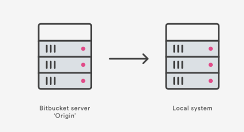

※ 이미지에는 Bitbucket server라고 되어있는데, github를 hosting tool로 쓴다면 이는 github server가 된다.

github의 경우 repo의 code 버튼을 눌러나오는 url를 복사한다.

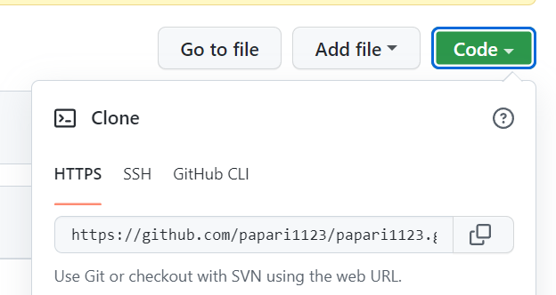


local repo를 생성할 폴더 위치로 이동하고 아래 명령어를 통해 cloning을 한다.  
```commandline
$ git clone {복사한url}
```

추가된 후 git status 명령어로 기존 repo에 저장된 파일과 다른 파일들(local에서 작업해 추가되거나 변경되어야 할 파일)을 확인한다.
```commandline
$ git status
```

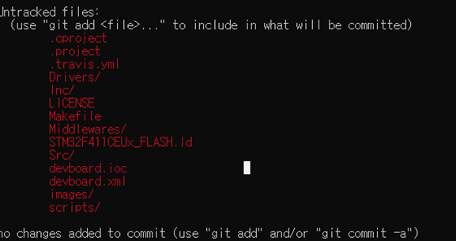

파일을 git server에 반영하기 위해서 일단 git add 명령어로 파일들을 index 영역에 추가한다.   
파일이름에 .을 쓰면 모든 파일(빨간색으로 표시된 파일들)이 다 추가된다.
```commandline
$ git add {파일이름}
```
> **LF will be replaced by CRLF와 같은 오류가 나는 경우**  
리눅스와 윈도우 개발 환경에서 같이 작업을 할 경우에 자주 나오는 에러로, 유닉스 시스템에서는 LF(Line Feed)로 한 줄의 끝이 이루어져있지만, 윈도우는 줄 하나가 CR(Carriage return)과 LF(Line Feed)로 이루어져 있기 때문에 생긴 호환 문제이다.
 이 경우 자동변화해주는 core.autocrlf라는 기능을 켜주면 된다.    
**윈도우 사용자의 경우** 이러한 변환이 항상 실행되도록 다음과 같은 명령어를 입력한다. 물론 시스템 전체가 아닌 해당 프로젝트에만 적용하고 싶다면 —global 을 빼주면 된다.   
**리눅스나 맥을 사용하고 있는 경우** 조회할 때 LF를 CRLF를 변환하는 것은 원하지 않을 것이다. 따라서 뒤에 input이라는 명령어를 추가해줌으로써 단방향으로만 변환이 이루어지도록 설정한다.
```commandline
$ git config --global core.autocrlf true
$ git config --global core.autocrlf true input
```
  
다시 git status 명령어를 사용해 파일이름이 초록색으로 변경된 것을 확인한다.
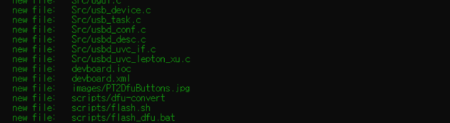


# 2. commit하고 push해 repository에 반영하기
아직 해당 파일들은 commit되지 않았기 때문에 commit 명렁어를 이용해 commit한다.
```commandline
$ git commit -m "{변경메세지}"
```

commit에는 성공했으나 이는 local에만 적용된 것이고 원격 저장소에는 반영이 되지 않았다.   
만약 git add 이후에 변경하거나 추가한 파일이 있다면, git add를 추가로 해줘야 commit에 반영된다.   
이렇게 add를 일일히 하기가 귀찮다면 아래와 같이 -am으로 옵션을 준다.
```commandline
$ git commit -am “{변경메세지}”
```
커밋 메시지를 잘못 작성했을 경우, --amend 옵션으로 다시 커밋하여 메시지를 수정할 수 있다.
```commandline
$ git commit -amend -m  “{변경메세지}”
```
local에서 commit된 내용을 hosting server에 반영하기 위해서는 git push 명령어가 필요하다.  

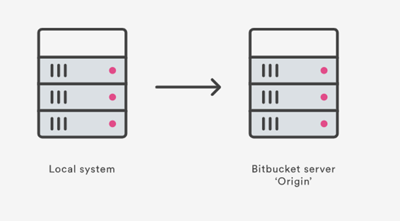

```commandline
$ git push -u {저장소} {브랜치명}
```
저장소를 처음 만든 경우 위 명령어에서 저장소와 브렌치 명은 origin, master이 기본값이다. (clone하면 보통 자동으로 origin으로 저장소 이름이 생성됨),  

또한 **-u는 원격저장소로부터 업데이트를 받은 후 push를 하는 옵션**인데 필수는 아니나 **충돌을 막기 위해 습관적으로 -u 사용이 권장**된다.

만약 기존에 있던 원격 저장소를 복제한 것이 아니라면, 아래와 같이 원격 서버의 주소를 git에게 알려줘야 한다.
```commandline
$ git remote add {저장소} {원격 서버 주소}
```
# 3. pull로 repository의 파일들을 local에 반영하기
이번에는 원격저장소에서 변경된 내역을 local에 내려받는 방법을 알아본다.    
원격저장소의 option에서 add file을 해서 원하는 파일을 업로드하고 commit한다.

이 새로운 file을 내려받기 위해 local repo로 이동하여 pull  명령어를 실행한다.
```commandline
$ git pull {저장소} {브랜치명}
```
   
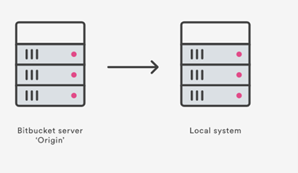


# 4. branch를 만들고 merge하기
branch를 만들고 변경사항을 만들어본다.   
branch는 실제로 commit를 할 pointer로 이해해야 하는데, branch를 만들면 git에서 하는 일은 새로운 pointer를 만드는 것이며 새롭게 모든  파일이나 폴더를 생성하는 것은 아니다.

먼저, 아래와 같이 master branch만 있다고 가정한다.
   
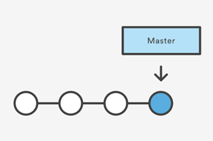

local repo에 들어가 branch 명령어를 사용한다. 여기서는 future-plans을 예시로 사용한다.
```commandline
$ git branch {브랜치명}
```

이 명령어는 branch를 생성은 하지만, 해당 branch로 switching되지는 않는다. 아래와 같은 상황.
  
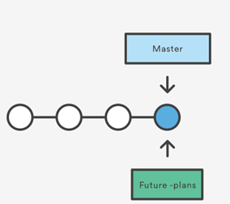


새로운 branch에서 작업을 하려면 check out을 해야 한다.
```commandline
$ git checkout {브랜치명}
```

checkout 후 아래와 같은 상황이 된다.   
파일 또한 이 branch에 속하게 된다.

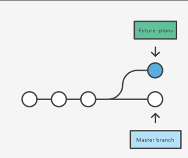
  
이 상태에서 local repo에 파일을 변경 후 git status 명령어를 사용한다.
On branch {변경된 브랜치명}으로 branch가 변경됨을 알 수 있다.    
변경 사항을 git add로 추가하고 commit 하면 아래와 같은 상황이 된다.
   
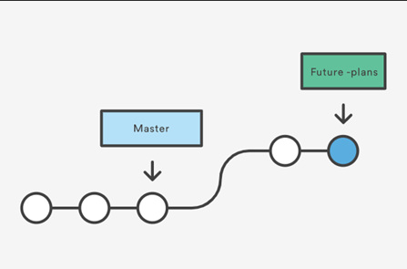

이제 fast-forward 방식으로 branch를 merge해본다.    
git checkout master 명령을 통해 master branch로 switch한 뒤 merge 명령어를 수행한다.
```commandline
$ git merge {브랜치명}
```
merge 후 future-plans branch가 필요없어질 경우 아래 명령어를 사용해 branch를 제거한다.
```commandline
$ git branch -d future-plans
```
변경 사항을 git hosting server에 저장하기 위해 push 명령어를 써본다.
  
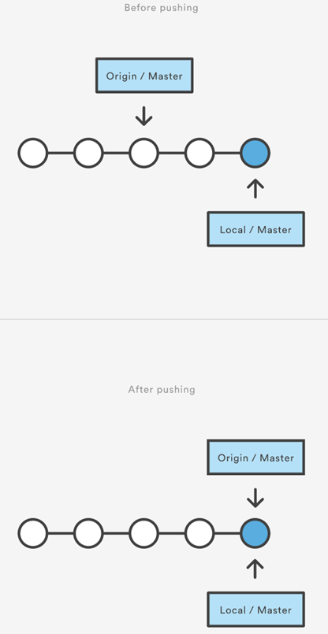

# Discussion
기본적인 git 사용법을 다뤘고, 혼자 git을 사용하는데는 clone, push, pull, merge로도 충분하다고 생각한다.  
다만 여럿이 사용할 때는 부득이하게 버전간 충돌이 날 수 있고 이를 관리할 방법이 필요하다.

# Reference 
[bitbucket tutorial](https://www.atlassian.com/git/tutorials/learn-git-with-bitbucket-cloud)     
[누구나 쉽게 이해할 수 있는 Git 입문](https://backlog.com/git-tutorial/kr/stepup/stepup1_1.html)   
[Git 기초 (티스토리)](https://webclub.tistory.com/317)   
[git 명령어 (티스토리)](https://victorydntmd.tistory.com/74)   
   