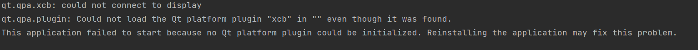
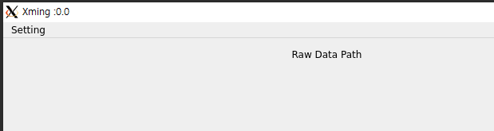
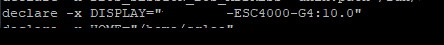
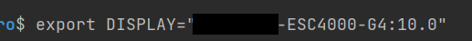
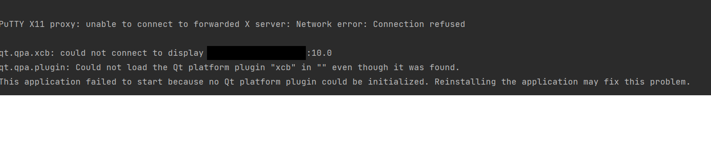

# Introduction
리눅스 서버를 다룰 경우 보통 CLI 환경에서 작업을 많이 한다.
하지만 부득이하게 GUI 환경이 필요한 상황이 있다.
특히 QT를 사용하거나 해야할 떄, 테스트해야할 프로그램이 무조건 GUI 환경을 요구하는 경우,
CLI만 지원하는 개발 환경에서는 **아래와 같이 could not connect to display 오류가 뜬다.**


이를 해결하기 위해 먼저 리눅스 서버에 접속하기 위해 제일 간편한 CLI환경인 **Putty에서
X-forwarding을 사용하는 방법**을 알아보고, 이후 **Putty SSH Session의 터미널 환경과 같은 다른 환경에서도** 사용할 수 있는 방법을
알아봤다.

# X-window
X-window는 리눅를 유닉스 계열 운영체제에서 GUI 환경을 쓸 수 있도록 하는 프레임워크다.
디스플레이에 창을 표시하며, 마우스와 키보드 등의 입력 장치와 상호 작용이 가능하다.    
X-forwarding는 X server(GUI 프로그램을 실행할 리눅스 서버)의 GUI를 X-client(디스플레이 하드웨어를 지원하는)에서 처리할 수 있도록 하는 방법이다.


# 1. Putty에서 X-forward를 사용하기

## ssh 설정 변경 (Server)
vi나 nano 같은 텍스트 편집기로 /etc/ssh에 ssh_config을 연다.
```commandline
cd /etc/ssh
sudo vi ssh_config 
```
ForwardX11 no를 ForwardX11 yes 로 수정하고, 아래 명령어로 서비스를 재시작한다.
```commandline
service sshd restart 
```

## X-window 설치 (client)
1. X-window를 설치한다. 아래 링크에서 설치하긴 했는데 다른 공식 링크가 있을 것 같다.   
https://sourceforge.net/projects/xming/
2. XLaunch를 실행하고 one window - start no client - Clipboard를 체크하고 마침을 누른다. (이건 일반적인 설정이고, 입맛에 맞게 바꿔도 된다.)
3. Putty를 설치한다. 공식사이트에서 설치할 수 있다.   
https://www.putty.org/
4. Putty Connection-SSH-X11에서 X11 forwarding에 Enable X11을 체크하고, Session에서 서버의 IP와 포트번호를 설정하고 실행한다. 
5. 이제 QT와 같은 GUI 지원이 필요한 프로그램을 실행해본다. 아래 예시처럼 X-window 창에 원격서버 프로그램이 GUI 환경에서 오픈이 된다.


# 2. Pycharm SSH session 환경에서 X-forward 사용하기
위 Putty가 실행되는 것을 확인한 상태에서 진행이 가능하다.
1. Putty로 X11 forwarding Enable 체크 후 SSH 실행한 상태에서, export 쳐서 나오는 DISPLAY 변수를 확인한다.
 

2. Pycharm SSH session을 열고, 터미널에서 DISPLAY 변수를 동일하게 수정한다.    


3. 터미널에서 GUI 지원이 필요한 프로그램을 실행한다. **XLaunch와 Putty가 모두 실행된 상태여야 한다.**

그런데 이 방법은 Putty를 사용해야 해서 상당히 번거롭다.
Putty를 사용하지 않고 바로 할 수 있는 방법이 있을텐데, 찾게 되면 업로드를 할 예정이다.


# 자주 발생하는 오류들
## Connection refused ~~
아래와 같이 뜰 경우, XLaunch를 실행했는지 확인한다.


# Reference 
[참고링크-네이버블로그](https://m.blog.naver.com/sunchan683/221465317759)    
[참고링크](http://yochin47.blogspot.com/2018/02/ubuntu-client-pc-pycharm-community.html)