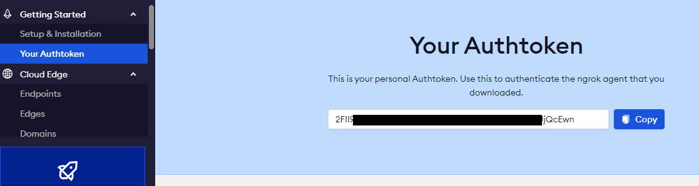
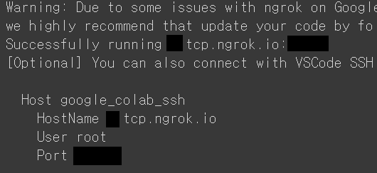
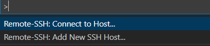
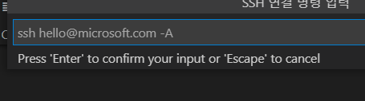
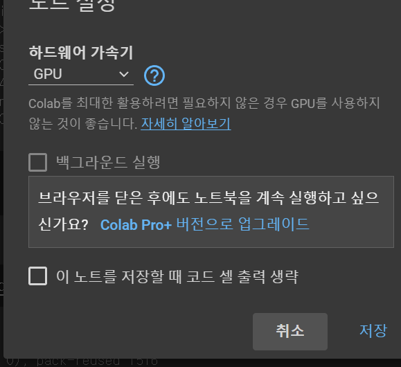

# Introduction
코랩이 실행되는 컨테이너 환경에 직접 접속하기 위해 colab-ssh를 활용해본다.

## ngrok
ngrok은 외부에서 로컬 개발 환경에 접속하게 하는 프로그램이다. 아래 인용글을 참고하자.
>로컬에 구성한 개발 환경을 급하게 외부에 공개해야 할 경우가 있습니다.

>예로 갑자기 외부에서 중요한 고객에게 개발중인 제품을 시연해야 하거나 개발 단계에서 social login 연동등 web hook 을 수신해야 할 경우 domain 을 부여하고 외부에 공개해야 하는데 이를 위해서는 별도의 개발 서버로 옮기고 build와 deploy 를 하는 번거로운 과정을 거쳐야 합니다.

>개발용 로컬 호스트를 tunneling을 통해(Secure tunnels to localhost) 외부에서 연결할 수 있도록 해주는 ngrok를 사용하면 쉽고 빠르게 로컬 개발 환경을 외부에 공개할 수 있습니다.

# 방법
## ngrok 가입 후 토큰 확인
ngrok에 가입하여 토큰을 확인한다.
https://ngrok.com/




## Host 정보를 알기 위해 코랩에서 명령어 실행
코랩에서 아래 명령어들을 실행한다.
```python
!pip install colab-ssh
from colab_ssh import launch_ssh

NGROK_TOKEN = '{NGROK_TOKEN}' # ngrok 토큰
PASSWORD = 'pwpwpw' # 비밀번호 설정

launch_ssh(NGROK_TOKEN, PASSWORD)
```
아래와 같이 HostName, User, Port 정보가 나온다.


## VSCode 실행
VSCode를 실행하고 Remote - SSH를 설치한다.
설치된 상태에서 f1를 눌러 먼저 Add New SSH Host.. 를 선택


입력창이 나오는데, 아래와 같이 Host 정보를 따라 입력한다.
```commandline
ssh {User}@{HostName} -p {Port}
```


입력이 제대로 되었는지 구성요소 확인에 들어가서 최신 설정만 남긴다.    
그리고 F1을 다시 눌러 Remote-SSH: Connect to Host.. 를 선택한 뒤 OS는 linux, pw는 Host 정보 설정 시 사용한 pw를 그대로 입력한다.

그러면 코랩 컨테이너 환경에 접속해 터미널로 명령어 실행도 가능하다.    
만약 프로그램을 돌릴 때 GPU를 같이 쓰고 싶으면 코랩에서 GPU로 유형 변경을 한다.   


# Reference
- [ngrok 설명](https://www.lesstif.com/software-architect/ngrok-39126236.html)    
- 네이버 ai 부스트캠프 (원본 없이, 내용 재구성)