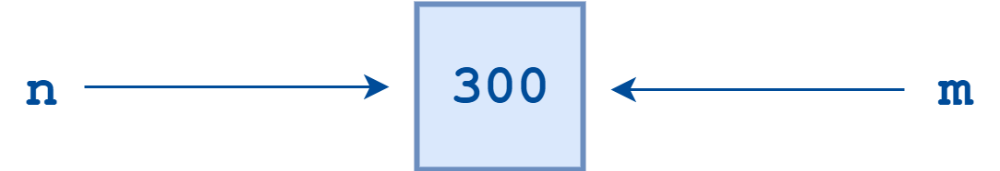
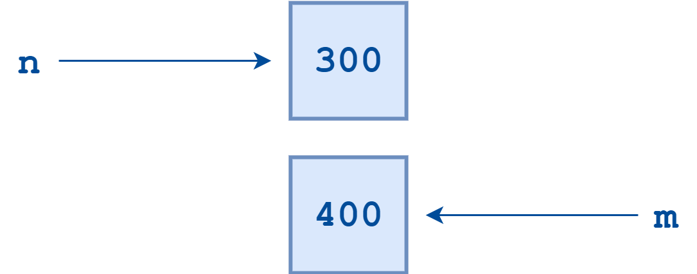
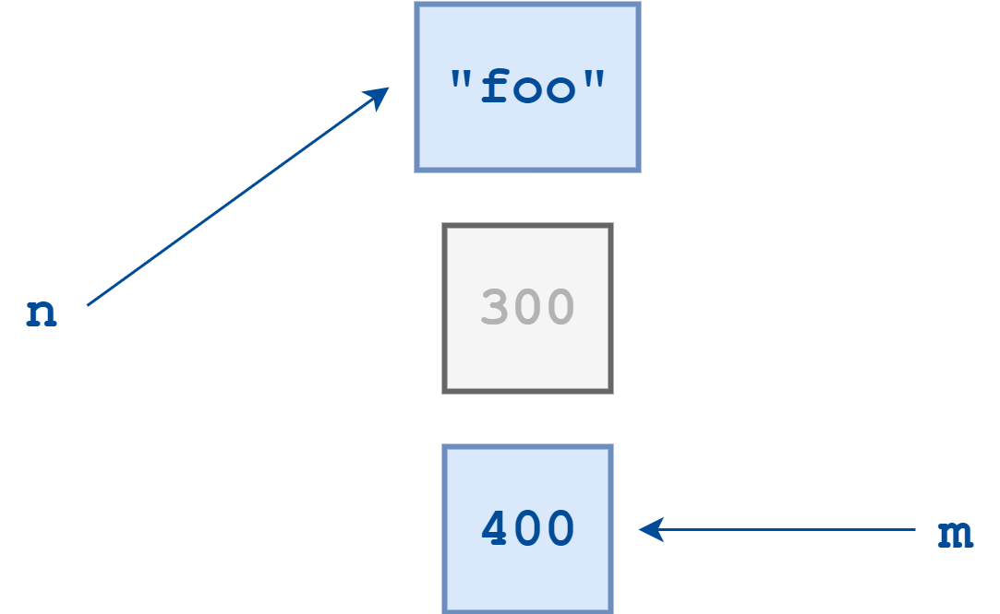

# Introduction
파이썬 언어가 어떻게 변수를 메모리에 할당하고 관리하는지 알아본다.

# Object References
파이썬은 객체 지향 언어이다. 파이썬의 모든 것들이 객체라고 알려져 있다.
상당히 추상적인 표현이다. 그러나, 변수가 어떻게 할당되는지 안다면 왜 이런 표현이 맞는지 알 수 있다.

## 변수의 할당 
파이썬 변수는 일종의 심볼릭 네임이다. **이는 객체에 대한 포인터 또는 참조를 의미한다.**     
객체가 변수에 할당이 된다면, 그 객체의 이름을 불러 참조할 수 있다.
예를 들면 다음과 같은 상수를 할당한다고 해보자.
```python
n = 300
```
300이란 객체가 있고, 이를 n이란 변수(심볼릭 네임)에 할당했다. n이란 변수는 300이란 상수의 포인터라고 할 수 있고
다음과 같이 이미지로 표현할 수 있다.   


이제 m = n 이란 할당문을 써보자.
```python
m = n
```
    
m에 n이 참조하는 객체를 동일하게 참조한다. **새로운 객체를 만든 것이 아니다.**



여기서 m을 400으로 바꿔보자. 그럼 n도 바뀔까?
```python
m = 400
```

n은 바뀌지 않는다. 단지 m이 참조하는 객체가 400으로 바뀌었을 뿐이다.
이는 숫자 상수가 아닌 문장이어도 동일하다.
```python
n = "foo"
```
이 때 객체 300을 참조하는 변수가 없어졌기 때문에, 300이란 객체는 실제로 존재하지 않게 된다.


즉, 객체를 참조하는 변수가 없을 경우 해당 객체의 lifetime이 끝난다. 

## Garbage collection과 Reference Counting
 이 때 동적으로 할당했던 메모리 영역에서 필요가 없어진(lifetime이 끝난) 데이터 영역을 해제하는 것을 garbage collection (gc)이라고 하며,
Python은 reference한 변수가 없을 때 자동으로 gc를 수행한다.
이러한 방식을 **Reference counting**이라고 한다.


# Discussion
## 요약
- 파이싼 
- 변수는 일종의 심볼릭 네임으로 객체(데이터)를 참조한다.
- reference counting에 의해 변수의 lifetime이 정해진다.
- 이에 따라 gb도 자동으로 이뤄진다.

## 기타 
- reference counting가 여러 문제를 야기하는데 다른 포스팅에서 다룰 예정이다.

# Reference
[python 공식문서](https://realpython.com/python-variables/)     
[Statically Vs Dynamically Typed Languages](https://www.youtube.com/watch?v=jlUZw8-6ljw)    
[Memory allocation and managment](https://www.youtube.com/watch?v=arxWaw-E8QQ)