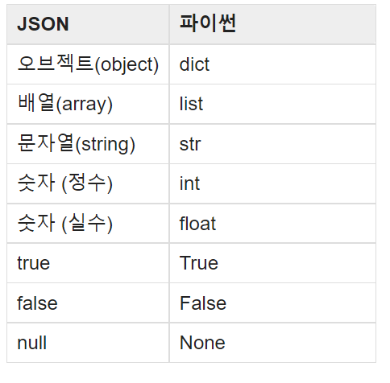
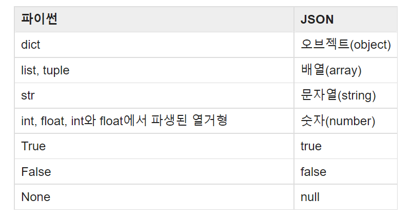

# Introduction
json은 웹에서 데이터 통신을 할 때 주로 사용하는 텍스트 기반 데이터 포멧이다. 
파싱 또는 직렬화가 없이도 javascript에서 사용할 수 있다. 다만, 데이터 포멧을 기술하기 위한 오버헤드가 큰편이다. 그래서 그런지 압축하면 용량이 잘 줄어든다.
파이썬에서 사용할 시에는 파싱이 필요하다.

# 사용법
먼저, 표준 라이브러리인 json 모듈을 import한다.
```
import json
```
## json 읽기
### load
json.load는 json 파일을 읽기 위해 주로 사용되는 함수이다.
```python
# 정의
json.load(fp, *, cls=None, object_hook=None, parse_float=None, 
          parse_int=None, parse_constant=None, object_pairs_hook=None, **kw)

# 예시
with open(path, 'r') as f:
    data = json.load(path)

```
fp에는 JSON 데이터를 포함하면서 .read()를 지원하는 텍스트 또는 바이너리 파일 객체가 인자로 들어간다.
JSON 디코더를 사용해 fp를 파이썬 객체로 역직렬화(deserialization)한다.

### loads
JSON 데이터가 str, bytes 또는 bytearray 인스턴스로서 저장된 경우 loads를 쓸 수 있다.
```python
# 정의
json.loads(s, *, cls=None, object_hook=None, parse_float=None, 
           parse_int=None, parse_constant=None, object_pairs_hook=None, **kw)

person_json = '{"name": "papari", "id": 321, "items": [{"language": "python", "ability": "good"}, {"language": "c++", "ability": "normal"}]}'
# 예시
dict = json.loads(person_json)
```

### 유용한 인자들
#### parse_float 
숫자로 된 텍스트를 float 형태로 저장한다. float(num_str)과 동일

#### parse_int 
숫자로 된 텍스트를 int 형태로 저장한다. int(num_str)과 동일

'
## json 쓰기
### dump
json.dump으로 파이썬 obj를 fp에 JSON 형식으로 직렬화한다. obj는 보통 dictionary를 이용해 데이터를 구성하고, 이를 변환한다.
fp는 .write()를 지원하는 파일류 객체이다.
```python
# 정의
json.dump(obj, fp, *, skipkeys=False, ensure_ascii=True, check_circular=True,
          allow_nan=True, cls=None, indent=None, separators=None, default=None, sort_keys=False, **kw)

# 예시
data = {
    "LMH" : {
        "sex": "female",
        "age" : 15,
        "friends" : ["LSG", "LMS"]
    },
    "STH" : {
        "sex": "male",
        "age" : 14,
        "friends" : ["LMH", "LSG"]
    }
}

with open('student.json', 'w') as f:
    json.dump(data, f)
```

### dumps
obj를 json 형식의 **파이썬 str 객체**로 직렬화한다. 인자는 dump와 동일.
```python
# 정의
json.dumps(obj, *, skipkeys=False, ensure_ascii=True, check_circular=True,
           allow_nan=True, cls=None, indent=None, separators=None, default=None, sort_keys=False, **kw)
```

### 유용한 인자들
#### skipkeys
skipkeys가 참일 경우 기본형(str, int, float bool, None)이 아닌 딕셔너리 키가 있을 경우
Type Error를 발생시키는 대신 건너뛴다.
#### ensure_ascii
ensure_ascii이 true이면 non-ASCII 문자도 아래와 같이 ASCII 문자로 변환한다.
"홍길동" -> "\\ud64d\\uae38\\ub3d9",
false이면 아스키로 변환하지 않고 그대로 둔다.
true로 해서 한글이 깨질 때는 false로 두면 된다.
#### indent
음이 아닌 정수나 문자열일 경우, 정수나 문자열만큼 들여쓰기를 한다.

## 인코딩과 디코딩
### 인코딩
JSON -> Python obj로 역직렬화 과정을 디코딩이라고 하며, 다음과 같이 변환된다.


### 디코딩
Python obj -> JSON로 직렬화 과정을 인코딩이라고 하며, 다음과 같이 변환된다.



## @ 참고
[PYTHON JSON 공식 문서](https://docs.python.org/ko/3/library/json.html)

